いつも大変お世話になります。Microsoft Azure サポート チームです。

請求書払い (銀行振り込み) への変更申し込みについて、本記事で以下をご案内させていただきます。

ご参考になりましたら幸いです。

1.  本記事の目的
2.  請求書払いの概要
3.  注意事項
4.  請求書払いへの変更方法 (すでにご利用の Azure サブスクリプションを変更する)
5.  請求書払いでの購入方法 (これから購入する Azure サブスクリプションにて設定する)
6.  請求書についての補足

### 1\. 本記事の目的
___

Azure の請求書払いをご利用いただくために、弊社サポート窓口へのお問い合わせを必要とします。

その際にどのようなお手続きが必要であるか、どれくらいのお時間を要するかなどについて事前にお客様にご提供させていただきまして、少しでもお客様のお役に立つことができれば幸いです。

### 2\. 請求書払いの概要
___

Azure では以下のお支払い方法をご利用いただけます。

-   クレジット カード払い
-   請求書払い※

※ お支払いは、請求書発行日から 30 日以内に指定の銀行口座へのお振込みをお願いしております。
※ 振り込み手数料につきましては、お客様のご負担をお願いしております。

しかしながら、ユーザーからの不正申し込みと不正使い込みを防止することを目的に、既定ではクレジット カード払いのみが設定可能となっております。
請求書払いを設定していただくためには弊社の与信審査が発生いたします。

その与信審査通過後に請求書払いを設定していただくことが可能になります。
この与信審査を含めまして、Azure で請求書払いをご利用いただくための注意事項、一連の流れについて以降におまとめいたします。

### 3\. 注意事項
___

注意事項について記載を致します。

後述に読み進めていただく前に、また実際にお問い合わせをいただく前に事前にご確認くださいませ。

\[与信審査について\]

-   必ず与信審査が通ることをお約束するものではございません。
-   与信審査の処理には、お申し込みから 5 ～ 7 営業日かかる可能性があります。
-   与信審査通過後の請求書払いへのご変更お手続き自体は、お客様ご自身にてアカウントポータルより実施いただきます。

\[お支払い方法の変更と請求書の発行について\]

-   請求書払いへ変更いただくと、クレジット カード払いへの変更はおこなえません。
-   請求書払いへの変更後、請求書はポータル画面よりダウンロードをお願いいたします。請求書の郵送サービスはおこなっておりません。
-   すでに発行されている請求書の修正および再発行はおこなっておりませんので、あらかじめご了承ください。
-   変更前のお支払い情報が登録されているすべてのサブスクリプションのお支払い方法が変更後のお支払い方法に変更されますので、変更の際はご留意ください。
-   請求書は毎月 \[Azure アカウント作成日\] の翌日に発行されます。請求書発行日をご希望の日付とされたい場合、Azure アカウントの作成を請求書発行ご希望日の前日に実施ください (ただし、29 日、30 日、31 日作成の場合は 2 日発行となります) 。

\[お支払いについて\]

-   お支払いは、請求書発行日から 30 日以内に指定の銀行口座へのお振込みをお願いしております。また、その際に発生する振り込み手数料につきましては、お客様のご負担をお願いしております。
-   請求書払い (銀行振り込み) の場合、入金の経理処理に 5 営業日程度お時間をいただいております。ご入金の時期によっては、請求書の \[入金額\] の項目に前月分のお支払い金額が反映されない場合がございます。この場合、繰越残高として翌月以降の請求書でご請求額が合算されますが、すでにお支払い済みの場合には前月繰越残高を差し引いた金額にてご入金ください。

\[その他\]

-   無料試用版をお使いのお客様は、お支払い方法を請求書払いとしていただくことはできません。ご利用したい場合には従量課金版へアップグレードが必要になります。アップグレード方法の詳細は以下のドキュメントをご参照ください。
 
 -   [Azure 無料アカウントまたは Azure for Students Starter アカウントをアップグレードする](https://docs.microsoft.com/ja-jp/azure/cost-management-billing/manage/upgrade-azure-subscription)
 
-   お支払い情報が登録されていない MSDN/MPN/BizSpark をお使いのお客様は請求書払いへの変更のために使用制限を解除する必要がございます。使用制限の解除方法の詳細は以下のドキュメントをご参照ください。
 
  -   [Azure の使用制限](https://docs.microsoft.com/ja-jp/azure/cost-management-billing/manage/spending-limit)
 
-   お支払い担当者の情報を変更される場合は、アカウントポータルのプロファイルから担当者の情報を変更いただくようお願いいたします。

### 4\. 請求書払いへの変更方法 (すでにご利用の Azure サブスクリプションを変更する)
___

すでにご利用いただいている Azure サブスクリプションのお支払い方法を請求書払いに変更していただくための一連の流れをご案内いたします。

-   Azure アカウントの情報を確認・更新 (お客様操作)
-   与信審査に必要な情報を収集 (お客様操作)
-   弊社にお問い合わせ (お客様操作)
-   与信審査を実施 (Microsoft にて実施)
-   与信審査が通った後に請求書払いへ変更 (お客様操作)

#### 1\. Azure アカウントの情報を確認・更新 (お客様操作)

弊社にお問い合わせいただく前の事前準備となります。

以下の手順で Azure アカウントの登録情報を確認・更新してください。

1.  以下の URL にアクセスをする
 
 https://account.azure.com/Profile/
 
2.  対象 Azure サブスクリプションのアカウント管理者 (Azure アカウント) でサインインをする
3.  \[詳細の編集\] をクリックする
4.  以下赤枠部分について会社情報を正しく入力する
    
    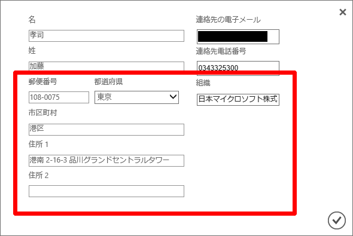
    
    注)
    \[郵便番号\] \[都道府県\] \[市区町村\] \[住所 1\] に会社の住所情報を正しく入力してください。
    \[組織\] に会社名を正しく入力してください。
    \[住所 2\] は必須ではありません。
    
    これらの情報をご提供いただき、与信審査の際に確認いたします。
    適切な情報が入力されていない場合、与信審査を開始できません。
    

5.  以下赤枠部分についてご登録者様の情報を正しく入力する
    
    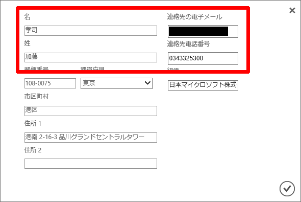
    
    注)
    \[名\] \[姓\] \[連絡先の電子メール\] \[連絡先電話番号\] にご登録者様の情報を正しく入力してください。
    これらの情報をご提供いただき、与信審査の際に確認いたします。
    適切な情報が入力されていない場合、与信審査を開始できません。
    

6.  \[レ\] をクリックする

#### 2\. 与信審査に必要な情報を収集 (お客様操作)

弊社にお問い合わせいただく前の事前準備となります。

以下の情報をご用意ください。

※ お問い合わせいただいた後に担当者よりメールにてご連絡を受けた場合は、収集いただきました情報につきまして、貴社セキュリティポリシーに則した方法で暗号化など実施いただき、メールの返信にて情報をご提供ください。
※ 情報をご提供いただいてから与信審査の手続きが開始となりますので、ご協力お願いいたします。
※ 以前、与信審査にてお支払い担当者の情報をご登録いただいたお客様にて、今後お支払い担当者の情報を変更される場合は、アカウントポータルのプロファイルから担当者の情報を変更いただくようお願いいたします。

1.  対象 Azure サブスクリプションのアカウント管理者 ( メールアドレス形式 ) 確認方法は以下の公開情報をご確認下さい。
 
 -   [Azure サブスクリプション管理者を追加または変更する](https://docs.microsoft.com/ja-jp/azure/cost-management-billing/manage/add-change-subscription-administrator)
 
2.  会社名
    ※ 上記「1. Azure アカウントの情報を確認・更新 (お客様操作)」でご入力いただいた会社名情報と一致している必要がございます。    
    ※ また、会社名について英語表記も併せてご用意ください。
    
3.  会社の Web サイトの URL
4.  会社の住所
    ※ 上記「1. Azure アカウントの情報を確認・更新 (お客様操作)」でご入力いただいた会社の住所情報と一致している必要がございます。
    
5.  ご登録者様の情報
    
    お名前
    お名前 (英語表記)
    電話番号
    メールアドレス

    ※ 上記「1. Azure アカウントの情報を確認・更新 (お客様操作)」でご入力いただいたご登録者様の情報と一致している必要がございます。
    ※ 弊社経理担当者より、入金に関しての内訳等を確認させていただく場合がございます。ご対応いただけるご担当者様の連絡先をご記入ください。
    ※ メールアドレスのドメインに会社名が入っていない場合、メールアドレスと会社の関連性が確認できる書類 (インターネットプロバイダー様の契約書類) をご提供いただく必要がございます。
    

#### 3\. 弊社にお問い合わせ (お客様操作)
※ すでにサポートへお問い合わせいただいている場合はご対応不要でございます。

弊社にお問い合わせいただきます。
お問い合わせ方法は以下の公開情報をご確認ください。

[https://docs.microsoft.com/ja-jp/azure/billing/billing-how-to-pay-by-invoice](https://docs.microsoft.com/ja-jp/azure/billing/billing-how-to-pay-by-invoice)

※ 「請求書による支払いを要求する」をご参照ください。

手順 2. の \[課金\] は、現在の画面では \[請求\] になります。
手順 3. の \[Pay by Invoice (請求書による支払い)\] は、現在の画面では \[インボイスによる支払い\] になります。
手順 4. の \[詳細\] に、請求書払いへの変更をご要望の旨の一文と、上記「2. 与信審査に必要な情報を収集 (お客様操作)」で収集していただいた情報をご入力ください。

#### 4\. 与信審査を実施 (Microsoft にて実施)

お問い合わせ作成後、ご提供いただきました情報を確認し、弊社の与信審査を開始させていただきます。

\[与信審査\] が完了いたしますと、お客様あてに \[与信審査\] 完了 (請求書払いへの変更が可能となりましたという内容のメールとなります) のご案内メールが自動配信されますが、審査完了後、サポート窓口にてお客様のポータル上で \[請求書払い\] の表示がされるようお手続きを実施させていただき、あらためましてご連絡をさせていただきますので、今しばらくお待ちいただきますようお願いいたします。

該当メールが配信された時点では、\[請求書払い\] へのご変更は実施いただけませんこと、あらかじめご了承くださいませ。
なお、必ず与信審査が通ることをお約束するものではございません。
また、状況によりましては再審査となり、お客様に追加の情報提供を依頼する場合がございます。

#### 5\. 与信審査が通った後に請求書払いへ変更(お客様操作)

与信審査が通りましたら、請求書払いに変更していただきます。
以下の手順で対象 Azure サブスクリプションの支払い方法を請求書払いに変更してください。

1.  以下の URL にアクセスをする
 
  https://account.azure.com/Subscriptions/
 
2.  対象 Azure サブスクリプションのアカウント管理者でサインインをする
3.  対象 Azure サブスクリプションをクリックする
4.  \[支払い方法の管理\] をクリックする
    
    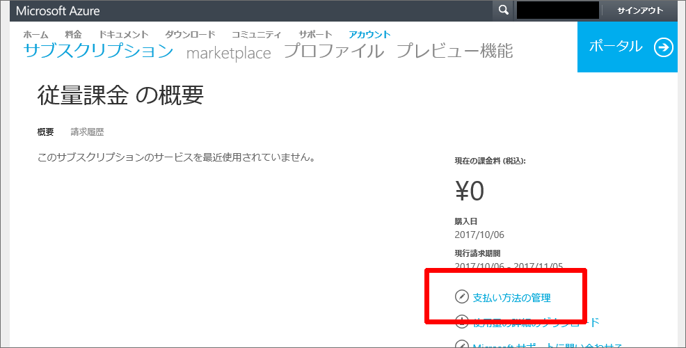
    
5.  \[+ 請求書\] をクリックする
    
    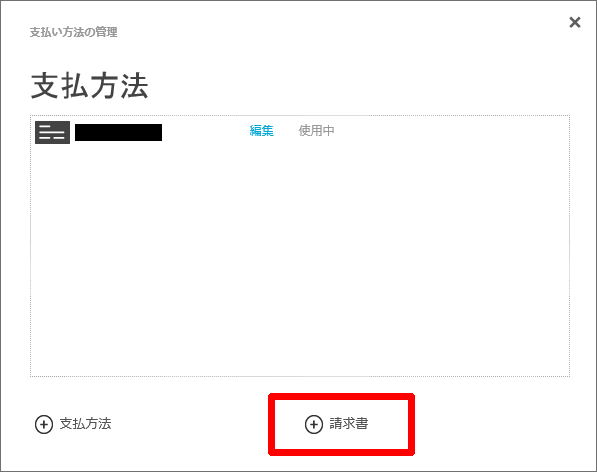
    
6.  下記画面で会社情報を入力する
    
    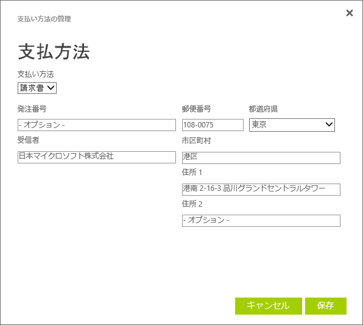
    
    注)
    \[支払い方法\] が請求書になっていることを確認してください。
    \[発注番号\] は Azure サブスクリプションが複数ある場合に、識別番号としてご利用いただけます。
    \[受信者\] は会社名を入力してください。

7.  \[保存\] をクリックする

8.  \[請求書\] が追加されているかご確認いただき、\[代替使用\] をクリックする
    
    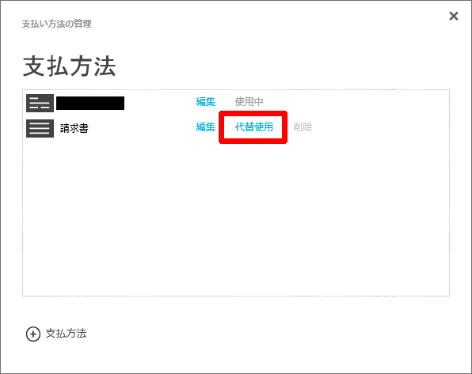
    
9.  \[支払い方法の管理\] 画面に切り替わりましたら、画面右下の \[保存\] をクリックする
    
    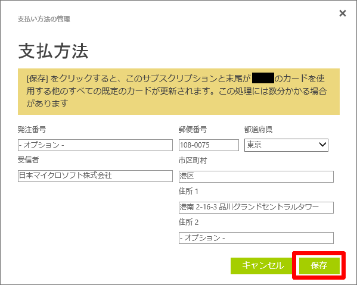
    
10.  以下の場面になり、請求書が \[使用中\] なっていることを確認したら × ボタンをクリックする
    
    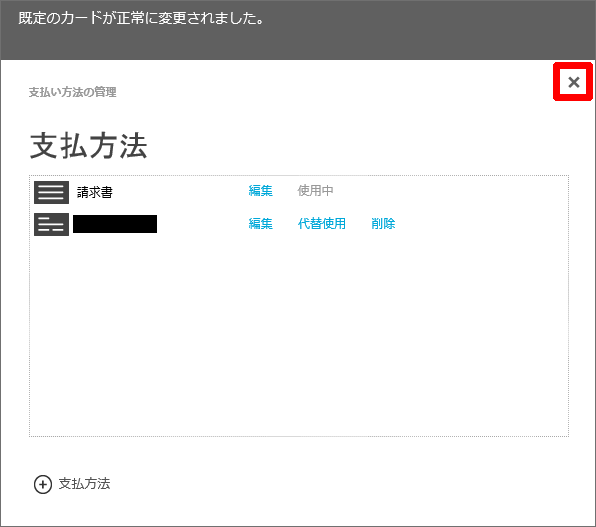
    

### 5\. 請求書払いでの購入方法 (これから購入する Azure サブスクリプションにて設定する)
___

これからご購入いただく Azure サブスクリプションについて、はじめから請求書払いでご利用をいただくための一連の流れをご案内いたします。

-   Azure アカウントを登録する (お客様操作)
-   Azure アカウントの情報を確認・更新 (お客様操作)
-   与信審査に必要な情報を収集 (お客様操作)
-   弊社にお問い合わせ (お客様操作)
-   与信審査を実施 (当窓口にて実施)
-   与信審査が通った後に Azure サブスクリプションを購入する (お客様操作)

#### 1\. Azure アカウントを登録する(お客様操作)

Azure アカウントをご登録いただきます。
以下の手順で Azure アカウントを登録してください。

1.  以下の URL にアクセスをする

 https://azure.microsoft.com/ja-jp/offers/ms-azr-0003p/

2.  \[今すぐ購入\] をクリックする
3.  Microsoft アカウント、もしくは組織アカウントでサインインをする
4.  \[自分の情報\] ページで必須項目を全て入力して \[次へ\] をクリックする
    
    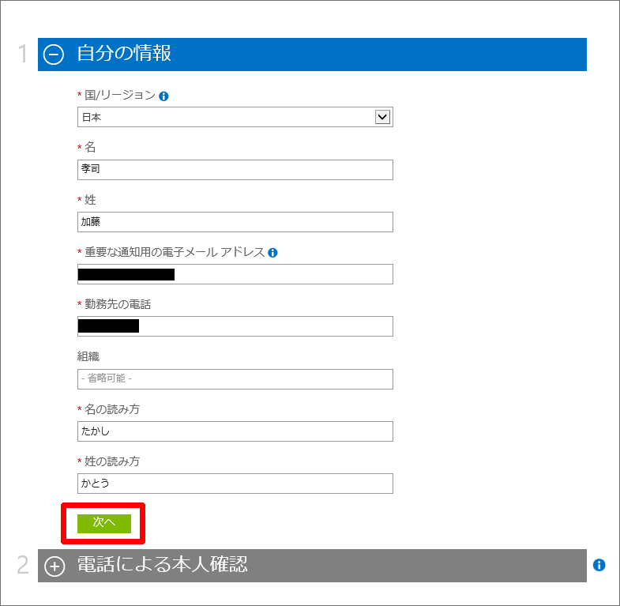
    
5.  \[電話による本人確認\] ページで電話番号による本人確認をおこなう
    
    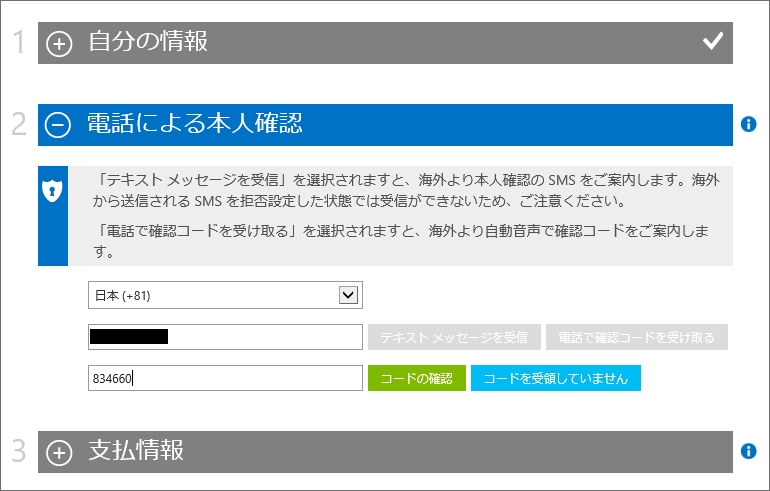
    
6.  本人確認が正常に終わり \[支払情報\] ページが表示されることを確認する
7.  \[支払情報\] ページの情報は入力せず、画面右上のサインアウトをクリックする
    
    ※ ここまでの作業で Azure アカウントは登録されます。
    ※ これ以上進めず必ずサインアウトをしてください。
    ※ 電話認証を正常に完了できない場合は、弊社サポート チームまでお問い合わせください。
    
    
    

#### 2\. Azure アカウントの情報を確認・更新 (お客様操作)

弊社にお問い合わせいただく前の事前準備となります。
上記「請求書払いへの変更方法 (すでにご利用の Azure サブスクリプションを変更する) 」 - 「1. Azure アカウントの情報を確認・更新 (お客様操作)」と同じ手順で対象 Azure アカウントの登録情報を確認・更新してください。

#### 3\. 与信審査に必要な情報を収集 (お客様操作)

弊社にお問い合わせいただく前の事前準備となります。
上記「請求書払いへの変更方法 (すでにご利用の Azure サブスクリプションを変更する) 」 - 「2. 与信審査に必要な情報を収集 (お客様操作)」と同じ情報をご用意ください。
なお、Azure サブスクリプションの購入前となるため、「1. 対象 Azure サブスクリプションのアカウント管理者」として上記「1. Azure アカウントを登録する (お客様操作)」でご登録をいただいた Azure アカウントをご用意ください。

#### 4\. 弊社にお問い合わせ (お客様操作)

弊社にお問い合わせいただきます。
上記「請求書払いへの変更方法 (すでにご利用の Azure サブスクリプションを変更する)  」 - 「3. 弊社にお問い合わせ (お客様操作)」と同じ手順でお問い合わせください。

#### 5\. 与信審査を実施 (当窓口にて実施)

お問い合わせ作成後、ご提供いただきました情報を確認し、弊社の与信審査を開始させていただきます。

\[与信審査\] が完了いたしますと、お客様あてに \[与信審査\] 完了 (請求書払いへの変更が可能となりましたという内容のメールとなります) のご案内メールが自動配信されますが、審査完了後、サポート窓口にてお客様のポータル上で \[請求書払い\] の表示がされるようお手続きを実施させていただき、あらためましてご連絡をさせていただきますので、今しばらくお待ちいただきますようお願いいたします。

該当メールが配信された時点では、\[請求書払い\] へのご変更は実施いただけませんこと、あらかじめご了承くださいませ。
なお、必ず与信審査が通ることをお約束するものではございません。

また、状況によりましては再審査となり、お客様に追加の情報提供を依頼する場合がございます。

#### 6\. 与信審査が通った後に Azure サブスクリプションを購入する(お客様操作)

Azure サブスクリプションをご購入いただきます。
以下の手順で Azure サブスクリプションを購入してください。
※ サブスクリプションをご購入いただいた日より 1 か月の課金サイクルが開始されます。ご購入後はサイクルのご変更はできかねますので、あらかじめ課金サイクルをご検討のうえご購入ください。

1.  以下の URL にアクセスをします。

 https://account.azure.com/Subscriptions
  
 
2.  上記「1. Azure アカウントを登録する (お客様操作)」でご登録いただいた Azure アカウントでサインインする
3.  \[Microsoft Azure サブスクリプションを追加しましょう。\] の \[追加\] をクリックする
    
    
    
4.  \[プランの選択\] ページで希望のプランを選択する
    
    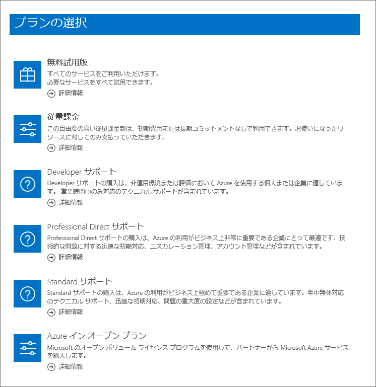
    
5.  \[支払情報\] ページで \[支払い方法\] から \[請求書\] を選択し、その他情報を入力して \[次へ\] をクリックする
    
    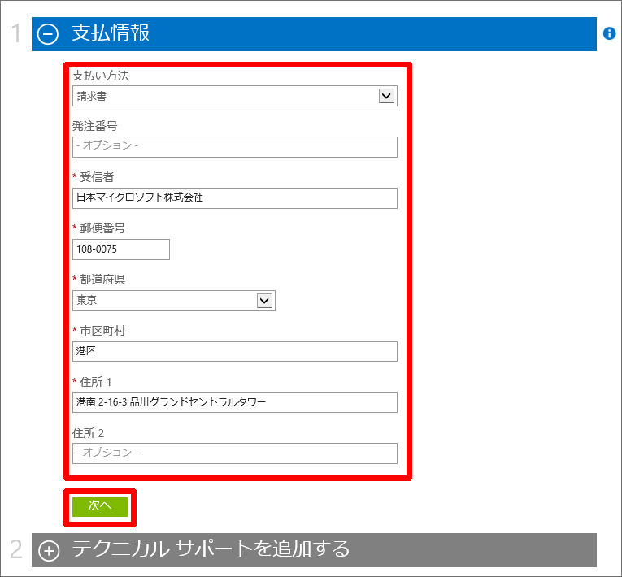
    
    注)
    \[支払い方法\] が請求書になっていることを確認してください。
    \[発注番号\] は Azure サブスクリプションが複数ある場合に、識別番号としてご利用いただけます。
    \[受信者\] は会社名を入力してください。

6.  \[テクニカル サポートを追加する\] ページで適宜サポート プランを選択して \[次へ\] をクリックする    
    ※ サポート プランが不要な場合 \[テクニカル サポートがないか、既に Microsoft Premier サポートに加入しています。\] を選択します。
    
    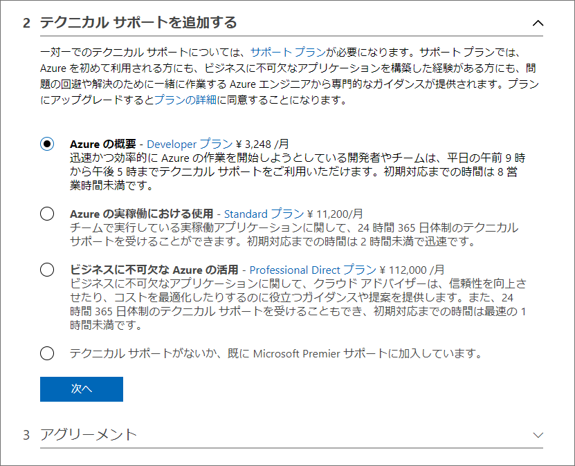
    
7.  \[契約\] ページで必要項目にチェックを入れて、\[購入\] をクリックする
    
    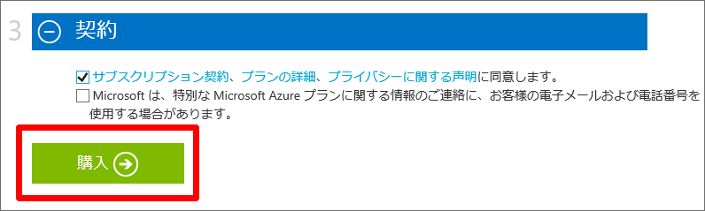
    

### 6\. 請求書についての補足
___

請求書について関連する情報を補足させていただきます。
ご参考になりましたら幸いです。

Azure の請求書と毎日の使用状況データをダウンロードまたは表示する
[https://docs.microsoft.com/ja-jp/azure/billing/billing-download-azure-invoice-daily-usage-date](https://docs.microsoft.com/ja-jp/azure/billing/billing-download-azure-invoice-daily-usage-date)

Microsoft Azure の請求書の見方
[https://blogs.msdn.microsoft.com/dsazurejp/2013/10/10/windows-azure-5/](https://blogs.msdn.microsoft.com/dsazurejp/2013/10/10/windows-azure-5/)

Azure オンライン請求書に反映される情報の変更方法について
[https://blogs.msdn.microsoft.com/dsazurejp/2015/11/02/azure-3/](https://blogs.msdn.microsoft.com/dsazurejp/2015/11/02/azure-3/)
※ 請求書に表示される情報の変更方法が記載されております。
※ 変更についてはお客様操作にて実施可能です。

クレジットカードの登録・変更・削除方法について
[https://blogs.msdn.microsoft.com/dsazurejp/2013/08/22/393/](https://blogs.msdn.microsoft.com/dsazurejp/2013/08/22/393/)
※ クレジットカード情報が登録されている場合、請求書払い変更後に削除操作をいただけます。

以上の通りご案内いたします。

引き続き弊社製品・サービスについてお客様のお役に立てる情報のご案内に努めさせていただきます。

よろしくお願いします。