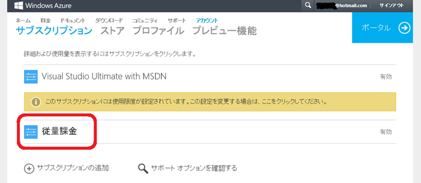
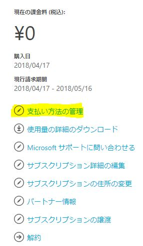
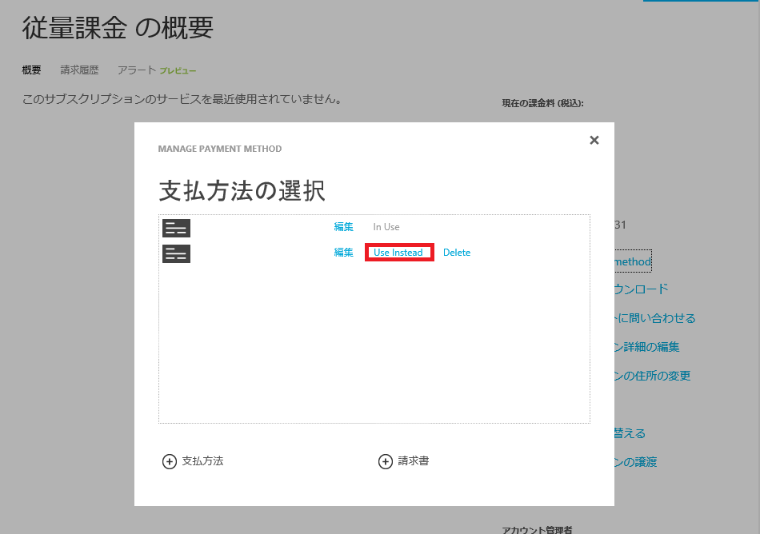
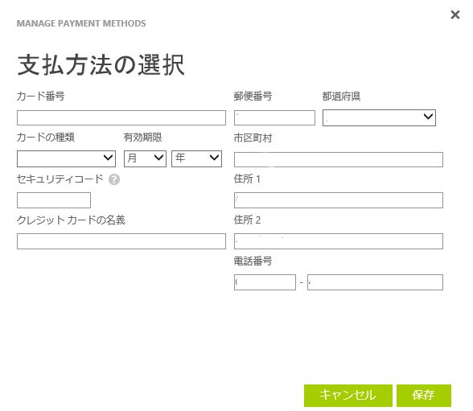
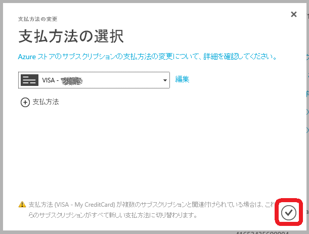
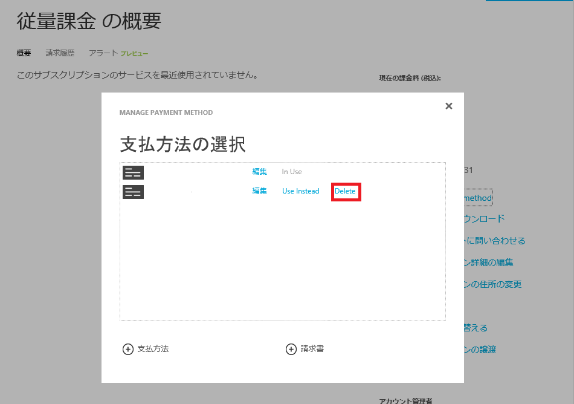

※この記事は 2018 年 4 月 時点の情報を基に作成しており、 変更される可能性がございます。予めご了承ください。

下記に Microsoft Azure のクレジットカードの登録・変更方法についてご案内いたします。

## クレジットカードの登録・変更手順

1.  [アカウントポータル](https://account.windowsazure.com/Subscriptions/)にログインします。

クレジットカードの変更をしたいサブスクリプションを選択します。(下記例では「従量課金」)

2.   右側に表示される「支払方法の管理」をクリックします。

3\. 「＋支払方法」をクリックします。もしすでにクレジットカードが登録されている場合には、登録済のクレジットカードの一覧が表示され、特定のクレジットカードの「代替使用」を選択すると、クレジットカード変更ができます。
<注意事項>

特定のサブスクリプションのクレジットカードを変更すると、変更対象のクレジットカードをご利用中の全てのサブスクリプションのお支払方法も、変更したクレジットカードに変更されます。

4\. クレジットカードの情報を入力し、「次へ」を押下します。

5\. 追加が完了すると、次の画面で登録されたクレジットカードが表示されます。右下のチェックマークを押すと完了します。

## クレジットカードの削除手順

新しいクレジットカードの登録・変更を実施した後、古いクレジットカードを削除する手順は 2 通りあります。

\[1\] アカウントポータルからの削除方法

対象サブスクリプションの「支払方法の管理」をクリックし、削除対象のクレジットカードの「削除」をクリックします。

<注意事項>

特定のサブスクリプションのクレジットカード情報を削除すると、削除対象のクレジットカードを登録している全てのサブスクリプションのお支払情報からも、削除したクレジットカードが削除されます。

\[2\] Microsoft アカウントからの削除方法

※本方法は、Microsoft アカウントで Microsoft Azure のアカウント管理者に設定されている場合に利用可能です。組織アカウントが Microsoft Azure のアカウント管理者に設定されている場合には、お客様側でクレジットカードの削除ができませんので、マイクロソフト サポートサービスまでお問い合わせください。

1.  Microsoft アカウントのサイト ([http://account.live.com/](http://account.live.com/)) にアクセスし、お客様がご利用の Microsoft アカウントでログインします。
2.  画面上の \[支払いと請求\] – \[支払いオプション\] をクリックします
    -   **NOTE**「お客様のアカウント保護にご協力ください」のページが出力され、セキュリティコードの入力がもとめられることがあります。
3.  「お支払い方法の管理」 の画面上でご登録いただいているお支払方法の一覧が表示されますので、削除したいクレジットカードを選択します。
    -   **NOTE** 画面右上のドロップダウンリストが「 JP- 個人用アカウント」と表示されている場合は、プルダウンで「JP - ビジネスアカウント」にご変更ください。
4.  画面中央にクレジットカードの詳細情報が表示されますので、「削除」リンクをクリックします。

クレジットカードが特定のサブスクリプションに紐づけられている場合には、削除できません。また、特定の利用しないサブスクリプションをキャンセルしたとしても、念のため３か月間データを保管しています。その関係から、その３か月間はサブスクリプションは削除が猶予されており、その影響でクレジットカードも削除できません。即座にサブスクリプションの削除・クレジットカードの削除をご要望の場合には、マイクロソフト サポートサービスまでお問い合わせください。

\--

Microsoft Azure サポートチーム