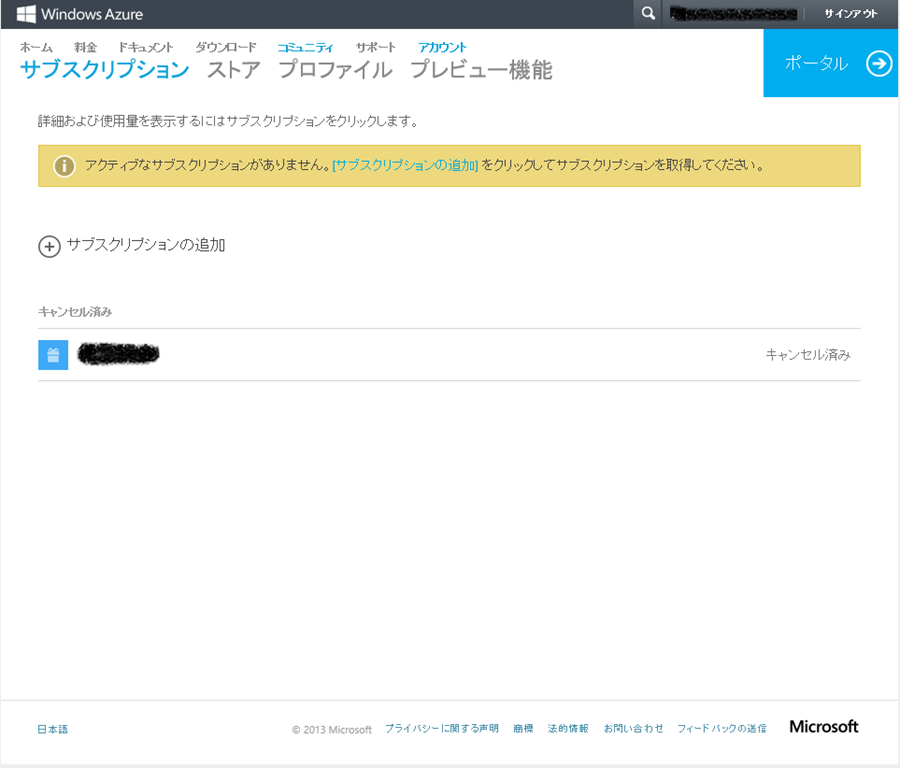
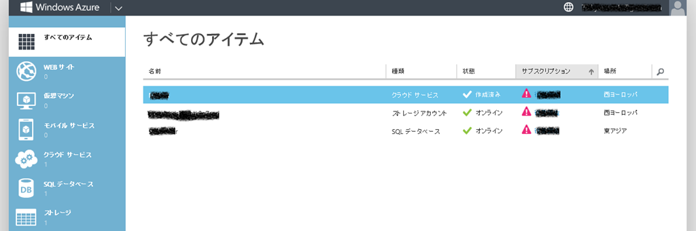
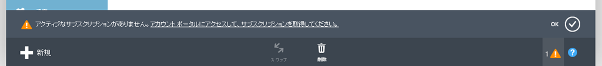

みなさんこんにちは。Windows Azure サポートチームです。本日は、無料評価版が期限が切れた後に、再アクティベーション (有効化) をする方法についてご案内いたします。

## 内容

Windows Azure では 1 ヵ月の無料評価版が利用可能ですが、利用期限が過ぎると、サブスクリプションは無効化されます。無効化される前に、サービス継続の際には従量課金版への移行をお願いする通知がメールにて行われます。有効化することなく、期限を過ぎ、サブスクリプションが無効化されると、各機能は即時に無効化されます。利用期限が過ぎてもしばらくの間お客様のデータは保管しております。しかし約 60 日後にサービスの提供が完全に停止されると、お客様のデータは完全に削除され、ご利用いただけなくなります。ストレージサービスや SQL データベースで保存する必要のあるデータはコピーしていただきますようお願いいたします。

　クラウドサービス　・・・　配置されているパッケージは削除されます。
　仮想マシン　・・・　配置されている仮想マシンは停止状態になります。
　ストレージサービス　・・・　データは保存されますが、読み込みしかできなくなります。
　SQL データベース　・・・　データは保存されますが、読み込みしかできなくなります。
　Web サイト　・・・　配置されているアプリは保存されますが、サーバーは停止されます ( アクセスできません ）

また、[アカウントポータル](https://account.windowsazure.com/Subscriptions)では「キャンセル済み」として表示されます。

[管理ポータル](https://manage.windowsazure.com/)にはログインができますが、各サービスの新規作成ができなくなっています。

## 従量課金への移行

もし、無効化されたサブスクリプションをそのまま使いたい場合には、従量課金版へ移行する必要があります。

サブスクリプション名については、お客様が事前に変更していない限り 「無料評価版 (Free Trial)」 のままになっている可能性があります。
サブスクリプション名については、お客様自身で変更できますので、必要に応じて以下の手順を実施ください。

1.  [アカウントポータル](https://account.windowsazure.com/Subscriptions/) にアクセスし、ご利用の Microsoft アカウントを使用してログインを行います。
2.  対象のサブスクリプションをクリックします。
3.  右下の「サブスクプションの詳細の編集」をクリックします。
4.  サブスクリプション名を変更します。

補足

1.  クラウドサービスを配置している場合には、パッケージが削除されておりますので、利用していたパッケージを再度アップロードしてご利用ください。
2.  仮想マシンについては、「停止状態」となっておりますので、ご利用の際には電源を入れてご利用ください。

\--  
Windows Azure サポート チーム