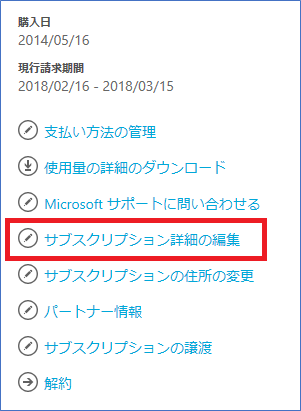
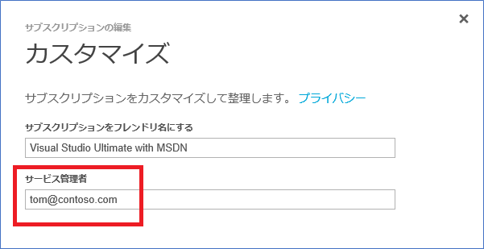
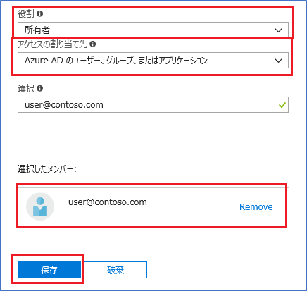
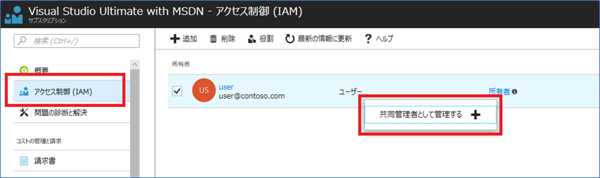

2018/3/14 現在

お客様の組織/体制の変更があった際に担当者を変更したい場合があると思います。本トピックでは各管理者を変更する方法についてご案内します。

※スクリーンショットは 2018/3/14 現在のものです。

本情報の内容（添付文書、リンク先などを含む）は、作成日時点でのものであり、予告なく変更される場合があります。

## アカウント管理者の変更方法

アカウント管理者とは、Azure の課金契約を管理しているアカウントです。変更をご希望の場合は、[Azure サブスクリプションの所有権の譲渡](https://docs.microsoft.com/ja-jp/azure/billing-subscription-transfer)のドキュメントをご参照の上、ご変更ください。

## サービス管理者の変更方法

サービス管理者はアカウント管理者によって変更することができます。サインアップ時の既定設定では、サービス管理者はアカウント管理者でもあります。 サービス管理者が別のユーザーに変更されると、アカウント管理者は、Azure Portal にアクセスできなくなります。 ただし、アカウント管理者はいつでもアカウント センターを使用して、サービス管理者を自身に戻すことができます。

変更の手順は下記のとおりです。

1.  [「サービス管理者を変更するための制限事項」](https://docs.microsoft.com/ja-jp/azure/billing/billing-add-change-azure-subscription-administrator#limits)を参照して、使用するシナリオがサポートされていることを確認してください。
2.  アカウント管理者として [Azure センター](https://account.windowsazure.com/subscriptions)にサインインします。
3.  サブスクリプションを選択します。
4.  右側にある \[サブスクリプション詳細の編集\] を選択します。

5\. **\[** サービス管理者 **\]** ボックスに、新しいサービス管理者の電子メール アドレスを入力します。

## 共同管理者の追加手順

Azure サブスクリプション サービス管理の共同管理者としてユーザーを追加するには、そのユーザーに、サブスクリプションの RBAC 所有者ロールを付与します。

変更の手順は下記のとおりです。

1.  [Azure Portal のサブスクリプション](https://portal.azure.com/#blade/Microsoft_Azure_Billing/SubscriptionsBlade)にアクセスします。
2.  アクセス権を付与するサブスクリプションを選択します。
3.  メニューから **\[** アクセス制御  **(IAM)\]** を選択します。
4.  **＋追加**をクリックしアクセス許可の追加を表示します。
5.  **\[** ロール **\]** ボックスで、**\[** 所有者 **\]** を選択します。
6.  **\[** アクセスの割り当て先 **\]** ボックスで、**\[Azure AD** **のユーザー、グループ、またはアプリケーション ****\] を選択します。
7.  **\[** 選択 **\]** ボックスに、所有者として追加するユーザーのメール アドレスを入力します。 ユーザーを選択し、**\[** 保存 **\]** を選択します。

8\. 追加した所有者ユーザーを**右クリック**し、**\[** 共同管理者として追加 **\]** を選択します。 **\[** 共同管理者として追加 **\]** オプションが表示されない場合は、ページを更新するか、別のインターネット ブラウザーを試してください。

**参考情報**

上記情報は以下のドキュメントにも記載されています。こちらも合わせてご参照いただければ幸いです。

-   [Azure サブスクリプション管理者を追加または変更する](https://docs.microsoft.com/ja-jp/azure/billing/billing-add-change-azure-subscription-administrator)

変更履歴

-   2014 年 10 月 18 日に、サービス管理者の追加方法にアクティブディレクトリへのユーザー追加手順を加えました。
-   2015 年 7 月 8 日 アカウント管理者の変更方法など変更に伴い更新
-   2018 年 3 月 14 日 Azure ポータルの変更に伴い更新

\--

Azure サポートチーム