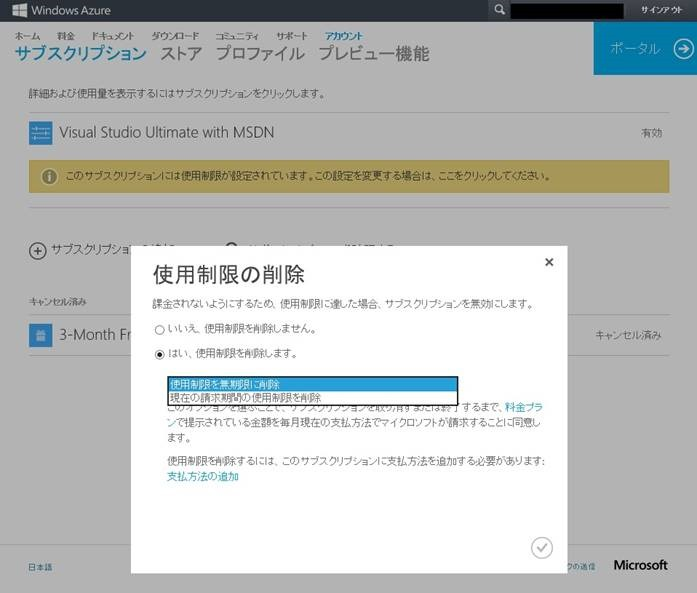
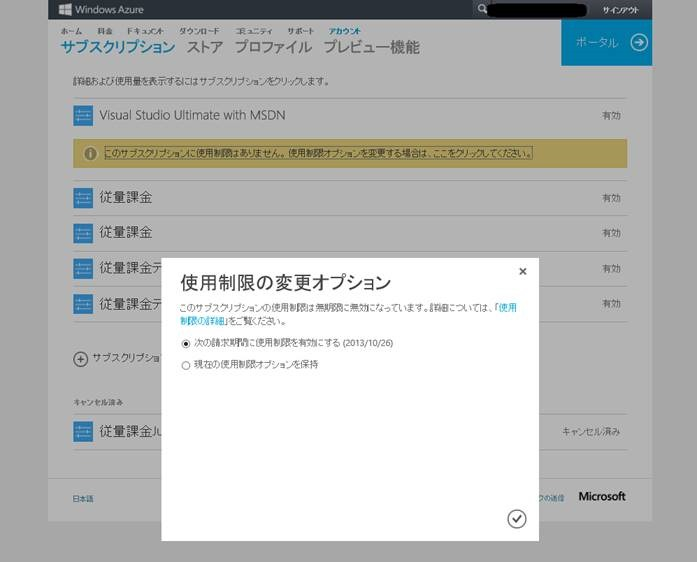

みなさんこんにちは、Windows Azure サポートチームです。最近のアカウントポータルのアップデートにより、MSDN, MPN (Microsoft Partner Network), BizSpark メンバー向けの Windows Azure サブスクリプションにおいて、使用制限を自由に設定することが可能となりました。

今回は、この使用制限の設定を変更する方法についてご紹介しようと思います。Windows Azure サブスクリプションの使用用途に合わせご活用いただけると幸いです。

## 使用制限とは

使用制限は、MSDN, MPN, BizSpark メンバー向けの Azure サブスクリプションに用意されている、月々利用可能なリソースを制限できる機能です。該当サブスクリプションには、特典で与えられた Azure 利用分（クジレット）を超過したリソースの利用に対する課金を防ぐために使用制限がかかっているため、特典で与えられた額以上を使うことはできません。このため、月々付与される Azure クレジットを超えるリソースの利用があった場合でも、課金が発生することはありません。

ただ、万が一 Azure クレジットを超える利用があった場合は、該当請求期間の間は、Azure サービスが無効化となります。使用制限機能を解除することで Azure サービスを再度利用できるようになりますが、その場合、課金が発生します。最近までは、一度この使用制限を外してしまうと、この機能を再び有効にすることはできませんでした。ただ、最近のアップデートにて、一度この使用制限を解除してしまっても、次の請求期間よりまたこの機能を元に戻すことができるようなりました。

次項にて、使用制限機能の設定を変更する手順をご案内します。

## 使用制限機能の設定を変更する方法

### 使用制限を解除する方法

1\. [アカウント ポータル](https://account.windowsazure.com/Subscriptions/)にアクセスし、ご利用の Microsoft アカウントでサインインします。

2\. メンバープランの下の「このサブスクリプションには使用制限が設定されています。この設定を変更する場合は、ここをクリックしてください」をクリックします。

3\. 「使用制限の削除」の画面が表示されますので、「はい、使用制限を削除します」をクリックし、以下のいずれかを選択します。

-   使用制限を無期限に解除
-   現在の請求期間の使用制限を削除

4\. 支払方法が登録されていない場合は、\[支払方法の追加\] より支払方法を追加します。

5\. チェックボタン (V) をクリックします。

Memo

手順 3. で「現在の請求期間の使用制限を削除」を選択しますと、使用制限機能は次の請求期間に再び有効化されます。

手順 4. で支払方法を追加する際、既定ではクレジットカードの支払方法のみが選択可能です。請求書払いをご要望の場合は、以下のサイトをご参照のうえ、お申し込みください。

-   [請求書払いへの変更申し込みについて](http://blogs.msdn.com/b/dsazurejp/archive/2013/06/27/azure-invoicing-process.aspx)

### 使用制限を再度有効にする方法

1\. [アカウント ポータル](https://account.windowsazure.com/Subscriptions/)にアクセスし、ご利用の Microsoft アカウントでサインインします。

2\. メンバープランの下の「このサブスクリプションに使用制限はありません。使用制限オプションを変更する場合は、ここをクリックしてください」をクリックします。

3\. 「使用制限の変更オプション」の画面が表示されますので、「次の請求期間に使用制限を有効にする」を選択し、チェックボタン (V) をクリックします。

Memo  
使用制限を解除した際に「現在の請求期間の使用制限を削除」を選択した場合は、使用制限は次の請求期間に自動的に有効化されます。現在の請求期間について使用制限を削除することはできません。

\--  
Windows Azure サポートチーム