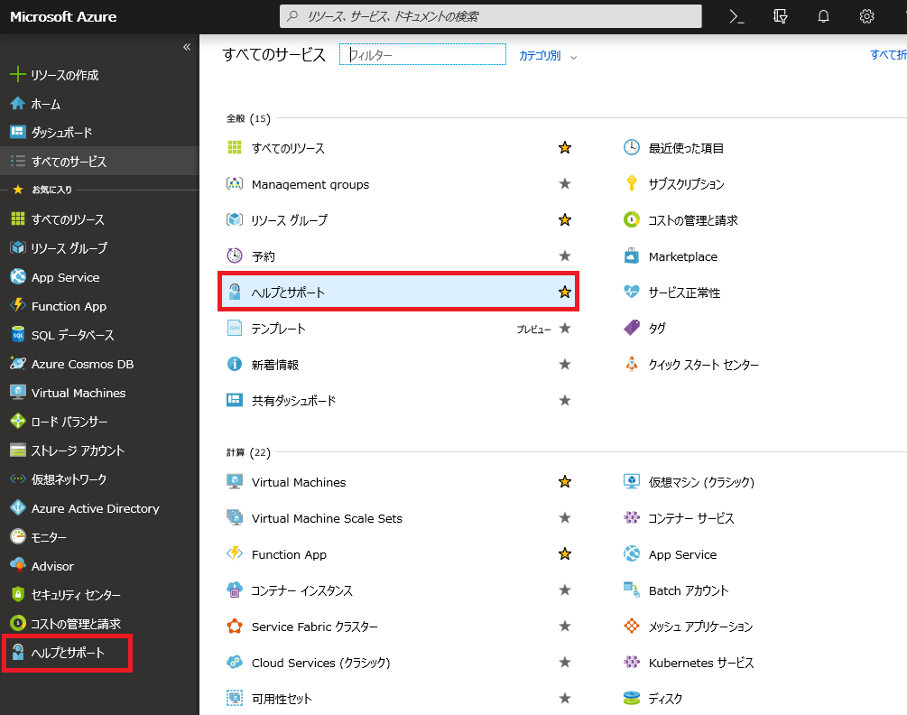
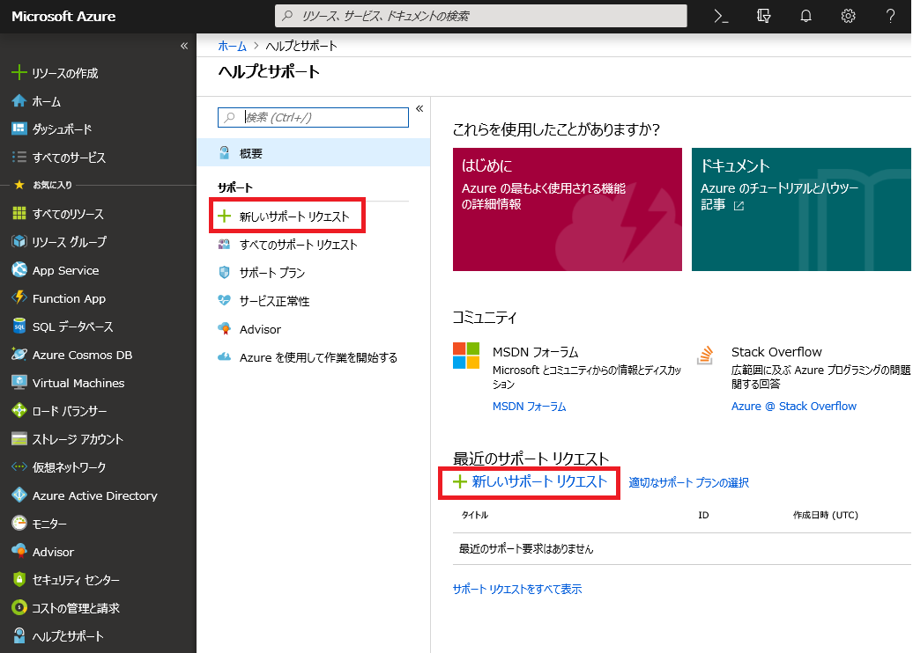
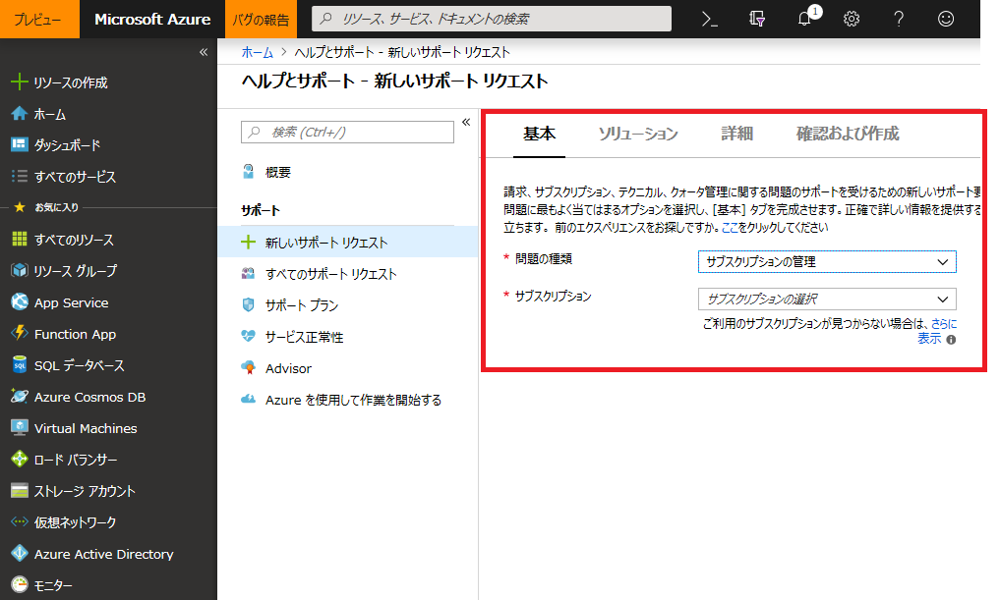
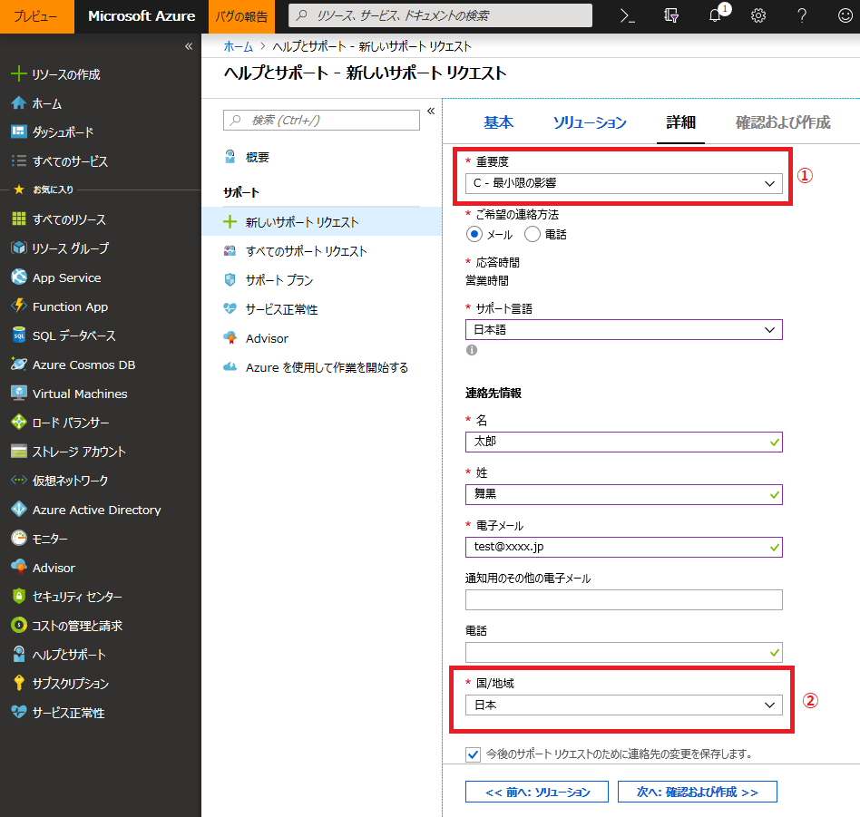
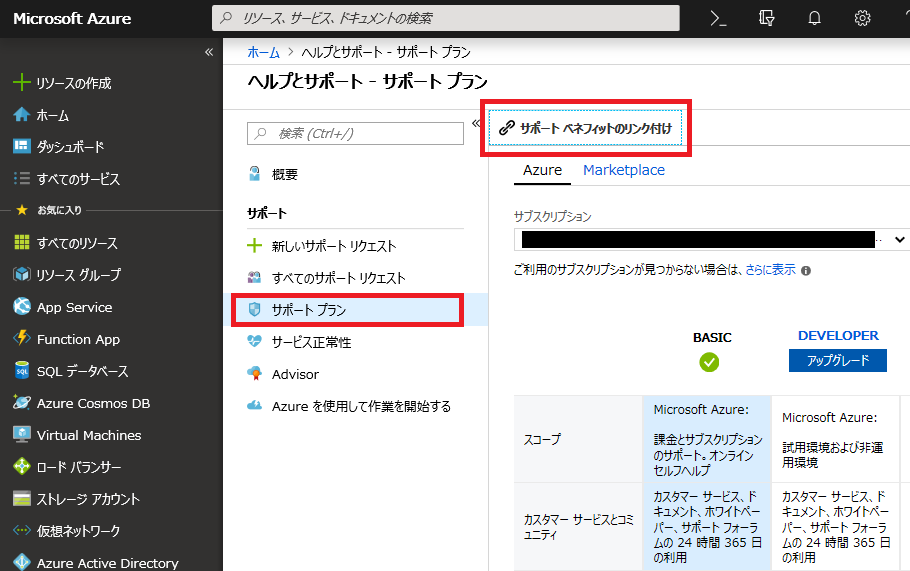
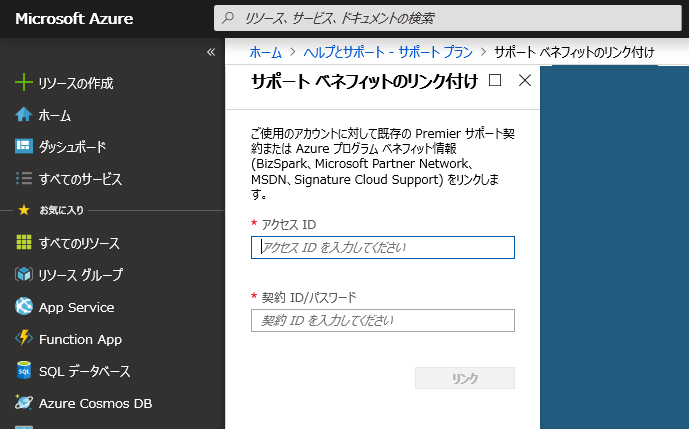
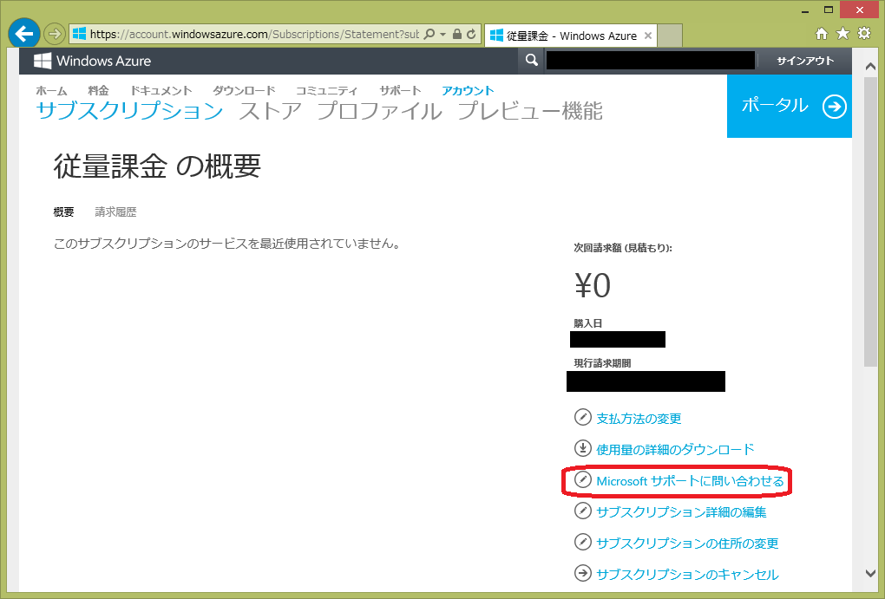

日々さまざまなお客様とお話をしていく中で、特に Azure の新規導入をご検討いただいているお客様から、「お問い合わせ先がわからない」という声をいただくことがあります。今回は、わたしたちサポートチームへのお問い合わせ方法についてご案内いたします。

※ 下記情報は 2019/01/31 現在のものになりますので、将来的には変更される可能性がございます。あらかじめご了承ください。

### **■ このドキュメントでご案内する内容**

1.  お問い合わせに関する情報
2.  ご契約前のお問い合わせ方法
3.  ご契約後のお問合せ可能な問題種類
4.  ご契約後のお問い合わせ方法
5.  補足 1 : メンバーシッププラン ( MSDN, MPN 等 ) を用いたお問い合わせについて
6.  補足 2 : アカウントポータルから「ヘルプ と サポート」画面に行く方法
7.  その他

### 1. お問い合わせに関する情報

お問い合わせ内容別に、問い合わせ方法が異なります。本ドキュメントと併せて、以下のお問い合わせ情報もご参照くださいませ。

-   「Azure のサポート」
    
    [<https://azure.microsoft.com/ja-jp/support/options/](https://azure.microsoft.com/ja-jp/support/options/)\>
    

-   「 Azure サポートに関する FAQ」
    
    [<https://azure.microsoft.com/ja-jp/support/faq/](https://azure.microsoft.com/ja-jp/support/faq/)\>
    

### **2. ご契約前のお問い合わせ方法**

以下のご質問のような、Azure サブスクリプションを契約する前のお問い合わせは「Azure 営業担当者に問い合わせる」<[https://azure.microsoft.com/ja-jp/overview/sales-number/](https://azure.microsoft.com/ja-jp/overview/sales-number/)\> よりお問い合わせください。

-   無料評価版はどうやって登録するの？
-   サブスクリプションがうまく登録できない
-   オンプレミスで運用中のシステムをクラウドに移行したいのですが、どの Azure プランが最適ですか？

### **3\. ご契約後のお問合せ可能な問題種類**

全てのサブスクリプションには、次のお問い合わせに対するサポートが無償で付帯しております。

-   請求関連
-   サブスクリプションの管理
-   クオータ (増加)

テクニカルなお問い合わせに関しましては有償サポートをご用意しております。

[サポートプランの比較](https://azure.microsoft.com/ja-jp/support/plans/)

### **4. ご契約後のお問い合わせ方法**

サブスクリプションご契約後のお問い合わせは Azure ポータル サイトより発行できます。ただし、お客様のアカウントは「サービス管理者 / 共同管理者」である必要があり、対象アカウントが「アカウント管理者」のみの場合はお問い合わせをあげられませんのでご注意ください。 (Azure で使用するアカウントの種類の詳細は[こちら](https://blogs.msdn.microsoft.com/dsazurejp/2013/10/02/303/)をご確認ください。)

1. [Azure ポータル](https://portal.azure.com/)にログインします。

2\. ブレードメニューの「ヘルプとサポート」、もしくは「すべてのサービス」で「ヘルプとサポート」を検索し、クリックします。

3\. いずれかの「新しいサポートリクエスト」をクリックします。

4\. 右側にお問い合わせる際の必要事項の選択、入力のペインが表示されるので、順次入力し、下にある\[次へ\] をクリックし、\[基本\] - \[ソリューション\] - \[詳細\] - \[確認および作成\] 画面を切り替えながらお問い合わせを作成してください。

**<\[詳細\]画面での注意事項>**

① \[重要度\]では以下の３つが選択可能です。

A - 重大な影響

B - 中程度の影響

C - 最小限の影響

通常は \[C - 最小限の影響\] を選択してください。

\[A - 重大な影響\] は緊急対応となります。サブスクリプションや課金に関するお問い合わせの際に \[A - 重大な影響\] を選択可能なシナリオは[こちら](https://blogs.msdn.microsoft.com/dsazurejp/2016/03/09/billing-seva-support/)をご覧ください。

\[技術（各種 Azure サービスについて）\] に関するお問い合わせで \[A - 重大な影響\] を利用するには STANDARD 以上の有償サポートが必要となります。

② \[国／地域\] は、必ず \[日本\] に設定してください。

### **5. 補足1: メンバーシッププラン(MSDN, MPN 等) を用いたお問い合わせについて**

Azure ポータルから MSDN や BizSpark などのサブスクリプションに含まれる、特典テクニカル サポートを利用して Azure の技術的な質問を行う場合には、以下の方法で事前に設定を行ってください。

**メンバーシッププランとサポート ベネフィットのリンク付け方法**

1.  Azure ポータル サイト ([https://portal.azure.com](https://portal.azure.com/)) へサインインします。
2.  \[ヘルプとサポート\] をクリックします。
3.  \[サポートリクエストの作成\] をクリックします。
4.  ブレードメニューで \[サポートプラン\]を選択します。
5.  上部に表示された \[サポート ベネフィットのリンク付け\] を選択します。

6.  \[サポート ベネフィットのリンク付け\] 画面が表示されるので \[アクセス ID \] \[契約 ID/パスワード\] を入力し \[リンク\] をクリックします。契約 ID とアクセス ID の先頭には **065** を付与してください。

**注意：** また、**MSDN 特典に付属のテクニカル サポート インシデント**につきましては、対象としては開発中の内容・製品のご質問に限定されます。運用中の製品や運用中の緊急対応については、お受けをしておりませんので予めご了承ください。

### **6\. 補足2: アカウントポータルから「ヘルプ と サポート」画面に行く方法**

1. [Azure アカウントポータル](https://account.windowsazure.com/Subscriptions)にログインします ( アカウント管理者のみがアクセス可能です)。サブスクリプションの一覧が表示されますので、お問い合わせを行う対象のサブスクリプションをクリックします。

2\. サブスクリプションの概要画面が表示されますので、画面右側「Microsoft サポートに問い合わせる」をクリックしてください。

### **7\. その他**

-   Azure サブスクリプション契約後のお問い合わせの際に、万が一ポータルからお問い合わせができない場合 (上記手順で失敗する場合)、下記のカスタマーサービスまでお問い合わせください。
    -   電話番号：**0120-41-6755**
    -   営業時間：**平日 9:00 - 17:30 (祝日および弊社指定休業日を除く)**
    -   お電話後、自動応答で 1 → 2 → 1 とお進みください。
        
        窓口につながりますので、「Windows Azure についてお問い合わせしたい」 とお伝えください。担当チームより折り返しご連絡いたします。
        
-   「技術的なお問い合わせ」 の場合には、別途サポートプランをご購入いただく必要がございます。詳細は[こちら](http://www.windowsazure.com/ja-jp/support/plans/)をご確認ください。

Azure サポートチーム一丸となって、皆様のご不明な点等を解消するべく、精一杯尽力させていただきますので、何かお困りの際にはぜひお気軽にお問い合わせください。

\--

Microsoft Azure  サポートチーム