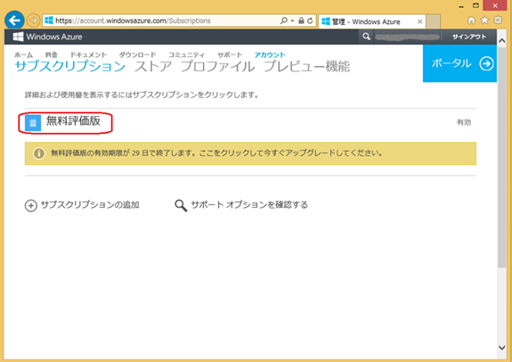
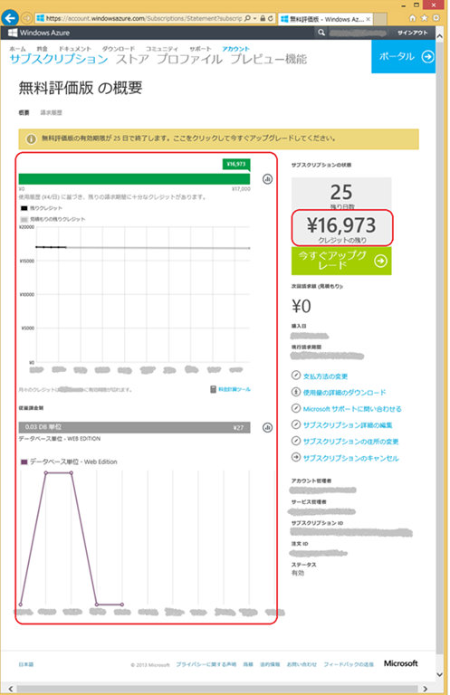
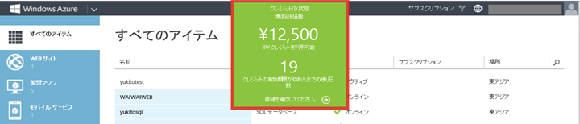

みなさん、こんにちは。Windows Azure サポートチームです。

今回は、無料評価版をご利用頂いているお客様から比較的よくお問い合わせ頂く、無料評価版のクレジットについてご紹介します。みなさんが安心して無料評価版をご利用頂けるように、少しでもお役に立てればと思います。

※この記事は 2014 年 2 月 20 日時点の情報を基に作成しており、記載内容は将来的に変更になる場合もございます。予めご了承ください。

## クレジットとは

クレジットとは、Windows Azure をご利用頂くためのプリペイドカードのようなものとお考えください。Windows Azure の課金金額は、ご利用のサービスとそのサービスの利用方法や稼働時間に応じて計算され、クレジットから支払われます。無料評価版をご利用頂いている場合、クレジットの残高は初期状態で \\ 20,500 になっていますが、この \\ 20,500 はマイクロソフトから無償で提供されるものであり、お客様にお支払をお願いするものではありませんので、ご安心ください。

## アカウントポータル上でのクレジットの確認方法

無料評価版のご利用期間中は、\\ 20,500 の範囲内であればご自由に Windows Azure をご利用頂けます。日ごとの課金状況やクレジットの残りを確認する場合は、以下の手順で確認することができます。

1\. [Windows Azure アカウントポータル](https://account.windowsazure.com/Subscriptions) にログインします。

2\. サブスクリプションの一覧が表示されますので、**\[無料評価版\]**をクリックします。

3\. サブスクリプションの概要が表示され、日ごとの課金状況とクレジットの残りを確認すことができます。

**NOTE**

[管理ポータル](https://manage.windowsazure.com/)上でもクレジットの状態を確認することが可能です。

\---

Windows Azure サポートチーム
