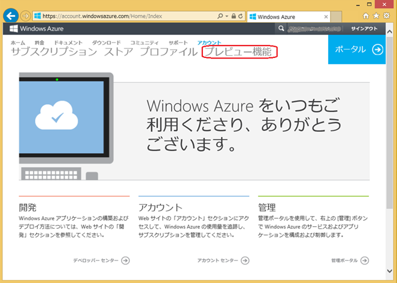
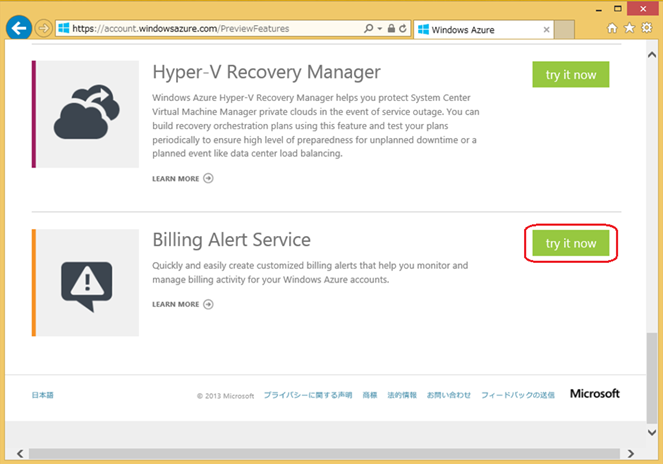
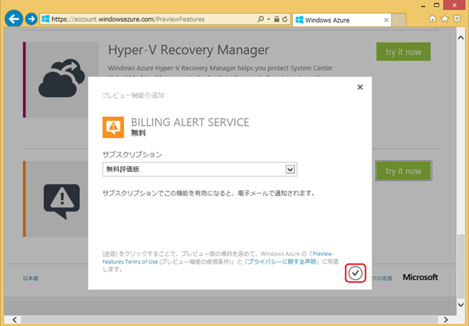
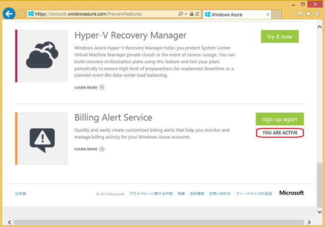
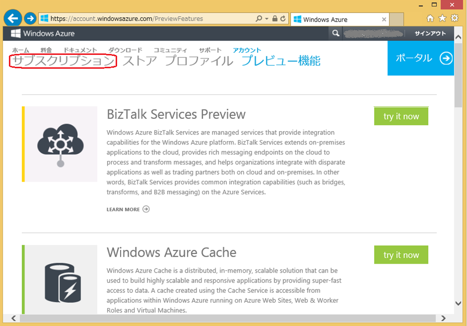
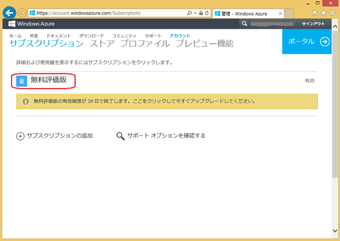
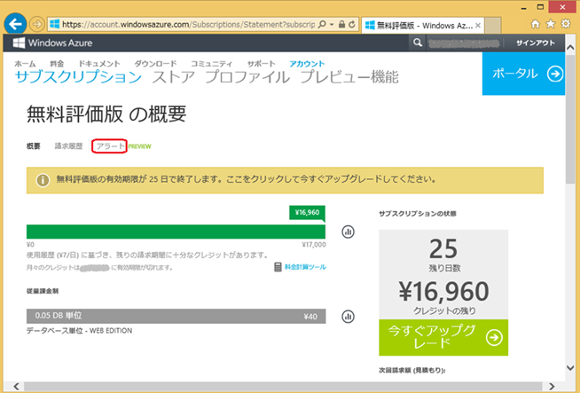
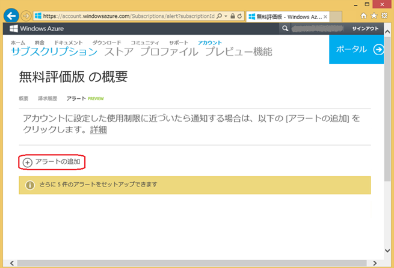
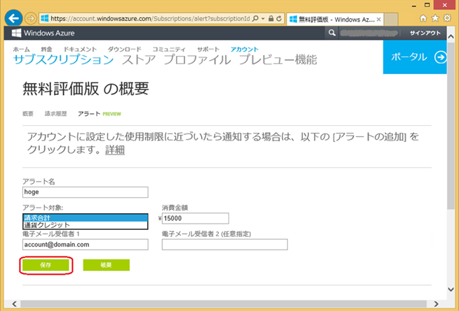
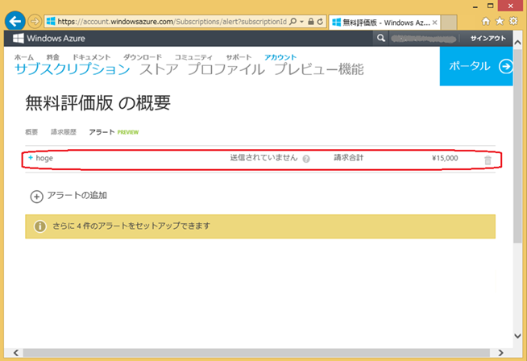

みなさん、こんにちは。Windows Azure サポートチームです。

突然ですが、質問です。みなさんは、Windows Azure の課金金額が予算を超えないか、心配に思ったことはないでしょうか？ Windows Azure はご利用頂いた分だけお支払い頂く課金ルールなので、余分なコストを削減できる反面、利用料が定額にならないのが心配だというお客様もいらっしゃると思います。今回は、Windows Azure を安心してご利用頂くために、お客様に代わって課金状況を監視する「Billing Alert Service」とその設定方法についてご紹介します。

※この記事は 2013 年 12 月 6 日時点の情報を基に作成しており、記載内容は将来的に変更になる場合もございます。予めご了承ください。

※Billing Alert Service は現在プレビュー機能ですので、ご質問等は Azure フォーラムのみで承っております。予めご了承ください。

-   Azure フォーラム

> [http://social.msdn.microsoft.com/Forums/ja-JP/home?forum=windowsazureja](http://social.msdn.microsoft.com/Forums/ja-JP/home?forum=windowsazureja)

## Billing Alert Service とは

「Billing Alert Service」とは、Windows Azure の課金状況を監視し、お客様が事前に設定した条件と課金状況が合致した場合に、メールで通知を行うサービスです。例えば、課金金額合計を月額 17,000 円以内に抑えたいから、請求金額合計が 15,000 円を超えた場合にメールで通知を受け取るといったことが可能です。また、Azure クレジット (無料枠) が 1,000 円を切った場合にメール通知を受け取るといったことも可能です。

## Billing Alert Service の有効化方法について

Billing Alert Service は現在プレビュー機能の一つです。このため、初期状態では、当該機能は有効になっていません。Billing Alert Service をご利用頂く場合には、まず始めに、以下の手順で有効化を行う必要があります。

1\. [Windows Azure アカウントポータル](https://account.windowsazure.com/Home/Index)にログインし、上部 ２ 段目に表示される **\[プレビュー機能\]**をクリックします。

※サインアウトしている場合は、右上の **\[サインイン\]**をクリックして、Microsoft アカウントでサインインしてください。

2\. プレビュー機能の一覧に Billing Alert Service が表示されますので、**\[try it now\]** をクリックします。

3\. プレビュー機能の追加確認が表示されますので、対象のサブスクリプションを選択し、 をクリックします。

※ 当該サービスは、サブスクリプションごとに適用します。

4\. Billing Alert Service が有効化され、プレビュー機能一覧の Billing Alert Service の欄に **\[YOU ARE ACTIVE\]** と表示されていることが確認できます。

## Billing Alert Service の設定方法について

Billing Alert Service を有効化したら、次に、以下の手順で Billing Alert Service のアラートの設定を行います。以下では、例として、請求金額の合計が 15,000 円になると、指定したメールアドレスに通知メールが届くアラートを作成しています。

1\. 上部 ２ 段目に表示さている **\[サブスクリプション\]** をクリックします。

※上記は「Billing Alert Service の有効化方法について」の手順 4. の続きで操作する場合です。それ以外の場合は、[Windows Azure アカウントポータル](https://account.windowsazure.com/Home/Index)にログインして、上部 ２ 段目に表示される **\[サブスクリプション\]** をクリックします。

2\. サブスクリプションの一覧が表示されますので、当該サービスをアクティブ化した **\[サブスクリプション\]** をクリックします。

3\. サブスクリプションの概要の上部のメニューに表示されている **\[アラート\]** をクリックします。

4\. 続いて **\[アラートの追加\]** をクリックします。

5\. アラートの設定項目が表示されますので、必要事項を入力し、**\[保存\]** をクリックします。アラート対象は「請求合計」と「 通貨クレジット 」 (クレジットの残り) の ２ つから選ぶことができます。

6\. 作成したアラートがアラート一覧に表示されていることが確認できます。

このように、Billing Alert Service は簡単に有効化とアラートの設定ができますので、是非ご活用いただけますと幸いです。

\--

Windows Azure サポートチーム
