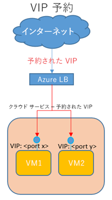

本トピックでは、昨年正式リリースされました Microsoft Azure の「予約済み IP アドレス」 の料金の仕組みについてご案内します。

## 予約済み IP アドレスの概要

「予約済み IP アドレス」 とは、仮想マシン・クラウドサービスの配置に割り当てることのできる、事前取得した静的な IP アドレスです。通常、仮想マシン・クラウドサービスに割り当てられるインターネットに公開される仮想 IP アドレスは、Azure 上にプールされている IP アドレスプールから自動的に割り当てがされます。そのため、仮想マシン・クラウドサービスの配置を削除すると、この仮想 IP アドレスは解放されてしまいます。しかし、この「予約済み IP アドレス」をつかうことで、Azure 上でパブリックな仮想 IP アドレス（ VIP ）を前もって予約しておき、仮想マシン・クラウドサービスを配置する際に設定することで、事前に予約しておいた 仮想 IP を割り当てることができます。

現在、予約済み IP アドレスは 仮想 IP にのみ使用でき、規定では、サブスクリプションあたり最大 5 個の 予約済み IP アドレスをご利用可能です。また、予約済み IP アドレスは固定ですが、一度クラウドサービスと関連付けると、関連付けを解除しない限り変更されません。なお、仮想マシンのシナリオでは、クラウドサービスのすべての VM が停止/割り当て解除された場合でも、予約済み IP アドレスはクラウド サービスと関連付けられたままです。

予約済み IP アドレスは、上記の通り既定ではサブスクリプションあたり 5 個が設定されていますが、5 個以上のご利用をしたい場合には、Microsoft Azure サポートサービスの課金サポートまでご相談ください。ご要望の際に提出いただく内容次第となりますが、審査をしたうえで、増加することも可能です。（ただし、審査の結果、増加できない場合もございますのでご了承ください）

## 予約済み IP の料金について

予約済み IP アドレスは、割り当てがされている仮想マシン・クラウドサービスの状態が「使用／実行中」の場合にのみ 「最初の５つまでは無料」です。仮想マシンの状態が「"停止済みかつ割り当て解除済み" の状態である場合」は、予約済み IP アドレスは「未使用」状態として、１時間単位で、少額の料金が課金されます。

-   **例１：予約済み IP アドレスを 1 つ割り当て、それを稼働中のクラウドサービスに割り当て  
    **⇒ この場合割り当てた１つの予約済み IP アドレスは無料です。
-   **例２：予約済み IP アドレスを 3 つ割り当て、それを稼働中の仮想マシン２台に割り当て、１つの予約済み IP アドレスは未使用  
    **⇒ 稼働中の仮想マシンに割り当てた 2 つの予約済み IP アドレスは無料。割り当てられていない予約済み IP アドレスには課金 (未使用時の予約料金) が発生します。
-   **例３：予約済み IP アドレスを 3 つ割り当て、それを稼働中の仮想マシン２台に割り当て、停止済み（割り当て解除済み）の仮想マシン１台に割り当てる  
    **⇒ 稼働中の仮想マシンに割り当てた 2 つの予約済み IP アドレスは無料。停止済み仮想マシンに割り当てられた予約済み IP アドレスには、課金（未使用時の予約料金）が発生します。

基本的な考え方として、IP リソースには限りがありますので、利用されていないものに関しては課金をさせていただいております。価格の詳細については、予約済み IP アドレスの[料金詳細](http://azure.microsoft.com/ja-jp/pricing/details/ip-addresses/)をご参照ください。仮想マシンの状態は、Microsoft Azure 管理ポータルの \[仮想マシン\] の状態、または VM ダッシュボードで確認できます。

◆補足: [料金詳細](http://azure.microsoft.com/ja-jp/pricing/details/ip-addresses/)ページの「その他の予約済み IP アドレス」の記述について◆

予約済み IP の料金テーブルにある「その他の予約済み IP アドレス」の文言は以下を示しています。

-   **予約済み** **IP** **アドレス ****:**  6 個目以降の予約済み IP アドレス
-   **IP** **アドレス** **リマップ:** 101 個目以降の IP アドレス リマップ

\--  
Windows Azure サポートチーム