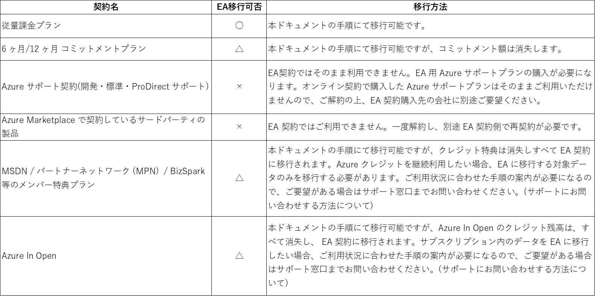
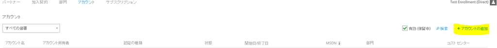
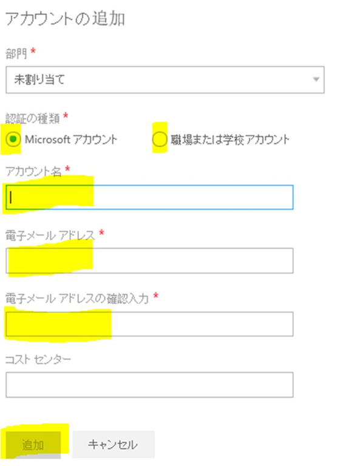
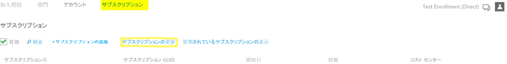

通常の従量課金などのポータルで有効化できる契約 (以下 オンライン契約) から、エンタープライズ契約 (以下 EA 契約) に変更したいことがあります。本ドキュメントでは、オンライン契約から EA 契約への移行方法についてご案内します。

## 事前知識

EA 契約移行作業にあたり、作業が必要な各担当者は以下の通りです。

エンタープライズ管理者
EA 契約全体を管理する権限があります。エンタープライズポータルでは、すべての権限があり、各アカウント管理者の追加・削除などが可能です。
EA 契約書上の 「通知連絡先およびオンライン管理者」 のメールアドレスが、既定のエンタープライズ管理者アカウントです。

アカウント管理者
EA 契約に登録されたアカウント管理者です。各アカウント管理者は、EA 契約下でのサブスクリプションの新規作成・削除などが可能です。エンタープライズポータル上では、自身の管理するサブスクリプションのみに管理権限があります。

## 注意点

-   本ドキュメントの手順を実施すると、移行対象のオンライン契約のアカウント管理者アカウントに紐づく全ての既存サブスクリプションが EA 契約に移行されます。
-   既存契約からそのまま EA 契約に移行できない場合がございます。詳細については、以下表をご参照ください。

## EA 契約の有効化

EA 契約は、購入したばかりの状態では有効化されていません。EA 契約を有効化後、お客様側で利用可能になります。EA 契約の有効化作業を実施していない場合は、以下の手順で、EA 契約を有効化してください。既に有効化されている場合は、次項 \[移行手順\] にお進みください。

EA 契約の有効化手順

1.  「Microsoft Azure サービス有効化のご案内 (間接)」のメールを受信します。
2.  メール内容を確認の上、[エンタープライズポータル](https://ea.azure.com/v1)に、エンタープライズ管理者アカウントでサインインします。
3.  サインインが完了すると、お客様の EA 契約が有効化され、ご利用開始になります。

※もし、「有効化のご案内」メールが届いていない場合には、サポート窓口までお知らせください。

## オンライン契約から EA 契約への移行手順

1.  **エンタープライズ管理者 & アカウント管理者**：事前準備
    
    本ドキュメントを事前に確認いただき、移行の注意点と全体の流れを確認ください。
    

**エンタープライズ管理者**：アカウント管理者の登録

1.  [エンタープライズポータル](https://ea.azure.com/v1) に、エンタープライズ管理者でサインインします。
2.  エンタープライズポータル画面左側の管理欄より、画面中央の 「アカウント」 をクリックします。
3.  「アカウントの追加」 をクリックします。

4.  アカウントの追加画面より、EA 契約に移行したい、オンライン契約をお持ちのアカウント管理者情報を入力します。「アカウント名」 は、お客様で任意のお名前を設定可能です (「○○開発用」 / 「○○運用用」 など)。「追加」をクリックすると、新規にアカウントが追加されます。

補足：「組織アカウント」 とは、Office 365 等で作成したアカウントのことです。

1.  **アカウント管理者** ： EA アカウントの有効化と移行作業
    1.  前手順のアカウント管理者の登録後、[エンタープライズポータル](https://ea.azure.com/v1) に前手順で EA 契約に登録したアカウントでサインインします。
    2.  サインインが完了すると、EA 契約のアカウント管理者として正式に有効化され、アカウント管理者が所有するオンライン契約のサブスクリプションの EA 契約の移行作業が走ります。
        
        ※ エンタープライズポータル上で、サブスクリプション情報が表示されるまで、移行時間を要する場合があります。(1 時間程度)
        
    3.  しばらくすると 「サブスクリプション欄」 の 「サブスクリプションの更新」 をクリックすると、サブスクリプション情報が表示されます。
        
        

\--

Microsoft Azure サポートチーム