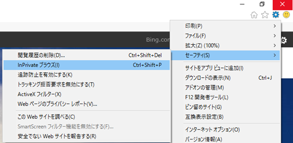
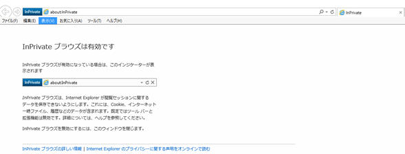
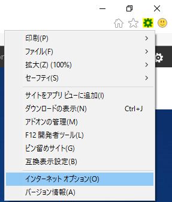
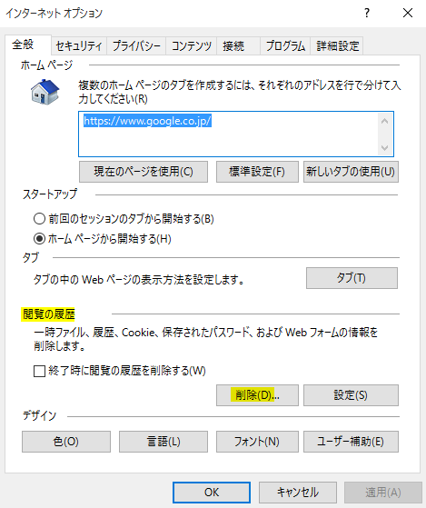
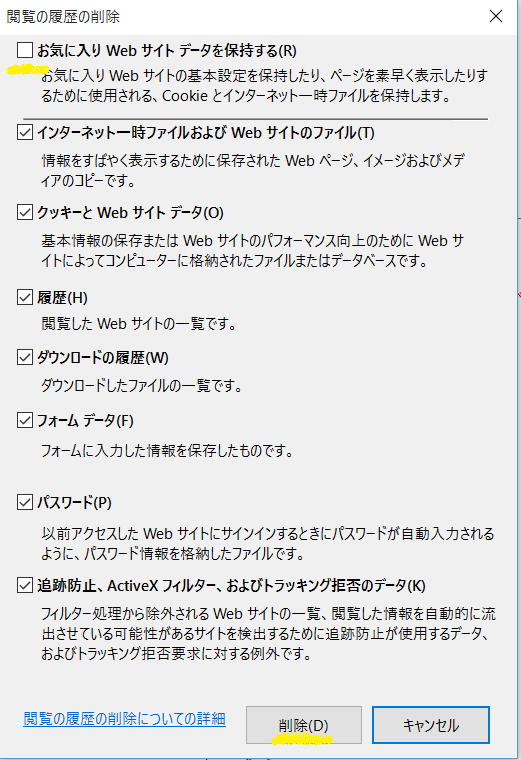
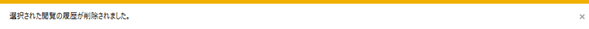

本トピックでは、もし、Microsoft Azure ポータルへのサインイン失敗や情報取得エラーなど生じた場合に、Internet Explorer でお試し頂きたい事前確認事項をご案内します。問題切り分けの一助としていただけますと幸いです。

## **InPrivate** **ブラウズ**

InPrivate ブラウズモードは、既存のセッション、キャッシュ情報等を読み込まず、新規のセッション情報で通信を行います。このため、既存の情報に影響を受けずにサイトの閲覧、ダウンロードなどが行えます。

**1\. Internet Explorer 画面右上のアイコンより、 \[セーフティ\] をクリックし、 \[InPrivate ブラウズ\] をクリックします。**

**2\. InPrivate ブラウズが表示されますので、画面上部に 対象の URL を入力し、アクセスします。**

## **閲覧の履歴（キャッシュ）の削除**

もし既存のセッションやキャッシュ情報等を手動で削除する場合は、以下をお試しください。

<注意事項>

キャッシュ削除の操作は、Microsoft Azure ポータル以外の Web サイトのキャッシュも削除します。Internet Explorer が保持しているすべての履歴やキャッシュが削除されますので、ご注意ください。もし、他サイトのキャッシュや履歴を消したくない場合は、この手順は取らないでください。

**1\. Internet Explorer を起動し、画面右上のアイコンから、\[インターネットオプション\] をクリックします。**

**2\. \[閲覧の履歴\] の \[削除\] をクリックします。**

**3\. 必要な場合、既定の削除対象を調整し、\[削除\] をクリックします。**

**※Cookie と一時ファイルを完全に削除するために、\[お気に入り Web サイト データを保持する\] のチェックは外してください。**

**4\. 閲覧の履歴の削除が完了すると、ブラウザーの下に、\[選択された閲覧の履歴が削除されました。\] と表示されます。**

**5\. 画面上部に 対象の URL を入力し、アクセスします。**

## **その他お試しいただきたいこと**

もし可能な場合、以下もお試しください。

**● 別の種類のブラウザー ※ でお試し頂く。**

-   ※1: Microsoft Edge をお使いの場合は、\[…\] (他の動作) ボタンをクリックし、\[新しい InPrivate ウィンドウ\] をクリックしてください。
-   ※2: Google Chrome をお使いの場合は InPrivate ブラウズモードと同等の機能として、シークレット モードがあります。シークレット モードでブラウザーを開くには、\[Google Chrome の設定\] – \[シークレット ウィンドウを開く\] をクリックしてください。

**● 別 PC のブラウザーでお試し頂く。**

\--  
Microsoft Azure サポートチーム