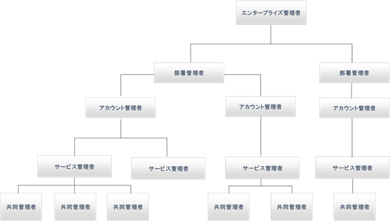
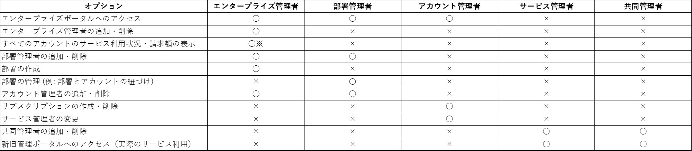

みなさんこんにちは、Microsoft Azure　サポートチームです。今回は、エンタープライズ加入契約 (以下 EA 契約) に登場する各管理者について「どのような管理者がいるのか」「各管理者はどのようなことができるのか」をご案内します。

※本トピックは 2018 年　3 月時点の情報です。将来的に情報が変わる可能性がありますのでご了承ください。

## **EA**契約の管理者の種類

Microsoft Azure EA 契約には、5 種類の異なる役割を持った管理者がいます。このうち、EA 契約に特化した管理者は「エンタープライズ管理者」と「部署管理者」となります。「アカウント管理者」、「サービス管理者」、「共同管理者」は、無料評価版・従量課金・コミットメントプランなどのオンライン契約でも利用される管理者となります。

-   **エンタープライズ管理者** **-** EA　契約の全体管理者で、部署管理者やアカウント管理者を管理するように指定された Microsoft アカウント / 組織アカウント。複数登録可。
-   **部署管理者** \- 部署を管理、新しいアカウント管理者を作成・管理するように指定された Microsoft アカウント / 組織アカウント。 複数登録可。
-   **アカウント管理者** \- サブスクリプションとサービス管理者を管理する Microsoft アカウント / 組織アカウント。複数登録可。
-   **サービス管理者** \- Windows Azure の各種サービスを利用するための管理者 (Microsoft アカウント / 組織アカウント)。サブスクリプション毎に 1 アカウントのみ登録可。
-   **共同管理者** \- Windows Azure の各種サービスを利用するための管理者 (Microsoft アカウント / 組織アカウント)。サブスクリプション毎に複数登録可。

各関係者の関係は次の図のようになります。

## **各管理者が実施できるオプション**

各管理者が実施できるオプションは、以下の通りです。

※利用金額は、パートナーより情報開示されているときのみ参照可能。

**NOTE**:

-   エンタープライズ管理者は複数登録いただけます
-   EA 契約の有償サポートプランは、契約に紐づくすべてのサブスクリプションにて利用可能です。
-   1 つのアカウントを、エンタープライズ管理者とアカウント管理者の両方に割り当てることができます
-   １ つのサブスクリプションに対し、複数のアカウント管理者は登録できません
-   初期設定では、アカウント管理者がそのままサービス管理者になっています
-   アカウント管理者とサブスクリプションの紐付きをお客様側で変更することはできません。ご希望の場合はサポートサービスまでお問い合わせください。(※ご変更いただけない場合がございます旨、予めご了承ください）

## **補足** **1**： 各ポータルサイト **URL**

関連のポータルサイトの各 URL は以下の通りです。

-   アカウントポータル <[https://account.azure.com/Subscriptions](https://account.azure.com/Subscriptions)\>
-   新旧管理ポータル <[https://portal.azure.com](https://portal.azure.com/ "新管理ポータル")\>, <[https://manage.windowsazure.com](https://manage.windowsazure.com/ "管理ポータル")\>
-   エンタープライズポータル <[https://ea.azure.com](https://ea.azure.com/ "EAポータル")\>

## **補足** **2**： **EA** **契約用** **Azure** **サブスクリプションの作成方法**

EA 契約用の Azure サブスクリプションは、オンライン契約のものと同様に、アカウントポータルより作成が可能です。以下の手順にて、エンタープライズ ポータルよりサブスクリプションを作成することも可能ですので、お試しくださいませ。

**<エンタープライズ ポータルよりサブスクリプションを作成する手順>**

1.  アカウント管理者で[エンタープライズ ポータル](https://ea.azure.com/)にログインします。
2.  左ペインの \[Manage\] タブを選択し、上部のリボンの \[サブスクリプション\] に移動します。
3.  \[ + サブスクリプションの追加\] をクリックします。
4.  アカウントポータルに遷移しますので、手順に沿ってサブスクリプションを作成します。

※初めてアカウントにサブスクリプションを追加する場合、連絡先情報を入力する必要があります。

**NOTE:** サブスクリプションを新しく追加すると、常に "Microsoft Azure エンタープライズ" という既定の名前が付きます。

\--

Microsoft Azure サポートチーム