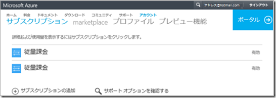
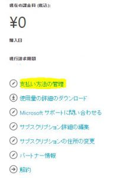
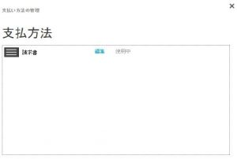
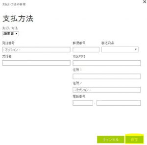
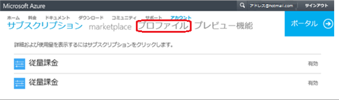
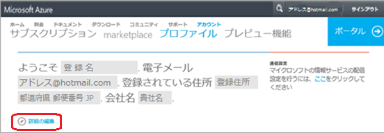
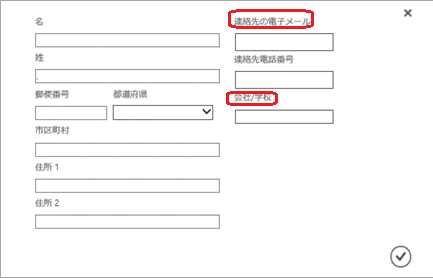

みなさんこんにちは、Microsoft Azure サポートチームです。今回は、Azure オンライン請求書上の住所等の情報を変更したいというお話しをお客様からいただく機会が多いことから、請求書に反映される情報の変更方法についてをご案内します。

※この記事は 2015 年 11 月時点の情報を基に作成しており、内容および手順は将来的に変わる可能性がございます。予めご了承ください。

## 請求書 1  ページ目 【請求先】 情報の変更方法

請求書 1 ページ目の右上【請求先】 には、[アカウントポータル](https://account.windowsazure.com/Subscriptions/)の \[支払方法の変更\] にご登録いただいた\[住所\]・\[宛先\] が反映されます。\[会社名\] の変更については、次項 \[請求書 2 ページ目 【販売先】 情報変更方法\] をご参照ください。

**\[住所\]・\[宛先\] 情報の変更方法**

1\. [アカウントポータル](https://account.windowsazure.com/Subscriptions/)の該当サブスクリプションをクリックします。

2\. 概要ページが表示されたら右側の \[支払方法の管理\] をクリックします。

3\. \[支払い方法の管理\] ウィンドウが表示されましたら、\[編集\] をクリックします。 

4\. 編集画面が開きましたら、請求書 １ページ目の 【請求先】 へ反映させたい \[住所\] と \[宛先\] を入力し、入力完了後 \[保存\] をクリックます。

※ 発注 番号は、請求書払いのサブスクリプションを複数ご利用の際などに識別できる番号です。任意となっておりますので、必要に応じてご登録をお願いします。

※ 請求書払いの \[宛先\] は下図の \[受信者\] の情報が反映されます。ご希望の会社名等を入力ください。

※ クレジットカード払いの \[宛先\]は、ご登録いただいているクレジットカードカードの名義人様のお名前が反映されます。

※ 【請求先】 の \[会社名\] の変更方法につきましては、次項 \[請求書 2 ページ目 【販売先】 情報変更方法\] をご参照ください。

例）請求書払いの支払い方法の管理画面

例）クレジットカード払いの支払い方法の管理画面

## 請求書 2 ページ目 【販売先】 情報の変更方法

請求書 2 ページ目の 【販売先】 には、[アカウントポータル](https://account.windowsazure.com/Subscriptions/)の \[プロファイル\] に登録いただいた\[住所\]・\[宛先\] ・\[会社名\] が反映されます。

**\[**住所\]・\[宛先\]・\[会社名\] 情報変更方法 

1\. アカウントポータル上部の \[プロファイル\] をクリックします。

2\. \[ようこそ\] から始まる画面が表示されたら、青字の \[詳細の編集\] をクリックします。

3\. 名前や住所等の登録画面が表示されたら、\[名\] の項目に反映されたい情報を入力、\[住所 1 \]･\[住所 2 \]･ \[組織\]（会社名）を入力し、更新完了後、右下のチェックをクリックします。

※ 請求書 2 ページ目の 【販売先】 の宛先には \[名\] のみが反映されますので、反映されたいお名前をフルネームでご入力ください。

※ 記号英数字ならびに環境依存文字をご入力いただくと、正常に請求書に反映されませんのでご注意ください。

※ \[連絡先の電子メール\] 宛に請求書発行通知メールが配信されます。

**<**重要>

-   ご変更いただいた情報の反映は、変更いただいた後の発行請求書より適用されます。
-   請求書の再発行はいたしかねますので、ご了承ください。

\--

Microsoft Azure サポートチーム