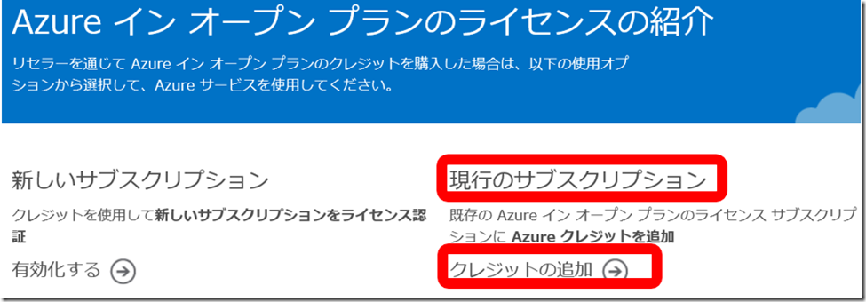
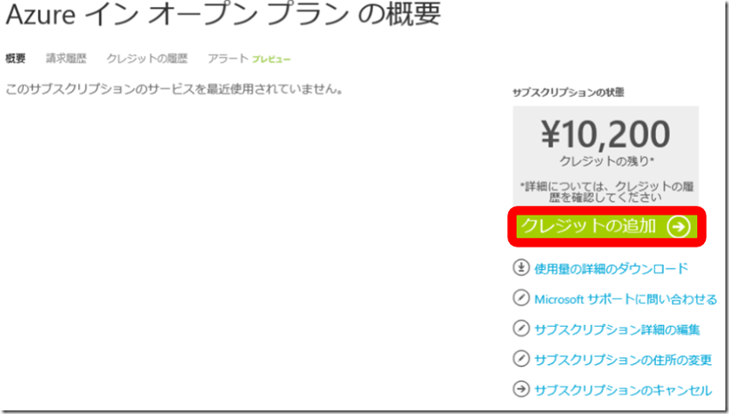
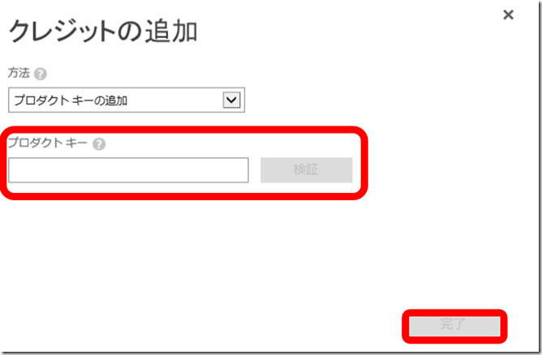
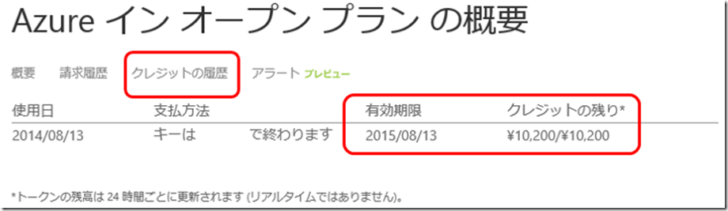
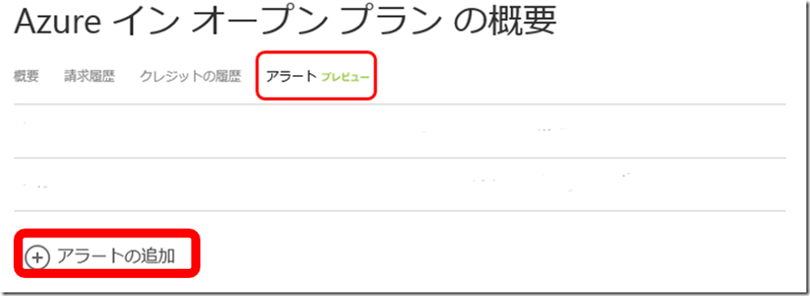

※ 2016 年 3 月時点の情報をもとに記載しています。

今回は、すでに　Azure イン オープン プランのサブスクリプションをご契約いただいているお客様が、追加購入いただいたクレジットを、既存のサブスクリプションに、追加する手順をご紹介いたします。

実際にクレジットを追加するための手順は、以下の項目をご参考に実施いただけますと幸いです。

## **■  1. 既存のAzure イン オープンサブスクリプションへのクレジット追加方法**

以下のサイトにアクセスして、\[**現状のサブスクリプション**\] - \[**クレジットの追加**\] よりお手続きをお願いいたします。

Title ： Azure インオープンプラン のライセンスの紹介

URL : [https://azure.microsoft.com/ja-jp/offers/ms-azr-0111p/](https://azure.microsoft.com/ja-jp/offers/ms-azr-0111p/)

もしくは、以下のアカウントポータルのサブスクリプション欄 より、<手順> 2. にお進みください。

URL : [https://account.windowsazure.com/Subscriptions](https://account.windowsazure.com/Subscriptions)

**<**手順>

１．上記サイト [https://azure.microsoft.com/ja-jp/offers/ms-azr-0111p/](https://azure.microsoft.com/ja-jp/offers/ms-azr-0111p/) にアクセスし、\[**現行のサブスクリプション**\] - \[**クレジットの追加**\]　をクリックし、アカウント管理者として、サインインします。

2 ．ご利用いただいているサブスクリプションの一覧ページより、クレジット追加対象の Azure インオープンのサブスクリプションをクリックします。

3 ． Azure インオープンプランサブスクリプションの概要ページ画面右横、黄緑色の \[**クレジットの追加**\] をクリックします。

4 ． \[**クレジットの追加**\] ウィンドウが表示されます。

購入いただいたプロダクトキー (OSA キー) の入力と検証後、ウィンドウ右下の \[**完了**\] をクリックします。

以上で、既存の Azure インオープンプラン サブスクリプションへのクレジットの追加は完了です。

## ■  2. Azure イン オープン プラン の クレジット状況の確認方法

ご利用の Azure イン オープン プランの、現在のクレジット残高や有効期限など、クレジットの状況については、以下の手順で確認いただけます。

正常に追加が完了したか、などのご確認にご利用いただけますので、ぜひご活用ください。

**<**手順>

1\. \[1. Azure インオープンプラン クレジット追加方法\] の項番 3. で表示した \[Azure インオープンプラン の概要\] のページを表示します。

2\. \[Azure インオープンプランの概要\]の下、 \[**クレジットの履歴**\] をクリックし、\[**有効期限**\] や \[**クレジットの残り**\] などを確認します。

## **■ 3. Azure イン オープン プラン アラート設定方法**

Azure インオープン プランは、クレジット残高が 0 になると、クレジットを追加購入いただくまでサブスクリプションが停止してしまいます。

また、クレジットの購入は、リセラー様経由となりますが、キー発効までに 1 週間ほどお時間がかかる状況です。

そこで、気づかないうちにクレジットがなくなってしまった、などの状況を未然に防ぐために、クレジットが切れる前にアラートが通知されるように設定をしていただくことをお勧めいたします。

メールによるアラート通知となりますので、ぜひ設定いただき、ご活用ください。

<注意事項>

現時点で、アラート機能は、プレビュー中です。この点を予めご了承の上、ご活用ください。

**<**手順>

1\. \[1. Azure インオープンプラン クレジット追加方法\] の項番 3. で表示した \[Azure インオープンプラン の概要\] のページを表示します。

2\. \[Azure インオープンプランの概要\]の下、\[**アラート**\] をクリックし、画面左下 \[**アラートの追加**\] をクリックして設定を行います。

## **■ 4. Azure イン オープン プラン ご利用時の注意点**

Azure イン オープンプランでは、Marketplace 製品がご購入いただけません。

別途 Marketplace 製品を購入いただくためのサブスクリプション (従量課金など) をご用意ください。

## **■ その他ご参考情報**
 Azure インオープンプラン のライセンスの紹介 - よく寄せられる質問 (FAQ)

URL : [https://azure.microsoft.com/ja-jp/offers/ms-azr-0111p/](https://azure.microsoft.com/ja-jp/offers/ms-azr-0111p/)

Title ： Microsoft Azure のオープン ライセンスの特徴

URL :http://www.microsoft.com/ja-jp/smb/business-news/azureopenlicense2

–

Microsoft Azure サポートチーム