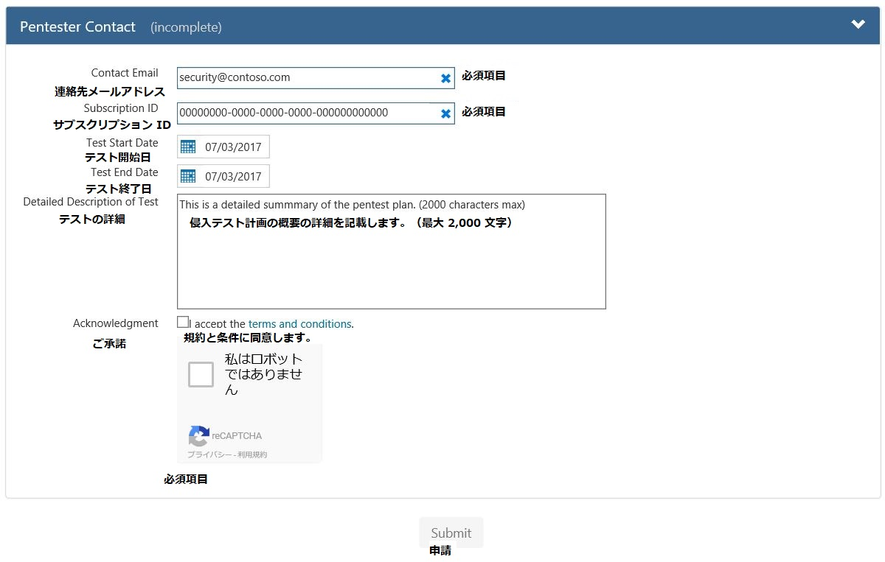

※ 2017 年 7 月時点の情報です。予告なく変更される可能性があります。最新情報は、[Azure サービスの侵入テスト通知の送信](https://portal.msrc.microsoft.com/ja-jp/engage/pentest) をご参照ください。

Web アプリケーションのリリースやインターネットに接続した環境の脆弱性診断のために、侵入テストを実施されることがあるかと思います。パブリッククラウド (Microsoft Azure など) に、アプリケーションを配置した際にも、侵入テストを実施したいというご要望があるかと思います。

**Microsoft Azure では、侵入テストのルール事項 ([Microsoft Cloud Unified Penetration Testing Rules of Engagement](https://technet.microsoft.com/ja-jp/mt784683) ) を順守頂き、侵入テストを実施頂く必要があります。****例外的なルールは適用外です。**

また、申請フォーム（[Azure サービスの侵入テスト通知の送信](https://portal.msrc.microsoft.com/ja-jp/engage/pentest)）での申請は任意です。もし、申請する場合は以下をご参照の上、内容を英語で記載し申請ください。

**<注意事項>**

**本申請は、プラットフォームのセキュリティ診断の無効化や有効化をするためや、セキュリティ検出を変更するための申請ではありません。**

## 必要な情報

・ ご連絡先のメールアドレス

・サブスクリプション ID

・テスト実施日

・テストの詳細

・対象の全ての資産情報（ IP や FQDN ）

・実施予定のテスト種別

## 申請フォームでの問い合わせ対象外の内容

・侵入テストに関する質問や侵入テストの補助依頼

・脆弱性やポートスキャンの警告

・オンプレミスのリソースに対するテストの警告

・ Azure サブスクリプション ID がない Azure Active Directory、Microsoft アカウント、 Office 365 やその他資産に対するテストの警告

## 申請フォーム

侵入テストの通知プロセス

1.  **侵入テストの申請フォーム送信完了**
    
    ※申請フォーム内 \[連絡先の電子メールアドレス\] に登録できるメールアドレスは 1 つのみです。複数登録はできません。
    
2.  **Azure チームからの受付**
    
    申請が受理されましたら、ご登録いただいた連絡先の電子メールアドレス宛に自動配信メールが送信されます。
    
    ※ メール件名は \[Microsoft Azure Penetration Testing Acknowledgement\] となります。
    
    もし追加情報が必要な場合は、Azure チームは申請フォームで提供された情報を利用してメールでご連絡いたします。
    
3.  **テスト完了**
    
    Azure チームにて申請が受理されましたら、メールに特定された条件でテストを実施します。テストの実行時間を延長、または変更する場合については、テスト内容が変更されない限り再申請は不要です。
    

\[禁止されている行為\]

・ほかのマイクロソフト クラウドの顧客情報に属しているリソースへのスキャン、もしくはテストを実施すること。

・ほかのマイクロソフト クラウドの顧客情報や弊社帰属のデータへのアクセス権を取得すること。

・あらゆる種類のサービス拒否テスト (DoS、DDoS 攻撃およびこれらのエミュレート) を実行すること。

・ Azure 仮想マシン以外の任意のリソースに対し、ネットワークに関する可用性テストを実行すること。

・大量のトラフィックを生成するサービスの自動テストを実行すること。

・意図的にほかの顧客のデータにアクセスすること。

・インフラストラクチャの実行に関する問題の再現手順が "概念実証 (Proof of Concept)" を超えること。

※ SQLi を使用して sysadmin アクセスが許可されていることを証明することは許容されますが、xp\_cmdshell を実行することはできません。

・マイクロソフト オンラインサービス条件に記載されている使用ポリシーに違反する方法で当社のサービスを使用すること。

・当社の従業員に対するフィッシングなどの、ソーシャル エンジニアリング攻撃を試みること。

\[推奨される行為\]

・クロス アカウント、またはクロス テナント データアクセスをデモンストレーションおよび証明するために、少数のテスト アカウントおよび / もしくは試用版テナントを作成すること。

※ ただし、これらのアカウントのいずれかを使用して、別の顧客またはアカウントのデータにアクセスすることは禁止されています。

・ Azure 仮想マシンに対して、可用性、ポートスキャン、または脆弱性評価ツールを実行すること。

・アプリケーションを起動して通常業務において予測されるトラフィックの値を確認すること。

※ 高負荷時のトラフィック量を見込んだテストを実施することを推奨します。

・セキュリティの監視と検出のテストすること (例: 異常なセキュリティ ログの生成、EICAR の削除など)。

・ Azure Web サイトや Azure Functions などの共有サービス コンテナーの制限を超えるテストを実施すること。

※ テストにより制限を超えることができた場合、即座にテストを終了して、弊社へ調査を依頼することを推奨します。

※ 意図的にほかの顧客のデータにアクセスすることは規約違反となります。

・ Microsoft Intune の条件付きアクセス、もしくはモバイル アプリケーション管理 (MAM) ポリシーを適用して、ポリシーが正常動作することを確認すること。

もし、Azure や他の Microsoft サービスに関連する潜在的なセキュリティの欠陥を見つけられた場合、[手順](https://technet.microsoft.com/ja-jp/security/ff852094) に沿って速やかにご報告ください。

侵入テストや通知の状態に関するその他ご質問は、サポートまでお問い合わせください。

もし、オンラインサービスバグ報奨金に該当すると思われる潜在的なセキュリティの欠陥を見つけられた場合、[バグ報奨金規約](https://technet.microsoft.com/en-us/security/dn800983/)をご参照ください。

＊＊

Microsoft Azure サポートチーム