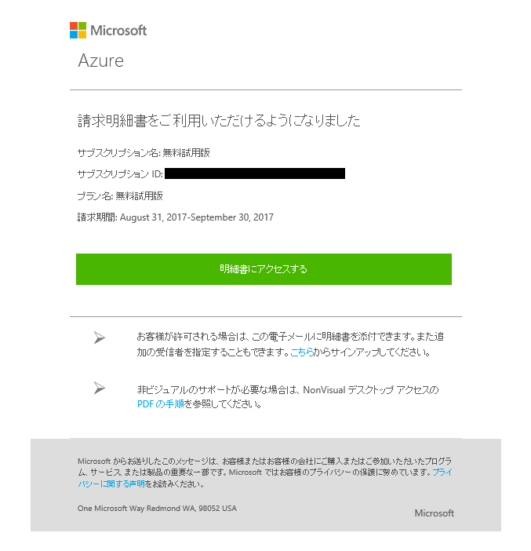
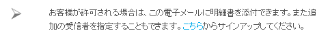
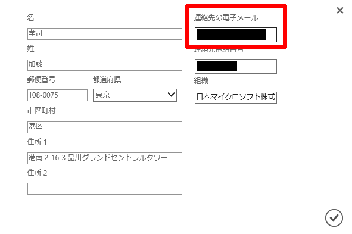

いつも大変お世話になります。Microsoft Azure サポート チームです。

本記事で、弊社によくお問い合わせをいただきます Azure の請求書をメールで送信する機能について、その注意点をご案内させていただきます。
本情報が少しでもお客様のお役に立つものとなりましたら幸いです。

1.  Azure の請求書をメールで送信する機能について
2.  ご注意事項
2.  Azure の請求書が発行されたことをメールで通知する機能について

### 1. Azure の請求書をメールで送信する機能について

___

以下公開情報でご案内をさせていただいている Azure の請求書をメールで**送信**する機能は、サポート プランの請求書ではご利用いただけません。

この点について本記事でご案内をさせていただきます。

Azure の請求書と毎日の使用状況データをダウンロードまたは表示する

[https://docs.microsoft.com/ja-jp/azure/billing/billing-download-azure-invoice-daily-usage-date](https://docs.microsoft.com/ja-jp/azure/billing/billing-download-azure-invoice-daily-usage-date)
※ 「メールで請求書を入手する (.pdf)」に記載されている機能についてです。
​
### 2. ご注意事項
​
___
​
上記の機能とは別に、Azure の請求書が発行されたことをメールで**通知**する機能がございます。
​
請求書をメールで送信するわけではなく、発行されたことを通知する機能となります。
​※ 後述でご案内をさせていただきます。
​
この機能はサポート プランでもご利用をいただけます。
​この Azure の請求書が発行されたことを通知するメールは以下のようなフォーマットで届きます。
​

​
これは Azure の請求書が発行されたことを通知するメールの例ですが、サポート プランの請求書が発行されたことを通知するメールも同フォーマットになります。
​
同フォーマットでお送りしていることから、サポート プランの請求書が発行されたことを通知するメール内にも以下の記載が含まれてしまっております。
​

​
弊社サービスのご利用におきまして混乱を招きまして誠に申し訳ございません。
​
サポート プランの請求書が発行されたことを通知するメール内に含まれる上記記載の「こちら」のリンクをクリックしていただきましても、サポート プランにつきましては請求書をメールで送信する機能はご利用いただけませんのでご注意くださいますと幸いです。
​
### 3. Azure の請求書が発行されたことをメールで通知する機能について
​
___
​
Azure の請求書が発行されたことを通知するメールは、以下に設定されているメールアドレスに届きます。
​
1.  以下の URL にアクセスをする
    [https://account.azure.com/Profile/](https://account.azure.com/Profile/)
    
2.  対象 Azure サブスクリプションのアカウント管理者 (Azure アカウント) でサインインをする
3.  \[詳細の編集\] をクリックする
4.  \[連絡先の電子メール\] に設定されているメールアドレスを確認する
    
    
    
    ※ \[連絡先の電子メール\] にご登録いただけるメールアドレスは 1 つまでとなります。複数名で通知メールを確認されたい場合は、グループアドレスのご利用についてご検討ください。
    
​
以上の通りご案内いたします。
​
引き続き弊社製品・サービスについてお客様のお役に立てる情報のご案内に努めさせていただきます。
​
よろしくお願いします。
