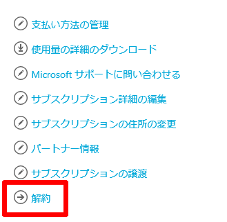
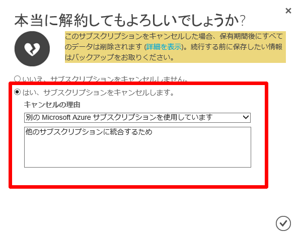
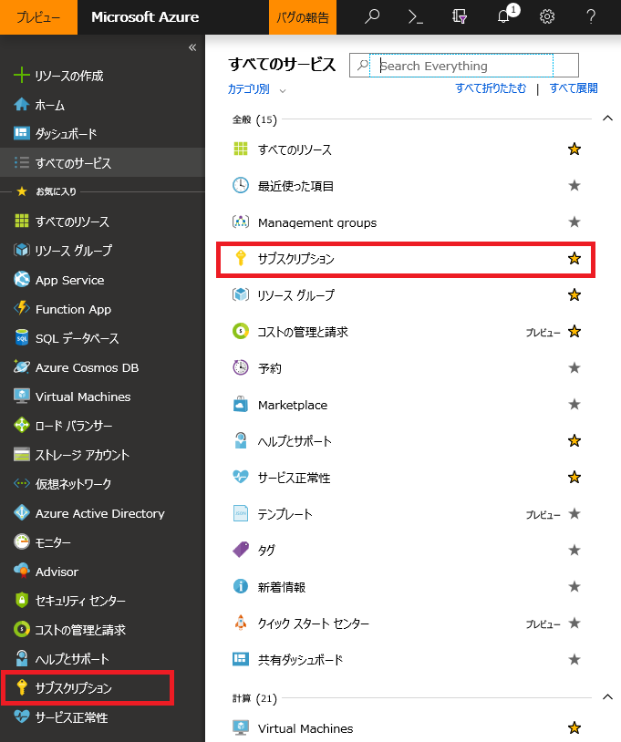
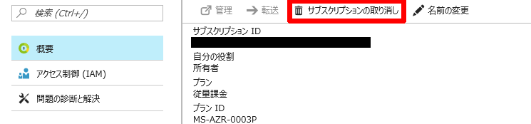
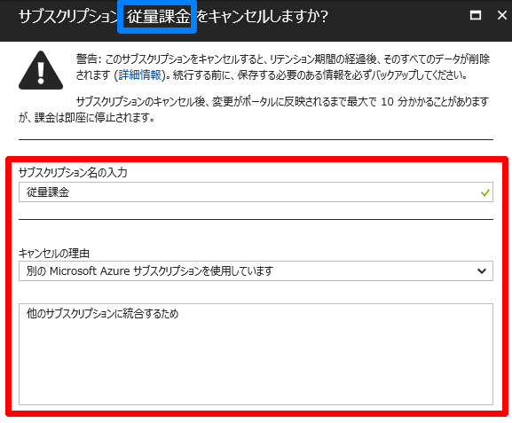

いつも大変お世話になります。Microsoft Azure サポート チームです。

Azure アカウントの削除について本記事で以下についてご案内をさせていただきます。

ご参考になりましたら幸いです。

1.  本記事の目的
2.  Azure アカウントとは
3.  Azure アカウントの削除について
4.  Azure アカウントの削除方法

### 1. 本記事の目的

___

本記事では、Azure アカウントの削除についてご案内いたします。

Azure をご利用のお客様から、「登録した Azure アカウントを削除したい」とのご要望をいただくことがございます。

本記事が少しでもお客様のお役に立つことができれば幸いです。

### 2. Azure アカウントとは

___

Azure アカウントとは、Azure にサインアップされた際に登録されるアカウントのことを指します。
Azure のサインアップ・サブスクリプションの購入は Microsoft アカウント・組織アカウントにて実施いただけます。

つまり、その際の Microsoft アカウントや組織アカウントが Azure アカウントとして登録されます。

### 3. Azure アカウントの削除について

___

誠に恐れ入りますが、Azure アカウントの削除をおこなう対応については、現時点ではご用意がございません。

この点について何卒ご了承をいただけますと幸いです。

上記を踏まえ、現時点において弊社では Azure アカウントの削除を以下のように定義いたしております。

-   Azure アカウントに紐づくサブスクリプションの削除
-   Azure アカウントに紐づくクレジットカード情報の削除
-   元の Microsoft アカウント・組織アカウントの削除

後述ではこの 3 点の削除方法について詳細をご案内させていただきます。

### 4\. Azure アカウントの削除方法

___

上記の通り、以下の 3 点を Azure アカウントの削除として定義いたしております。

この 3 点の詳細をご案内させていただきます。

-   Azure アカウントに紐づくサブスクリプションの削除
-   Azure アカウントに紐づくクレジットカード情報の削除
-   元の Microsoft アカウント・組織アカウントの削除

#### 1. Azure アカウントに紐づくサブスクリプションの削除

まずは、Azure アカウントに紐づくサブスクリプションを削除します。

サブスクリプションの削除は、アカウントポータル (https://account.azure.com/subscriptions) と Azure ポータル (https://portal.azure.com) の両方から行っていただくことができます。

以下に両手順をご案内いたします。

どちらかでご実施をいただけましたら幸いです。

以下の操作完了後、サブスクリプション内のサービスおよび課金が停止されることとなります。

サブスクリプション内のデーターは削除後からおよそ 90 日間経過後に完全削除されます。

＜アカウントポータルでサブスクリプションを削除する方法＞

1.  以下の URL にアカウント管理者でサインインをする
    
    [https://account.azure.com/subscriptions](https://account.azure.com/subscriptions)
    
2.  サブスクリプションの一覧ページで、該当のサブスクリプションをクリックする
3.  サブスクリプションの概要ページで、画面右から \[解約\] をクリックする
    
    
    
4.  解約確認ページで、\[はい、サブスクリプションをキャンセルします。\] を選択し、\[キャンセルの理由\] を選択し、適宜詳細を入力する
    
    
    
5.  右下の \[レ\] をクリックする

＜ Azure ポータルでサブスクリプションを削除する方法 ＞

1.  以下の URL に該当サブスクリプションのアカウント管理者、かつサービス管理者でサインインをする
    
    [https://portal.azure.com/](https://portal.azure.com/)
    

※ アカウント管理者の権限のみでは、サブスクリプションの一覧ページでサブスクリプションが表示されません。また、サービス管理者の権限のみでは、サブスクリプションの削除が行えません。

各種アカウント権限については[こちら](https://blogs.msdn.microsoft.com/dsazurejp/2013/10/02/303/)をご覧ください。

2.  画面左から直接 \[サブスクリプション\] をクリックするか、\[すべてのサービス\] から \[サブスクリプション\] を検索してクリックする。

3.  利用可能なサブスクリプションが表示されるので、該当のサブスクリプションをクリックし、概要のページの\[サブスクリプションの取り消し\] をクリックする
    
    
    
4.  キャンセル確認ページで、\[サブスクリプション名の入力\] に該当サブスクリプション名を入力し、\[キャンセルの理由\] を選択し、適宜詳細を入力する
    
    
    
    注) サブスクリプション名は青枠部分に表示されます。
    
5.  画面下の \[サブスクリプションの取り消し\] をクリックする

#### 2. Azure アカウントに紐づくクレジットカード情報の削除

Azure アカウントに紐づくクレジットカード情報の削除は、弊社にておこなわせていただきます。

以下情報を記載のうえ、弊社へお問い合わせをいただきますようお願いいたします。

-   対象の Azure アカウント (メールアドレス形式)
-   対象のクレジットカード種別 (VISA、Master、AMEX など)
-   クレジットカード番号下 4 桁
    
    ※ 個人情報保護のため、クレジットカード全桁の送付は決してなさらないようご注意をお願いいたします。
    
-   弊社での上記クレジットカードの削除実施にご同意いただける旨の一文
    
    ※ 例 ) 「このクレジットカードの削除に同意いたします」
    

上記お問い合わせをいただきましてから、弊社にてご要望のクレジットカード情報の削除を実施させていただきます。

この処理には 3 営業日ほどお時間をいただく可能性がございます。

また、クレジットカードへの請求が残っている場合は、請求が完了するまで削除できませんのでご注意ください。

あらかじめご了承をいただけますと幸いです。

#### 3. 元の Microsoft アカウント・組織アカウントの削除

Azure アカウントの元になった Microsoft アカウント・組織アカウントを削除する手順についてご案内いたします。

Microsoft アカウント・組織アカウントを削除された場合、Azure 以外にご利用いただいている Microsoft 製品 (Office 365、X-box など) の紐づけも解除されます。

また、該当アカウントにて Azure ポータルにアクセス不可となります。

これらについてご留意のうえ対応いただくようお願いいたします。

-   Microsoft アカウントの削除につきましては、下記弊社公開情報をご参照ください。

Microsoft アカウントの使用を停止する方法

[https://support.microsoft.com/ja-jp/help/12412/microsoft-account-how-to-close-account](https://support.microsoft.com/ja-jp/help/12412/microsoft-account-how-to-close-account)

-   組織アカウント (Office 365 の場合) の削除は以下の公開情報にそってご実施ください。

組織からユーザーを削除する

\- 本ページ内の「ユーザー管理の管理者: Office 365 から 1 つまたは複数のユーザーを削除します。」

[https://support.office.com/ja-jp/article/8B-d5155593-3bac-4d8d-9d8b-f4513a81479e](https://support.office.com/ja-jp/article/8B-d5155593-3bac-4d8d-9d8b-f4513a81479e)

-   組織アカウント (Azure Active Directory の場合) の削除は以下の公開情報にそってご実施ください。

Azure Active Directory を使用してユーザーを追加または削除する

\- 本ページ内の「ユーザーの削除」

[https://docs.microsoft.com/ja-jp/azure/active-directory/add-users-azure-active-directory](https://docs.microsoft.com/ja-jp/azure/active-directory/add-users-azure-active-directory)

なお、Microsoft アカウントに関する詳細につきましては、下記窓口までお問い合わせくださいますようお願いいたします。

メールでアカウントに関するサポートを受ける

[https://support.microsoft.com/ja-jp/help/12401](https://support.microsoft.com/ja-jp/help/12401)

以上の通りご案内いたします。

引き続き弊社製品・サービスについてお客様のお役に立てる情報のご案内に努めさせていただきます。

よろしくお願いします。