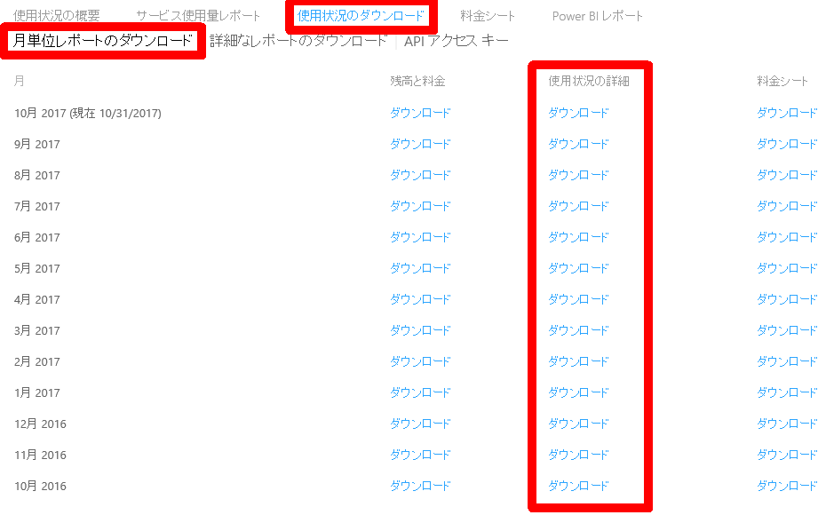
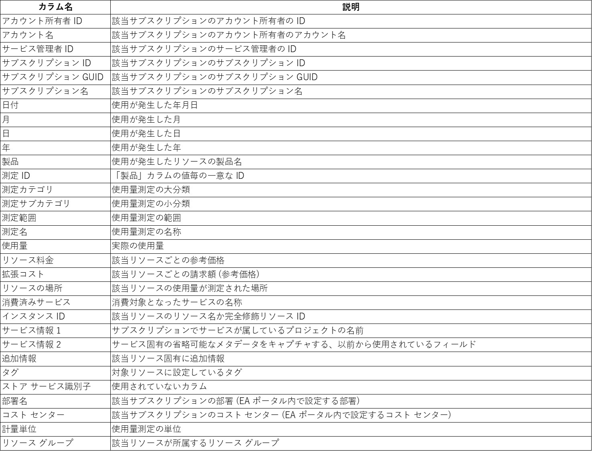

いつも大変お世話になります。Microsoft Azure サポート チームです。

EA 契約における Azure 使用状況レポートについて本記事で以下をご案内させていただきます。

ご参考になりましたら幸いです。

1.  使用状況レポートのダウンロードの方法
2.  ダウンロード可能な権限
3.  各カラムの説明
4.  注意事項

### 1\. 使用状況レポートのダウンロードの方法

___

EA ポータルから最も詳細な使用状況レポートをダウンロードする手順をご案内いたします。

1.  以下の URL にアクセスする
    [https://ea.azure.com](https://ea.azure.com/)
    
2.  適切な権限を持ったアカウントでサインインする
    
    ※ 権限について後述でご案内します。
    
3.  画面左から \[Reports\] をクリックする
4.  画面上から \[使用状況のダウンロード\] をクリックする
5.  \[月単位レポートのダウンロード\] をクリックする
6.  該当月の \[使用状況の詳細\] 列の \[ダウンロード\] をクリックする
    
    
    

### 2\. ダウンロード可能な権限

___

上記でご案内した使用状況レポートを EA ポータルからダウンロードできる権限についてご案内いたします。

使用状況レポートをダウンロード可能な権限は以下になります。

-   エンタープライズ管理者
-   部署管理者
-   アカウント所有者

#### 1\. エンタープライズ管理者

エンタープライズ管理者は EA ポータル内の最上位レベルの権限になります。

この権限を持っているアカウントは使用状況レポートのダウンロードが可能です。

#### 2\. 部署管理者

該当の EA ポータルにおいて以下状況の場合、部署管理者の権限を持っているアカウントも使用状況レポートのダウンロードが可能です。

-   マークアップ ステータス : 公開済み
-   DA ビューの請求額 : 有効

マークアップ ステータスと DA ビューについて、以下の EA ポータル内ヘルプをご案内させていただきます。

エンタープライズ ポータル パートナーの料金マークアップ

[https://ea.azure.com/helpdocs/partnerPriceMarkup](https://ea.azure.com/helpdocs/partnerPriceMarkup)

非エンタープライズ管理者向けレポート

[https://ea.azure.com/helpdocs/accountOwnerReporting](https://ea.azure.com/helpdocs/accountOwnerReporting)

#### 3\. アカウント所有者

該当の EA ポータルにおいて以下状況の場合、アカウント所有者の権限を持っているアカウントも使用状況レポートのダウンロードが可能です。

-   マークアップ ステータス : 公開済み
-   AO ビューの請求額 : 有効

マークアップ ステータスと AO ビューについて、以下の EA ポータル内ヘルプをご案内させていただきます。

エンタープライズ ポータル パートナーの料金マークアップ

[https://ea.azure.com/helpdocs/partnerPriceMarkup](https://ea.azure.com/helpdocs/partnerPriceMarkup)

非エンタープライズ管理者向けレポート

[https://ea.azure.com/helpdocs/accountOwnerReporting](https://ea.azure.com/helpdocs/accountOwnerReporting)

### 3\. 各カラムの説明

___

上記でご案内した使用状況レポートの各カラムについてご案内いたします。

なお、正確な値は EA ポータルにてご確認ください。

※ \[リソース料金\]、\[拡張コスト\] は参考の値となります。

### 4. 注意事項

___

注意事項についてご案内をさせていただきます。
当日の使用量が、完全にレポート反映されるまで、５営業日以上、要する場合がございます。

例: １０月１日の使用量反映は、１０月６日以降となる。

恐れ入りますがこの点についてご留意くださいますと幸いです。

以上の通りご案内いたします。

引き続き弊社製品・サービスについてお客様のお役に立てる情報のご案内に努めさせていただきます。

よろしくお願いします。