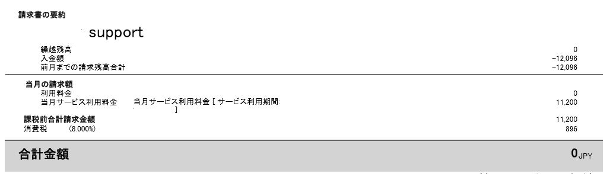
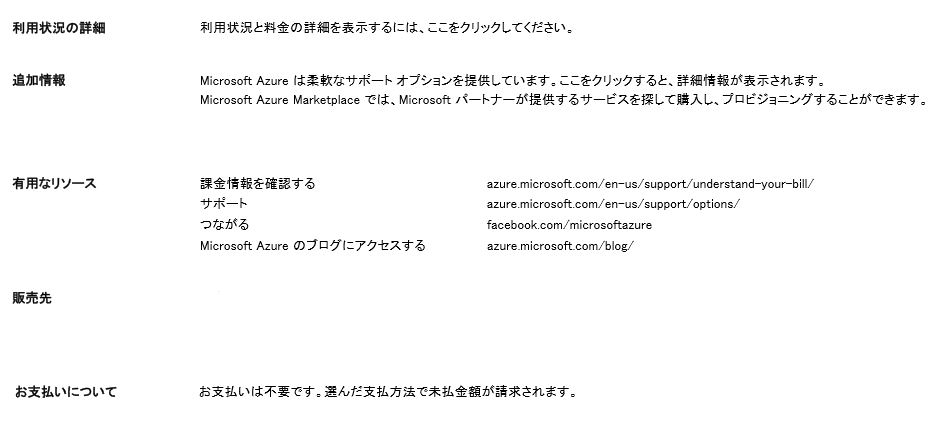

※本トピックは 2018 年 6 月時点の情報です。将来的に情報が変わる可能性がありますのでご了承ください。

いつも大変お世話になります。Microsoft Azure サポート チームです。

サポート プランの請求書について本記事で以下をご案内させていただきます。

ご参考になりましたら幸いです。

1. サポート プランの初回請求書発行日について
2. サポート プランの初回請求書のお支払いに関する情報について
3. 参考情報

## 1\. サポート プランの初回請求書発行日について

サポート プランの場合、ご契約いただいた日の翌日に初回請求書が発行されます。

また、クレジット カード払いの場合、この初回のご請求につきましては、サポート プランを

ご購入いただいた時点で、クレジット カード会社様へご請求をさせていただいております。

このため、翌日に初回請求書が発行された時点でお支払いが完了しているため、請求書上の合計金額

（ご請求金額）は 0 円となっておりますこと、何卒ご理解賜りますようお願いいたします。

例）クレジット カード払いのサポート プラン初回発行請求書 1 ページ目

## 2\. サポートプランの初回請求書のお支払いに関する情報について

クレジット カード払いのサポート プランの場合、サポート プランをご購入いただいた時点で、クレジット カード会社様へ請求されるため、初回に発行された請求書の 2 ページ目の \[お支払いについて\] には、\[お支払いは不要です\] と記載されます。

しかしながら、ご購入いただいた日にお支払いは完了されるため、実際にはクレジット カードへのお支払いはおこなわれておりますこと、何卒ご理解賜りますようお願いいたします。

例）クレジット カード払いのサポート プラン初回発行請求書 2 ページ目

## 3\. 参考情報

以下の参考情報についても併せてご確認くださいませ。

Microsoft Azure の請求書の見方

https://blogs.msdn.microsoft.com/dsazurejp/2013/10/10/windows-azure-5/

以上の通りご案内いたします。

引き続き弊社製品・サービスについてお客様のお役に立てる情報のご案内に努めさせていただきます。

よろしくお願いします。