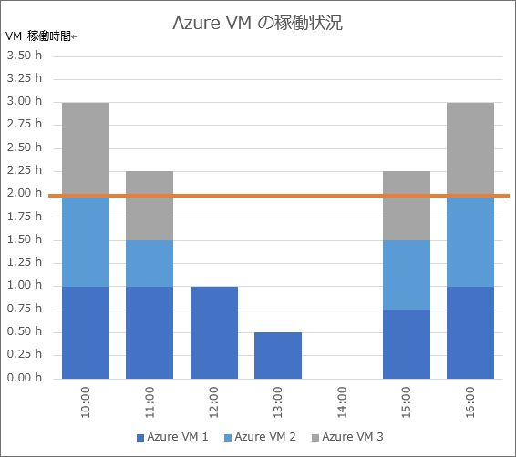
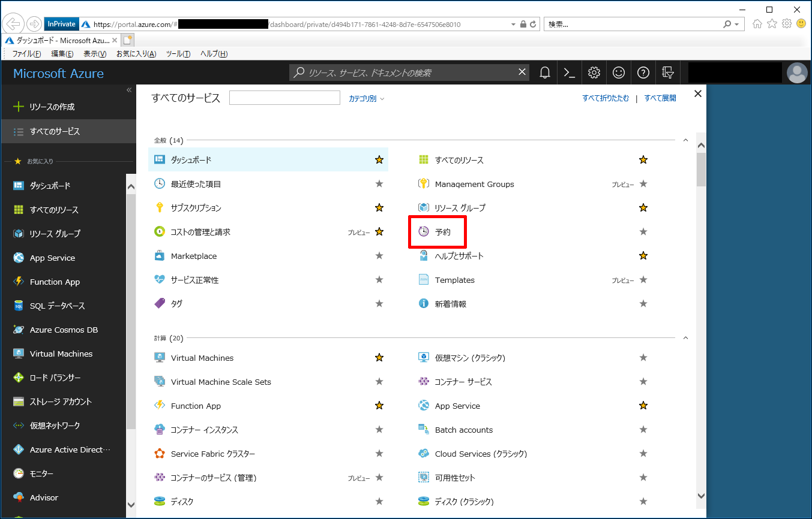
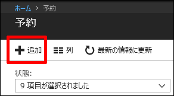
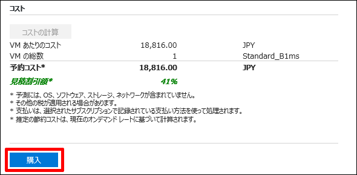
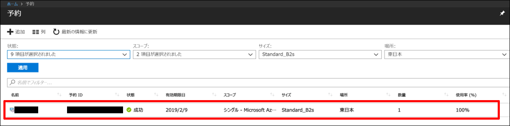
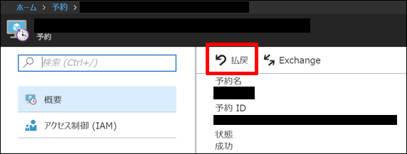
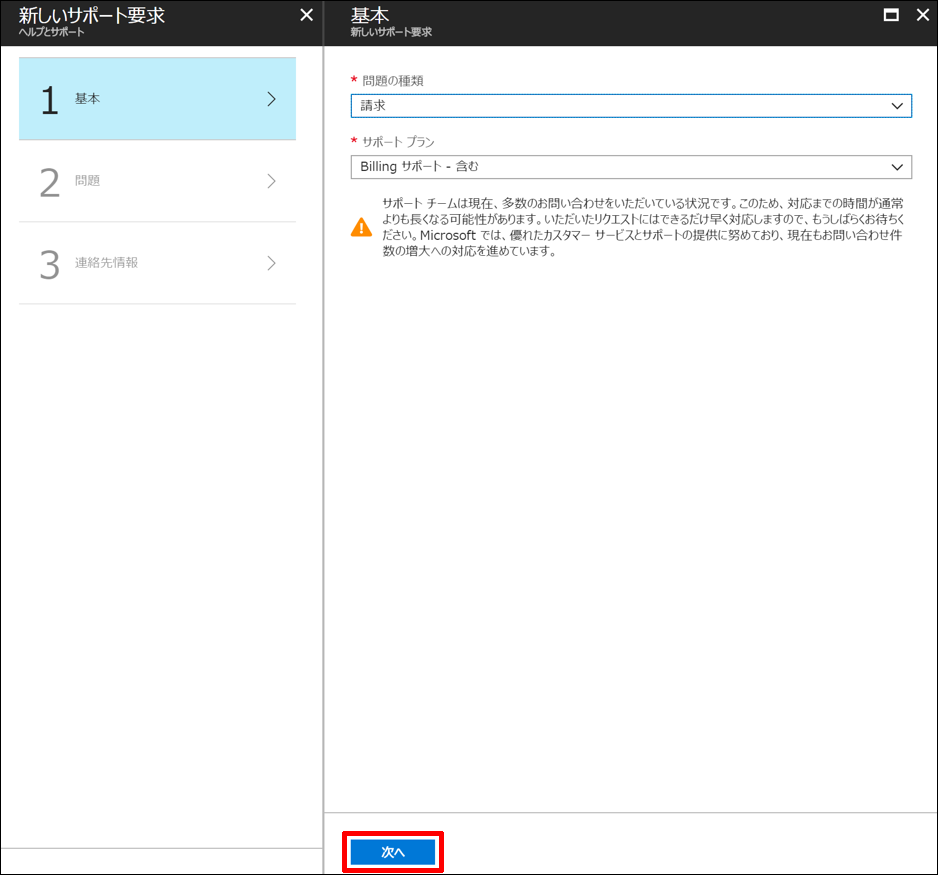
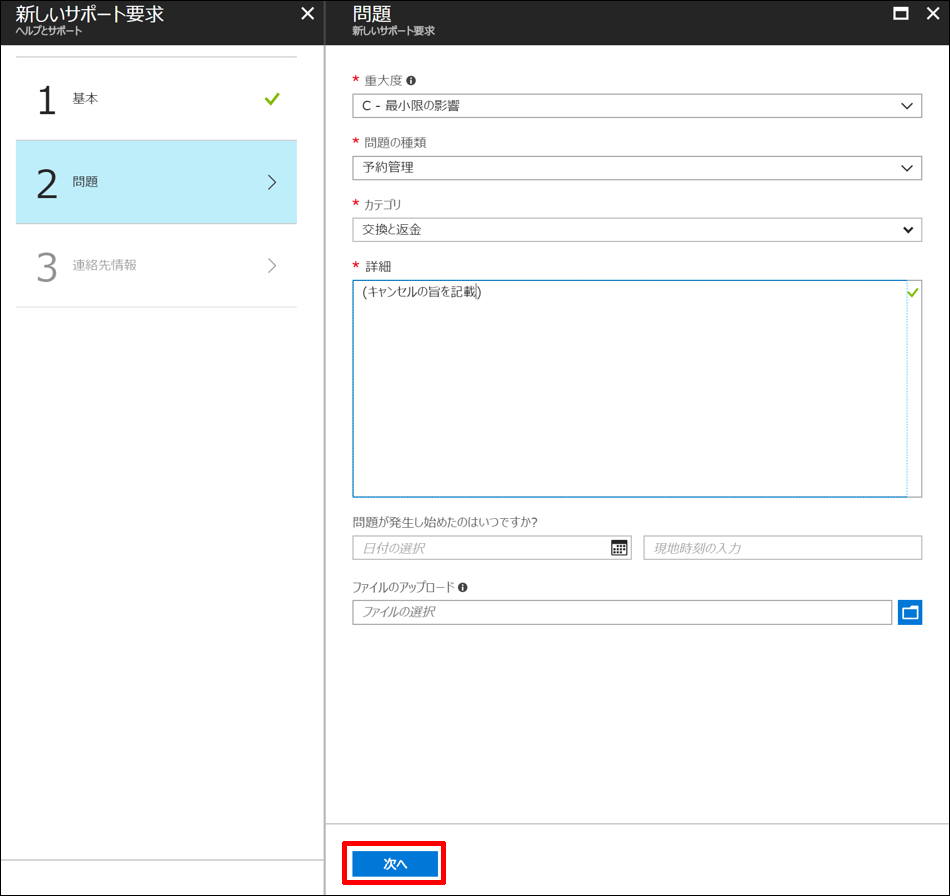
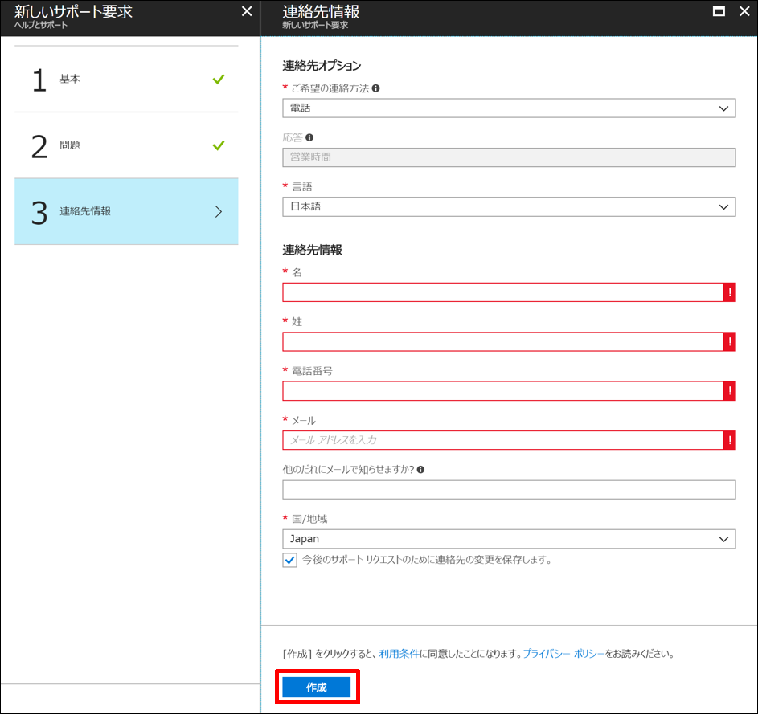

いつも大変お世話になります。Microsoft Azure サポート チームです。

良くお問い合わせをいただく Azure Reserved VM Instances (RIs) について本記事で以下をご案内させていただきます。

ご参考になりましたら幸いです。

1.  本記事の目的
2.  概要
3.  注意事項
4.  課金の仕組み概要
5.  課金の仕組み詳細
6.  購入方法
7.  キャンセル方法
8.  変更方法
9.  FAQ : よくあるご質問
10.  参考 URL

### 1. 本記事の目的

___

本記事は、最近お問い合わせが増えてきた Azure Reserved VM Instances (RIs) について、大切なポイントをおまとめしお客様にご案内することを目的としています。

**!! 注意事項 !!**

本記事は Azure Reserved VM Instances (RIs) について全てをご説明するものではありません。

必ず後述にご案内している 参考 URL についても併せてご参照ください。

### 2. 概要

___

Azure Reserved VM Instances (RIs) の概要をご案内します。

Azure Reserved VM Instances (RIs) は、Azure VM のコンピューティングリソース (仮想マシンのハードウェア部分の料金) を一括前払いで購入することで、コストを削減することができる仕組みです。

通常、Azure VM はご利用をいただいた分だけ課金が発生します。

この Azure VM に対して、1 年もしくは 3 年分を一括前払いでお支払いいただくことにより、通常の価格よりも低価格で Azure VM をご購入いただけるサービスが Azure Reserved VM Instances (RIs) です。

例えば、以下のような購入が行えます。

-   東日本リージョン、B2s サイズの Azure VM について、1 年分を 5 個購入する

すると、以下の効果があります。

-   東日本リージョン、B2s サイズの Azure VM 5 台について、1 年間、通常の価格よりも低価格で利用できる

### 3. 注意事項

___

Azure Reserved VM Instances (RIs) の注意事項をご案内します。

※ 2018 年 5 月現在の注意事項です。

#### Azure VM について

-   クラシックの Azure VM ではご利用いただけません。
-   Azure VM の A シリーズ、A\_v2 シリーズ、G シリーズはご利用いただけません。
-   購入した Azure Reserved VM Instances (RIs) が適用される Azure VM のインスタンスを選ぶことはできません。

#### サブスクリプションについて

-   従量課金、EA、CSP プランのみご利用可能です。
-   Azure イン オープンなど、他のプランではご利用いただけません。

#### 適用個所について

-   Azure VM のコンピューティングリソースの課金に対してのみ適用されます。
-   Windows OS や SQL Server などのソフトウェア部分、Azure VM に紐づくストレージ部分の課金に対しては適用されません。

### 4. 課金の仕組み概要

___

Azure Reserved VM Instances (RIs) の課金の仕組みについて概要をご案内いたします。

例えば、以下のような Azure VM が存在していたとします。

(ご説明のための仮の Azure VM サイズ、価格です)

\- Azure VM
サイズ : Z1
リージョン : 東日本
料金 : ￥ 10/時間

この Azure VM を 1 個購入します。

この Azure VM を 24 時間 1 カ月 (30 日) 稼働させた場合、￥ 7,200 (￥ 10 × 24 時間 × 30 日 = ￥ 7,200) の課金が発生します。

つまり、毎日 24 時間稼働させた場合、その月は ￥ 7,200 を支払います。

1 年間では ￥ 87,600 (￥ 10 × 24 時間 × 365 日 = ￥ 87,600) を支払います。

以下のような Azure Reserved VM Instances (RIs) が存在していたとします。

(ご説明のための仮の Azure VM サイズ、価格です)

\- Azure Reserved VM Instances (RIs)

サイズ : Z1
リージョン : 東日本
期間 : 1 年
料金 : ￥ 50,000

この Azure Reserved VM Instances (RIs) を 1 個購入します。

つまり、一括前払いで ￥ 50,000 を支払います。
合わせて、同サイズ、同リージョンの Azure VM を 1 個購入します。
この Azure VM を 24 時間 1 カ月稼働させても、課金は発生しません。
1 年間はこの状態が続きます。
一括前払いで購入した Azure Reserved VM Instances (RIs) が適用されるためです。

Azure Reserved VM Instances (RIs) の期限 (この例では 1 年) が切れると、適用が解除されますので、以降この Azure VM は通常通りの課金が発生します。
つまり、適用が解除された後は、この Azure VM を 24 時間 1 カ月 (30 日) 稼働させた場合、￥ 7,200 (￥ 10 × 24 時間 × 30 日 = ￥ 7,200) の課金が発生します。
毎日 24 時間稼働させた場合、その月は ￥ 7,200 を支払います。

### 5\. 課金の仕組み詳細

___

Azure Reserved VM Instances (RIs) の課金の仕組みについて詳細をご案内いたします。

例えば、以下のような Azure VM と Azure Reserved VM Instances (RIs) が存在していたとします。
(ご説明のための仮の Azure VM サイズ、価格です)

\- Azure VM
サイズ : Z1
リージョン : 東日本
料金 : ￥ 10/時間

\- Azure Reserved VM Instances (RIs)

サイズ : Z1
リージョン : 東日本
期間 : 1 年
料金 : ￥ 50,000

それぞれについて以下の個数を購入します。

\- 購入数

Azure VM : 3 個
Azure Reserved VM Instances (RIs) : 2 個

この状況を基に、いくつかの Azure VM 稼働状況を例にご説明いたします。

以下のグラフは、1 日のある時間帯における Azure VM 3 個の稼働状況を示すグラフです。

このグラフを基に、各時間帯での Azure Reserved VM Instances (RIs) の適用状況を説明します。

#### 10:00 台について

各 Azure VM が以下のように稼働しています。

-   Azure VM 1 : 1 時間
-   Azure VM 2 : 1 時間
-   Azure VM 3 : 1 時間

そのため、10:00 台の同リージョン、同サイズの Azure VM の合計の稼働時間は 3 時間になります。

つまり、本来は 10:00 台に以下の課金が発生します。

(1h (Azure VM 1) + 1h (Azure VM 2) + 1h (Azure VM 3)) × ￥ 10 = ￥ 30

この内の 2 時間分 (オレンジ色のラインまで) が Azure Reserved VM Instances (RIs) の適用対象となり、課金が発生しません。

Azure Reserved VM Instances (RIs) を 2 個購入しているためです。

つまり、Azure Reserved VM Instances (RIs) が適用されることで、10:00 台には以下の課金のみが発生します。

1h (Azure VM 3) × ￥ 10 = ￥ 10

なお、実際には Azure Reserved VM Instances (RIs) が適用される Azure VM、￥ 10 分の課金が発生する Azure VM がどれになるかは不明です。

それらを選ぶことはできません。

同リージョン、同サイズなので、どれが選ばれても差異は発生しません。

結果、10:00 台の Azure Reserved VM Instances (RIs) の使用率は 100% です。

#### 11:00 台について

各 Azure VM が以下のように稼働しています。

-   Azure VM 1 : 1 時間
-   Azure VM 2 : 0.5 時間 (つまり、11:30 まで稼働していた)
-   Azure VM 3 : 0.75 時間 (つまり、11:45 まで稼働していた)

そのため、11:00 台の同リージョン、同サイズの Azure VM の合計の稼働時間は 2.25 時間になります。

つまり、本来は 11:00 台に以下の課金が発生します。

(1h (Azure VM 1) + 0.5h (Azure VM 2) + 0.75h (Azure VM 3)) × ￥ 10 = ￥ 22.5

この内の 2 時間分 (オレンジ色のラインまで) が Azure Reserved VM Instances (RIs) の適用対象となり、課金が発生しません。

Azure Reserved VM Instances (RIs) を 2 個購入しているためです。

つまり、Azure Reserved VM Instances (RIs) が適用されることで、11:00 台には以下の課金のみが発生します。

0.25h (Azure VM 3) × ￥ 10 = ￥ 2.5

実際には Azure Reserved VM Instances (RIs) が適用される Azure VM、￥ 2.5 分の課金が発生する Azure VM がどれになるかは不明です。

それらを選ぶことはできません。

同リージョン、同サイズなので、どれが選ばれても差異は発生しません。

結果、11:00 台の Azure Reserved VM Instances (RIs) の使用率も 100% です。

#### 12:00 台について

各 Azure VM が以下のように稼働しています。

-   Azure VM 1 : 1 時間
-   Azure VM 2 : 0 時間 (稼働していない)
-   Azure VM 3 : 0 時間 (稼働していない)

そのため、12:00 台の同リージョン、同サイズの Azure VM の合計の稼働時間は 1 時間になります。

つまり、本来は 12:00 台に以下の課金が発生します。

1h (Azure VM 1) × ￥ 10 = ￥ 10

2 時間分 (オレンジ色のラインまで) が Azure Reserved VM Instances (RIs) の適用対象となり、課金が発生しません。

Azure Reserved VM Instances (RIs) を 2 個購入しているためです。

つまり、同リージョン、同サイズの Azure VM の合計の稼働時間が 2 時間に満たないため、Azure Reserved VM Instances (RIs) が適用されることで、12:00 台には一切課金が発生しません。

この場合は、唯一稼働をしている Azure VM 1 に対して Azure Reserved VM Instances (RIs) が適用されることになります。

結果、12:00 台の Azure Reserved VM Instances (RIs) の使用率は 50% です。

(1 時間分の Azure Reserved VM Instances (RIs) しか使用されていない)

13:00 台、14:00 台も同様の考え方となります。

#### 15:00 台について

各 Azure VM が以下のように稼働しています。

-   Azure VM 1 : 0.75 時間 (つまり、15:15 から稼働した)
-   Azure VM 2 : 0.75 時間 (つまり、15:15 から稼働した)
-   Azure VM 3 : 0.75 時間 (つまり、15:15 から稼働した)

そのため、15:00 台の同リージョン、同サイズの Azure VM の合計の稼働時間は 2.25 時間になります。

つまり、本来は 15:00 台に以下の課金が発生します。

(0.75h (Azure VM 1) + 0.75h (Azure VM 2) + 0.75h (Azure VM 3)) × ￥ 10 = ￥ 22.5

この内の 2 時間分 (オレンジ色のラインまで) が Azure Reserved VM Instances (RIs) の適用対象となり、課金が発生しません。

Azure Reserved VM Instances (RIs) を 2 個購入しているためです。

つまり、Azure Reserved VM Instances (RIs) が適用されることで、15:00 台には以下の課金のみが発生します。

0.25h (Azure VM 3) × ￥ 10 = ￥ 2.5

実際には Azure Reserved VM Instances (RIs) が適用される Azure VM、￥ 2.5 分の課金が発生する Azure VM がどれになるかは不明です。

それらを選ぶことはできません。

同リージョン、同サイズなので、どれが選ばれても差異は発生しません。

結果、15:00 台の Azure Reserved VM Instances (RIs) の使用率も 100% です。

以上のように、1 時間ごとにその時の対象リージョン、対象サイズの Azure VM の稼働状況から Azure Reserved VM Instances (RIs) の適用が判定され確定されます。

### 6. 購入方法

___

Azure Reserved VM Instances (RIs) の購入方法をご案内します。

1.  以下の URL から Azure ポータルにサインインをする
    
    [https://portal.azure.com](https://portal.azure.com/)
    
2.  画面左から \[すべてのサービス\] - \[予約\] をクリックする
    
    
    
3.  \[＋ 追加\] をクリックする
    
    
    
4.  以下を入力・選択して \[コストの計算\] をクリックする
    
    
    
    名前 : 任意の名称を入れます
    
    サブスクリプション : 対象のサブスクリプションを選択します
    
    スコープ (共有) : 従量課金のサブスクリプションの場合、同アカウントがアカウント管理者になっている全サブスクリプションでこの Azure Reserved VM Instances (RIs) が使用されます。EA のサブスクリプションの場合、同 EA 契約内の全サブスクリプションでこの Azure Reserved VM Instances (RIs) が使用されます。
    
    スコープ (単一サブスクリプション) : このサブスクリプションのみでこの Azure Reserved VM Instances (RIs) が使用されます。
    
    リージョン : 対象のリージョンを選択します
    
    VM サイズ : 対象の Azure VM サイズを選択します
    
    契約期間 : 「1 年」か「3 年」を選択します
    
    数量 : 購入する個数を入力します
    
5.  金額が表示されるので、確認をして問題なければ \[購入\] をクリックする
    
    
    

### 7\. キャンセル方法

___

一度購入をした Azure Reserved VM Instances (RIs) のキャンセル方法をご案内します。

キャンセル手続きは、以下の手順で Azure 課金 サポートにサービス リクエストを発行して行います。

**!! 注意 !!**

キャンセルを行う場合は、返金額から 12% のキャンセル手数料が差し引かれます。

※ 手数料のパーセンテージにつきましては、変更となる可能性もございます。

1.  以下の URL から Azure ポータルにサインインをする
    
    [https://portal.azure.com](https://portal.azure.com/)
    
2.  画面左から \[すべてのサービス\] - \[予約\] をクリックする
    
    
    
3.  キャンセル対象の Azure Reserved VM Instances (RIs) をクリックする
    
    
    
4.  \[払戻\] をクリックする
    
    
    
5.  以下を入力・選択して \[次へ\] をクリックする
    
    
    
    問題の種類 : 請求
    
    サポート プラン : Billing サポート - 含む
    
6.  以下を入力・選択して \[次へ\] をクリックする
    
    
    
    重大度 : C - 最小限の影響
    
    問題の種類 : 予約管理
    
    カテゴリ : 交換と返金
    
    詳細 : Azure Reserved VM Instances (RIs) のキャンセルであることを明記します
    
7.  各種連絡先情報を入力・選択して \[作成\] をクリックする
    
    
    
8.  サポート担当者からの連絡を待つ

### 8\. 変更方法

___

2018 年 5 月現在、一度購入をした Azure Reserved VM Instances (RIs) のリージョン、Azure VM サイズ、スコープ、数量などを変更する場合、現在の Azure Reserved VM Instances (RIs) を一旦キャンセルして、キャンセル手続き完了後にお客様にて新規で購入をする必要があります。

**!! 注意 !!**

なお、この変更の際のキャンセルにつきましては、返金額から 12% のキャンセル手数料は差し引かれません。

### 9\. FAQ : よくあるご質問

___

よくあるご質問についてご案内します。

_**前払いの料金一覧はどこから確認可能であるか？**_

EA の場合 :

EA ポータル ([https://ea.azure.com/](https://ea.azure.com/)) からダウンロードしていただけます。

CSP の場合 :

パートナーセンター ([https://partnercenter.microsoft.com](https://partnercenter.microsoft.com/)) より確認が可能でございます。

ダッシュボードの左項目 \[料金とプラン\] より \[Microsoft Azure Reserved VM Instances\] の該当月の表示をクリックいただだくと価格表がダウンロードしていただけます。

※ ご確認いただけるのは、CSP ライセンスの発注機能がご利用いただけるダイレクトパートナーとインダイレクトプロバイダーのみです。

従量課金の場合 :

一覧表のご用意がないため、上述の \[購入方法\] の操作における \[コストの計算\] ボタン押下後に表示される金額にてご確認ください。

_**Windows 分のOSコストを試算したいがどこから確認可能であるか？**_

EA の場合 :

EA ポータルからダウンロードいただける料金シートにて確認いただけます。

CSP の場合 :

CSP 用 Azure サービス料金計算ツールにてご確認いただけます。

[https://azure.microsoft.com/pricing/calculator/channel/](https://azure.microsoft.com/pricing/calculator/channel/)

※ CSP のパートナーセンターへアクセスされるアカウントでのログインが必要となります。

※ 画面下部の「ライセンスプログラム」欄を「クラウドソリューションプロバイダー（ CSP ）」を選択いただくことにより、CSP 料金が表示されます。

従量課金版の場合 :

一覧表のご用意がないため、価格サイト ([https://azure.microsoft.com/ja-jp/pricing/details/virtual-machines/linux/](https://azure.microsoft.com/ja-jp/pricing/details/virtual-machines/linux/)) より、Windows の料金と Linux の料金の差額から算出いただく必要がございます。

※ 差額分が OS コストとなるため

_**Azure Reserved VM Instances (RIs) の購入前にデプロイした既存の Azure VM は適用対象になるのか？**_

適用対象となります。

_**Azure Reserved VM Instances (RIs) の購入時にグレーアウトしている Azure VM のサイズがあります。選択可能とする方法を教えてください。**_

コア数増加の対応が必要となる可能性が高いため、Azure ポータルよりお問い合わせいただく必要があります。

_**Azure Reserved VM Instances (RIs) を適用する仮想マシンを指定する方法を教えてほしい**_

Azure Reserved VM Instances (RIs) は、ご購入内容 (リージョン、サイズ) に合致する既存の Azure VM に対して自動的に適用されます。

このため、適用する仮想マシンをお客様にて指定することはできません。

_**従量課金サブスクリプションにおける Azure Reserved VM Instances (RIs) の請求書はどのようにダウンロードするのか？**_

Azure Reserved VM Instances (RIs) の請求書については、現時点ではお客様側がダウンロードすることができません。

なお \[従量課金サブスクリプション\] ご利用の場合は Azure 課金サポートにお問い合わせいただければ、請求書をご提供することが可能でございます。

### 10\. 参考 URL

___

Azure Reserved VM Instances (RIs) について、弊社の様々な公開情報を以下にご案内します。

併せてご利用ください。

Azure Reserved VM Instances (RIs)

[https://azure.microsoft.com/ja-jp/pricing/reserved-vm-instances/](https://azure.microsoft.com/ja-jp/pricing/reserved-vm-instances/)

Azure Reserved VM Instances とは

[https://docs.microsoft.com/ja-jp/azure/billing/billing-save-compute-costs-reservations](https://docs.microsoft.com/ja-jp/azure/billing/billing-save-compute-costs-reservations)

Azure Reserved VM Instances による仮想マシンの前払い

[https://docs.microsoft.com/ja-jp/azure/virtual-machines/windows/prepay-reserved-vm-instances](https://docs.microsoft.com/ja-jp/azure/virtual-machines/windows/prepay-reserved-vm-instances)

予約インスタンスを管理する

[https://docs.microsoft.com/ja-jp/azure/billing/billing-manage-reserved-vm-instance](https://docs.microsoft.com/ja-jp/azure/billing/billing-manage-reserved-vm-instance)

予約インスタンスの割引の適用方法について

[https://docs.microsoft.com/ja-jp/azure/billing/billing-understand-vm-reservation-charges](https://docs.microsoft.com/ja-jp/azure/billing/billing-understand-vm-reservation-charges)

従量課金制サブスクリプションの予約インスタンス使用量について

[https://docs.microsoft.com/ja-jp/azure/billing/billing-understand-reserved-instance-usage](https://docs.microsoft.com/ja-jp/azure/billing/billing-understand-reserved-instance-usage)

エンタープライズ加入契約の Azure 予約インスタンス使用量について

[https://docs.microsoft.com/ja-jp/azure/billing/billing-understand-reserved-instance-usage-ea](https://docs.microsoft.com/ja-jp/azure/billing/billing-understand-reserved-instance-usage-ea)

Azure 予約インスタンスに含まれない Windows ソフトウェアのコスト

[https://docs.microsoft.com/ja-jp/azure/billing/billing-reserved-instance-windows-software-costs](https://docs.microsoft.com/ja-jp/azure/billing/billing-reserved-instance-windows-software-costs)

以上の通りご案内いたします。

引き続き弊社製品・サービスについてお客様のお役に立てる情報のご案内に努めさせていただきます。

よろしくお願いします。