いつも大変お世話になります。Microsoft Azure サポート チームです。

CSP の Azure サブスクリプションについて以下をご案内させていただきます。

ご参考になりましたら幸いです。

-   本記事の目的
-   大まかな流れ
-   1. Azure サブスクリプションを作成
-   2. Azure サブスクリプションを確認
-   3. 必要に応じて、再作成
-   お困りの時は・・・

### 本記事の目的

___

本記事は CSP パートナー様向けの記事になります。

エンドユーザー様が CSP の Azure サブスクリプションを利用開始するまでに行っていただく CSP パートナー様の作業についてご案内することを目的としています。

**!! 注意事項 !!**

CSP パートナーセンターや CSP の Azure サブスクリプションについて全てをご案内するものではありません。

以下情報も併せてご参照いただけますと幸いです。

Microsoft パートナー サポートへようこそ

[https://partnercenter.microsoft.com/ja-jp/partner/support](https://partnercenter.microsoft.com/ja-jp/partner/support)

### 大まかな流れ

___

エンドユーザー様が CSP の Azure サブスクリプションを利用開始するまでに行っていただく CSP パートナー様の作業について、大まかな流れをご案内します。

以下の流れで作業を行っていただきます。

1.  Azure サブスクリプションを作成
2.  Azure サブスクリプションを確認
3.  必要に応じて、再作成

それぞれの作業について後述に詳細をご説明します。

### 1. Azure サブスクリプションを作成

___

CSP パートナーセンターで、Azure のサブスクリプションを作成していただきます。

CSP パートナー様の作業になります。

詳細な手順についてご案内します。

1.  CSP パートナーセンターにサインインする
2.  画面左から \[CSP\] - \[顧客\] をクリックする
    
    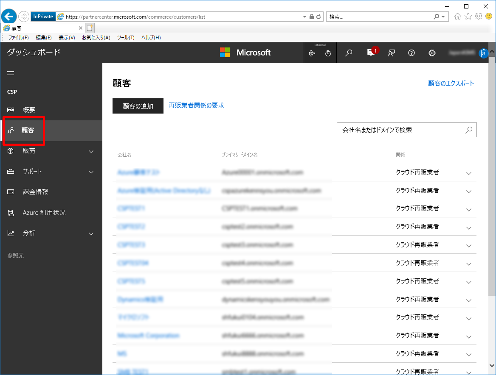 
    
3.  一覧から対象の顧客をクリックする
4.  \[サブスクリプション\] - \[サブスクリプションの追加\] をクリックする
    
     
    
5.  カタログ内から \[Microsoft Azure\] にチェックを入れる
    
    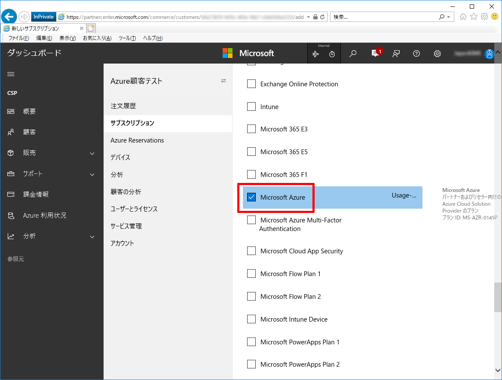
    
6.  画面一番下にスクロールし、\[次へ : レビュー\] をクリックする
    
    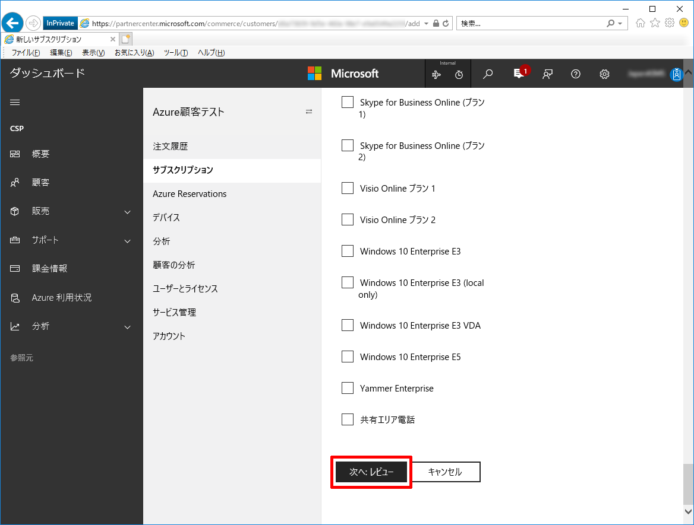
    
7.  \[送信\] をクリックする
    
    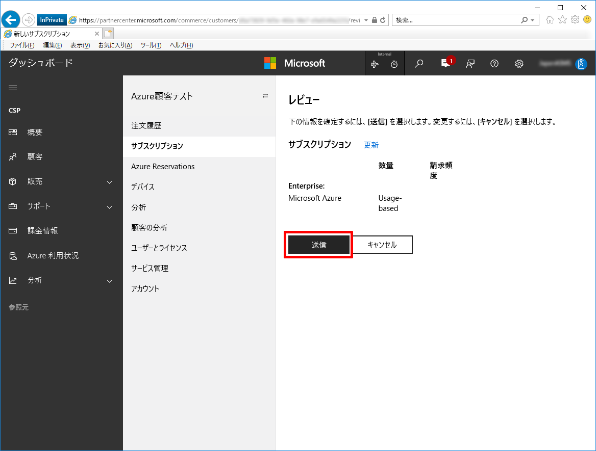
    

以上で、CSP パートナーセンターで、Azure のサブスクリプションを作成する手順は終了です。

### 2\. Azure サブスクリプションを確認

___

CSP パートナーセンターで Azure のサブスクリプションが作成されたら、その Azure サブスクリプションが Azure ポータル上に反映されているかを確認します。

CSP パートナー様の作業になります。

詳細な手順についてご案内します。

1.  CSP パートナーセンターにサインインする
2.  画面左から \[CSP\] - \[顧客\] をクリックする
    
     
    
3.  一覧から対象の顧客をクリックする
4.  \[サブスクリプション\] をクリックする
    
    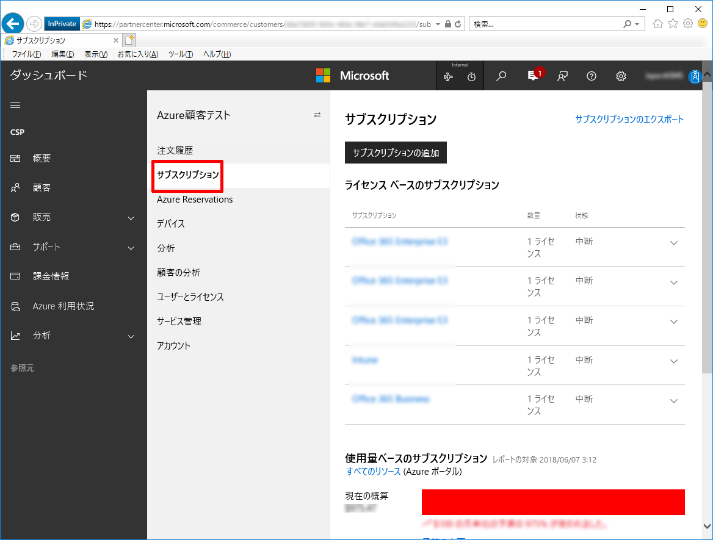
    
5.  画面をスクロールし、Microsoft Azure の一覧の中から先ほど追加した Microsoft Azure を展開して、そのサブスクリプション ID を確認する
    
    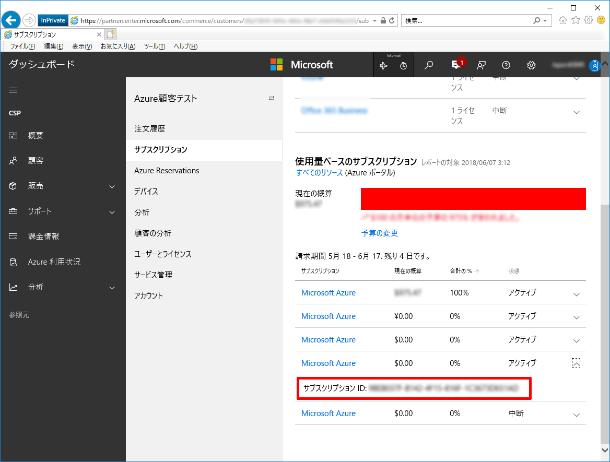
    
6.  \[サービス管理\] - \[Microsoft Azure Management Portal\] をクリックする
    
    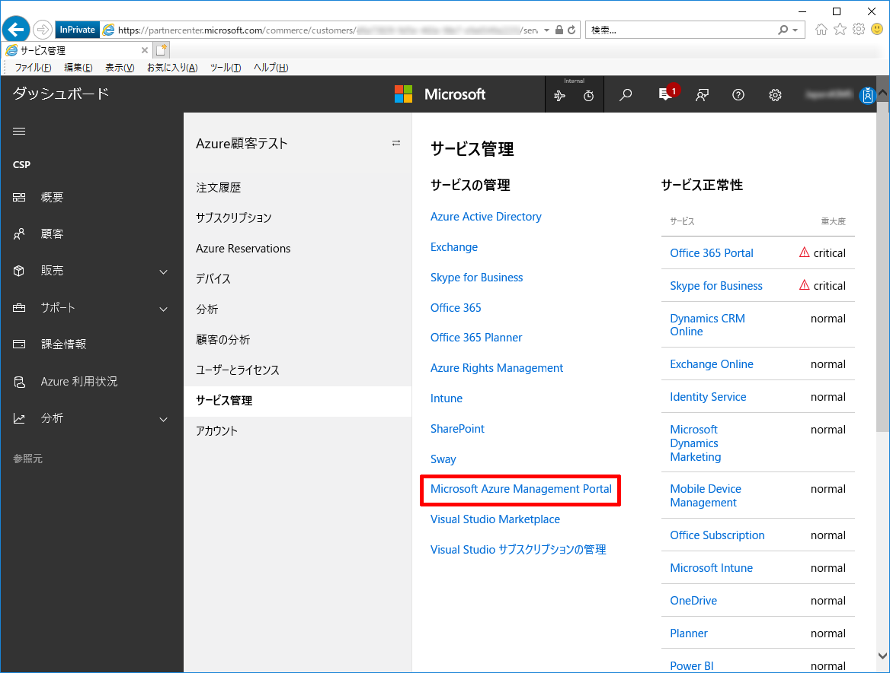
    
7.  対象の顧客の Azure ポータルが開くことを確認する
    
    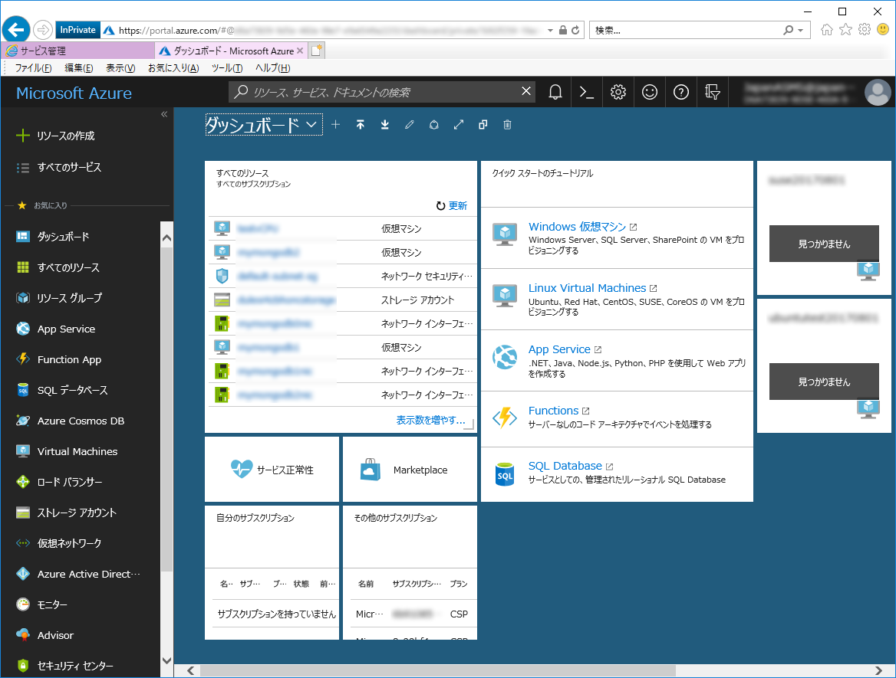
    
8.  画面左から \[すべてのサービス\] - \[サブスクリプション\] をクリックする
    
    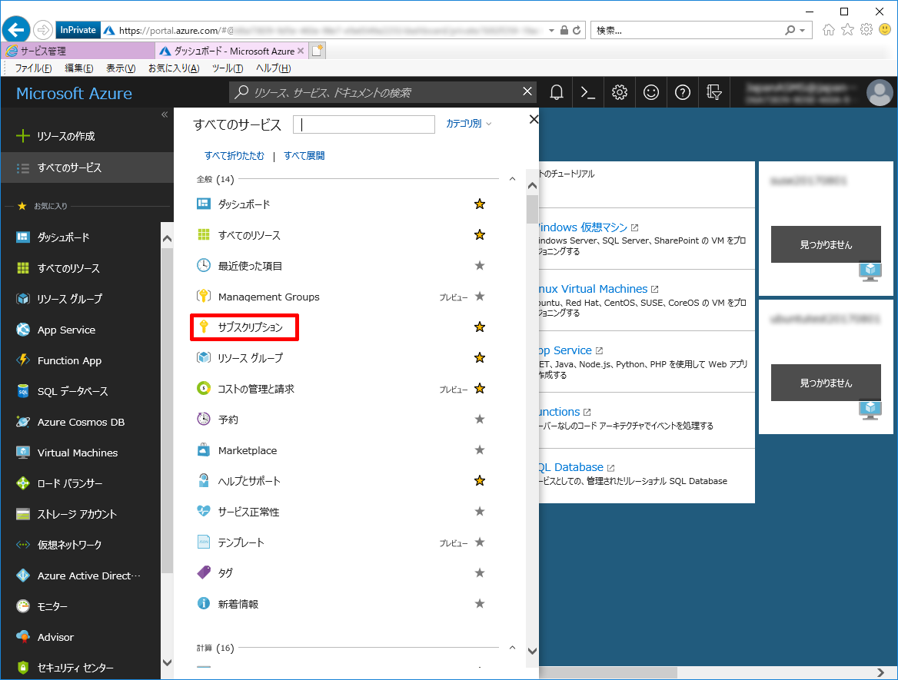
    
9.  サブスクリプションの一覧から、上記 5. で確認したサブスクリプション ID が存在していることを確認する
    
    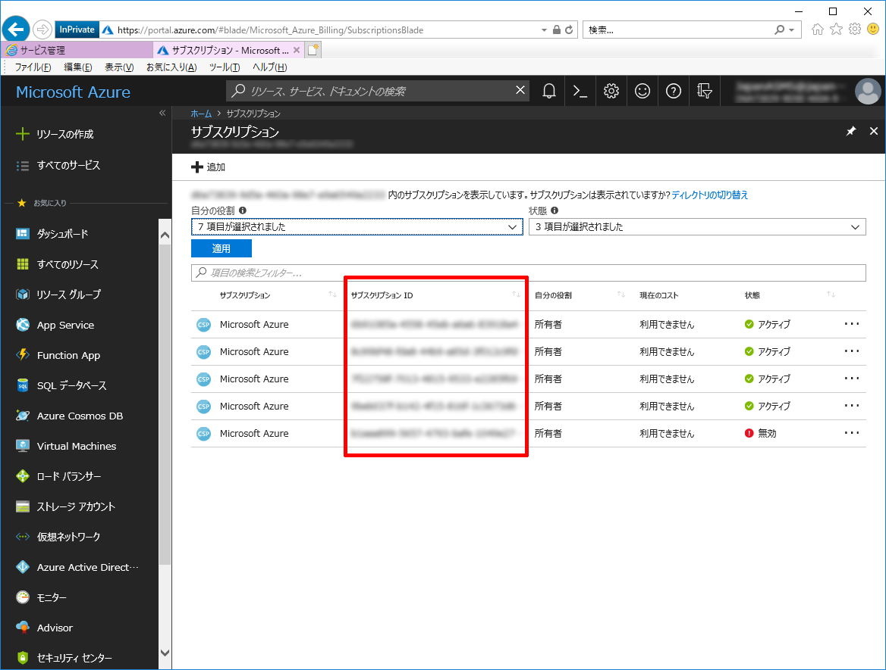
    

以上で Azure サブスクリプションが Azure ポータル上に反映されているか確認する手順は終了です。

この手順で Azure ポータル上で作成したサブスクリプションが確認できない場合、次の「3. 必要に応じて、再作成」もご確認ください。

### 3\. 必要に応じて、再作成

___

まれに、上記「2. Azure サブスクリプションを確認」の手順で、作成をした Azure サブスクリプションが Azure ポータルで確認できないことがあります。

その際は、Azure サブスクリプションを一旦削除して、同手順にて再作成・再確認します。

CSP パートナー様の作業になります。

Azure サブスクリプションを削除する詳細な手順についてご案内します。

なお、削除後の再作成・再確認は上記の「1. Azure サブスクリプションを作成」「[2. Azure サブスクリプションを確認」を再度行っていただきます。

1.  CSP パートナーセンターにサインインする
2.  画面左から \[CSP\] - \[顧客\] をクリックする
    
    
    
3.  一覧から対象の顧客をクリックする
4.  \[サブスクリプション\] をクリックする
    
    
    
5.  画面をスクロールし、Microsoft Azure の一覧の中から先ほど追加したものの Azure ポータル上で確認ができない Microsoft Azure をクリックする
    
    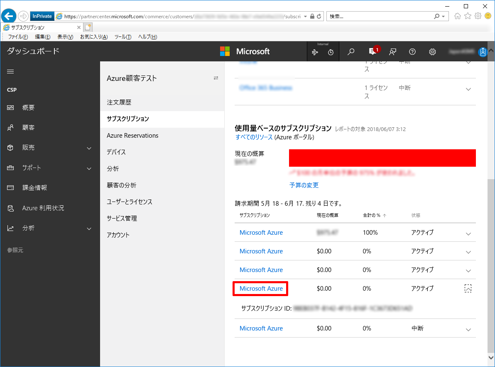
    
6.  \[中断\] を選択して \[送信\] をクリックする
    
    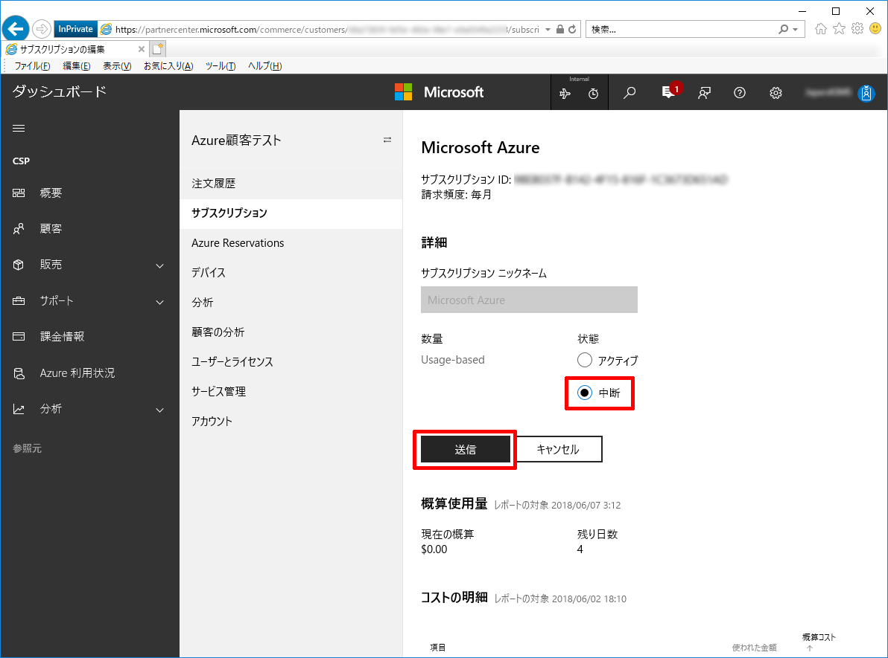
    

以上で Azure サブスクリプション削除する手順は終了です。

削除後、上記の「1. Azure サブスクリプションを作成」「2. Azure サブスクリプションを確認」を再度行って、Azure サブスクリプションを再作成してください。

### お困りの時は・・・

___

上記内容についてお困りのことがございましたら、是非私たちサポート サービスがご支援をさせていただければと思います。

上記ご説明の通り、この手順は CSP パートナーセンター上の操作と、Azure ポータル上の操作が含まれています。

それぞれの専門チームがお客様のお手伝いをさせていただきますので、その内容に応じて各担当窓口にご相談ください。

窓口が複数ありお客様にはご不便をおかけしますが、どうぞよろしくお願いします。

#### CSP パートナーセンター上の操作でお困りの時

以下の手順で私たちサポート サービスにお問い合わせください。

パートナー センターに関する問題の報告

[https://docs.microsoft.com/ja-jp/partner-center/report-problems-with-partner-center](https://docs.microsoft.com/ja-jp/partner-center/report-problems-with-partner-center)

#### Azure ポータル上の操作でお困りの時

以下の手順で私たちサポート サービスにお問い合わせください。

Azure サポート要求を作成する方法

[https://docs.microsoft.com/ja-jp/azure/azure-supportability/how-to-create-azure-support-request](https://docs.microsoft.com/ja-jp/azure/azure-supportability/how-to-create-azure-support-request)

以上の通りご案内いたします。

引き続き弊社製品・サービスについてお客様のお役に立てる情報のご案内に努めさせていただきます。

よろしくお願いします。