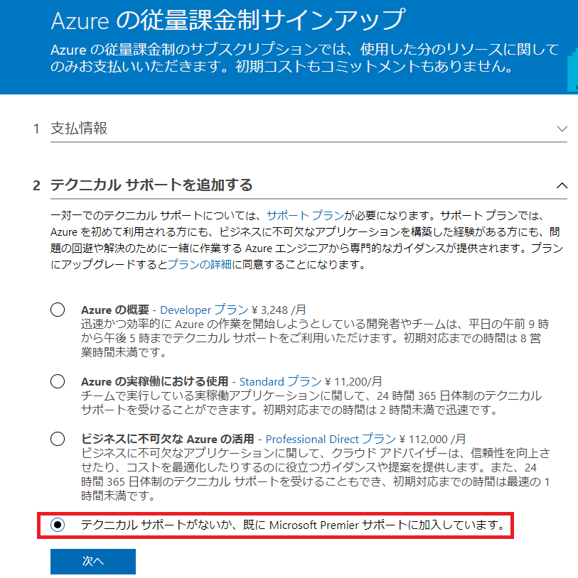

※本情報は 2018 年 7 月時点の情報です。今後、変更などがある可能性もありますのでご了承ください。

いつも大変お世話になります。Microsoft Azure サポート チームです。

Microsoft Azure サブスクリプション新規購入時のサポートプランの選択・購入方法について、

本記事で以下をご案内させていただきます。

ご参考になりましたら幸いです。

1.　Microsoft Azure サポートプランとは？

2.　サブスクリプション新規購入時に表示されるテクニカルサポート欄

3.　無償サポートプランの選択方法

4.　有償サポートプランの購入方法

## 1.　Microsoft Azure サポートプランとは？

Microsoft Azure では、無償と有償の各種サポートプランが提供されています。

ご利用目的に応じ、ご活用くださいますと幸いです。

詳細については、以下のドキュメントをご確認ください。

Azure のサポート プラン

https://azure.microsoft.com/ja-jp/support/plans/

## 2.  サブスクリプション新規購入時に表示されるテクニカルサポート欄

アカウントポータル上で、従量課金プランなど Microsoft Azure サブスクリプション新規購入時に、

サポートプランを選択・同時購入できるオプションが新たに追加されました。

ご希望に応じ、\[2 テクニカル サポートを追加する\] 欄でサポートプランをご選択くださいますと幸いです。

詳細については、本記事の後述内容をご参照くださいませ

## 3.  無償サポートプランの選択方法

Microsoft Azure の無償サポートプランをご希望の場合、Microsoft Azure サブスクリプション新規購入時の\[2 テクニカル サポートを追加する\] 欄で、

\[テクニカル サポートがないか、すでに Micrsofot Premier サポートに加入しています。\] を選択し、\[次へ\] をクリックします。

※ サインアップの際、最初に \[Azure の概要 - [Developer プラン](https://go.microsoft.com/fwLink/p/?LinkID=852457&clcid=0x411)\] が選択されている状態となっています。

サポートプランのご契約が不要な場合は、上記対応が必要となりますことご承知おきください。

例）従量課金プランの新規購入時に無償サポートプランを選択する場合

 

## 4.  有償サポートプランの購入方法

Microsoft Azure の有償サポートプランをご希望の場合、Microsoft Azure サブスクリプション新規購入時の\[2 テクニカル サポートを追加する\] 欄で、

\[Azure の概要 - [Developer プラン](https://go.microsoft.com/fwLink/p/?LinkID=852457&clcid=0x411)\]、\[Azure の実稼働における使用 - [Standard プラン](https://go.microsoft.com/fwLink/p/?LinkID=852458&clcid=0x411)\]、 \[ビジネスに不可欠な Azure の活用 – [Professional Direct プラン](https://go.microsoft.com/fwLink/p/?LinkID=852459&clcid=0x411)\] の いずれかを選択し、\[次へ\] をクリックします。

例）従量課金プランの新規購入時に有償サポートプランを同時購入する場合

 

以上の通りご案内いたします。

引き続き弊社製品・サービスについてお客様のお役に立てる情報のご案内に努めさせていただきます。

よろしくお願いします。