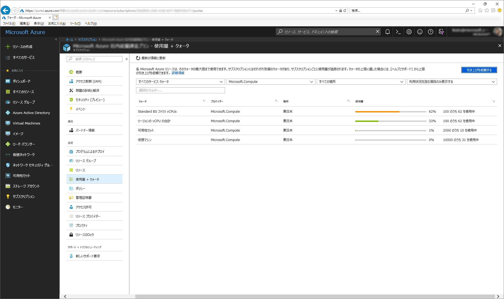

いつも大変お世話になります。Microsoft Azure サポート チームです。

Azure の各サービスの使用量とクォータを確認する方法について以下をご案内させていただきます。

ご参考になりましたら幸いです。

-   本記事の目的
-   事前に行う共通作業について
-   Virtual Machines の使用量とクォータを確認する方法
-   ネットワークの使用量とクォータを確認する方法
-   サブネットの使用量とクォータを確認する方法
-   ストレージ アカウントの使用量とクォータを確認する方法
-   Content Delivery Network の使用量とクォータを確認する方法
-   関連する弊社公開情報

### 本記事の目的

___

本記事では、PowerShell を使って Azure の各サービスの使用量とクォータを確認する方法をご案内いたします。

お客様から「現在のリソースの使用量を確認したい」「クォータ増加後の上限を確認したい」といったお問い合わせをいただくことがあります。

もちろん、Azure ポータルでは以下の画面で使用量とクォータを確認できます。

 

本記事ではこの使用量とクォータを PowerShell で確認する方法をご案内します。

**!! 注意事項 !!**
全てのサービスについてご案内するものではありません。
今後、少しずつご案内内容を増やしていければと思います。

また本記事内に記載する PowerShell の結果は弊社検証環境の結果です。
お客様環境で同じ結果が得られること、または同じ結果を得られるようにすることをお約束するものではありません。

### 事前に行う共通作業について

___

各サービスの使用量とクォータを確認するために事前に行う共通作業についてご案内します。

まずは、以下の手順を実施します。

1.  以下の弊社技術ブログに沿って、リソース マネージャー デプロイ モデルの Azure PowerShell をインストールする
    
    Azure PowerShell インストール手順   
    [https://blogs.technet.microsoft.com/jpaztech/2017/05/02/azure-powershell-3-8-0-install/](https://blogs.technet.microsoft.com/jpaztech/2017/05/02/azure-powershell-3-8-0-install/)
       ※ 既にインストール済みの場合、実施は必須ではありません。
    

2.  PowerShell を管理者として起動する

3.  以下のコマンドを実行して Azure に接続する   
    Connect-AzureRmAccount
    ※ 認証が発生するので、ID とパスワードを入力して認証を終えます。
    

4.  以下のコマンドを実行して対象の Azure サブスクリプションを指定する   
    Select-AzureRmSubscription -SubscriptionObject "<サブスクリプション ID>"
    
    <サブスクリプション ID> には、対象の Azure サブスクリプションのサブスクリプション ID を入れます。
    サブスクリプション ID は以下の弊社公開情報に沿ってご確認いただけます。
    
    サブスクリプション ID とデプロイ ID を確認する方法について
    [https://blogs.msdn.microsoft.com/dsazurejp/2013/12/06/id-id/](https://blogs.msdn.microsoft.com/dsazurejp/2013/12/06/id-id/)
    ※ 「■ サブスクリプション ID の確認方法」をご参照ください。
    
    例)
    Select-AzureRmSubscription -SubscriptionObject "aabbccdd-eeaa-bbcc-ddee-aabbccddeeaa"
    

### Virtual Machines の使用量とクォータを確認する方法

___

Virtual Machines のクォータと使用量を確認する方法をご案内します。
上記の「事前に行う共通作業について」を実施してから、以下の手順を実施します。

1.  以下のコマンドを実行して、Virtual Machines のクォータと使用量を取得する   
    
    Get-AzureRmVMUsage -Location:'<リージョン>'
     <リージョン> には、対象のリージョンを入れます。
    
    「Get-AzureRmVMUsage -Location:」まで入力していただいて、Tab キーを押下することで順にリージョンが表示されます。

    例)    
    Get-AzureRmVMUsage -Location:'Japan East'
    
2.  コマンドの結果を確認する
    Current Value が現在の使用量です。
    
    Limit がクォータです。
    例)
    Name                             Current Value Limit  Unit
    \----                             ------------- -----  ----
    
    Availability Sets                           10  2000 Count
    
    Total Regional vCPUs                        62   190 Count
    
    Virtual Machines                            31 10000 Count
    
    Virtual Machine Scale Sets                   0  2000 Count
    
    Standard BS Family vCPUs                    62   100 Count
    
    Basic A Family vCPUs                         0   100 Count
    
    Standard A0-A7 Family vCPUs                  0   100 Count
    
    Standard A8-A11 Family vCPUs                 0   100 Count
    
    Standard D Family vCPUs                      0   100 Count
    
    Standard Dv2 Family vCPUs                    0   100 Count
    
    Standard DS Family vCPUs                     0   100 Count
    
    Standard DSv2 Family vCPUs                   0   100 Count
    
    Standard G Family vCPUs                      0   100 Count
    
    Standard GS Family vCPUs                     0   100 Count
    
    Standard F Family vCPUs                      0   100 Count
    
    Standard FS Family vCPUs                     0   100 Count
    
    Standard NV Family vCPUs                     0    24 Count
    
    Standard NC Family vCPUs                     0    48 Count
    
    Standard H Family vCPUs                      0     8 Count
    
    Standard Av2 Family vCPUs                    0   100 Count
    
    Standard LS Family vCPUs                     0   100 Count
    
    Standard Dv2 Promo Family vCPUs              0   100 Count
    
    Standard DSv2 Promo Family vCPUs             0   100 Count
    
    Standard MS Family vCPUs                     0     0 Count
    
    Standard Dv3 Family vCPUs                    0   100 Count
    
    Standard DSv3 Family vCPUs                   0   100 Count
    
    Standard Ev3 Family vCPUs                    0   100 Count
    
    Standard ESv3 Family vCPUs                   0   100 Count
    
    Standard FSv2 Family vCPUs                   0   100 Count
    
    Standard NDS Family vCPUs                    0     0 Count
    
    Standard NCSv2 Family vCPUs                  0     0 Count
    
    Standard NCSv3 Family vCPUs                  0     0 Count
    
    Standard LSv2 Family vCPUs                   0     0 Count
    
    Standard EIv3 Family vCPUs                   0   100 Count
    
    Standard EISv3 Family vCPUs                  0   100 Count
    
    Standard Storage Managed Disks               0 10000 Count
    
    Premium Storage Managed Disks               31 10000 Count
    
    StandardSSDStorageDisks                      0 10000 Count
    
    DirectDriveDisks                             0 10000 Count
    
    StandardStorageSnapshots                     3 10000 Count
    
    PremiumStorageSnapshots                      0 10000 Count
    
    ZrsStorageSnapshots                          0 10000 Count
    

### ネットワークの使用量とクォータを確認する方法

___

ネットワークのクォータと使用量を確認する方法をご案内します。

上記の「事前に行う共通作業について」を実施してから、以下の手順を実施します。

1.  以下のコマンドを実行して、ネットワークのクォータと使用量を取得する
    
    Get-AzureRmNetworkUsage -Location:'<リージョン>'
    <リージョン> には、対象のリージョンを入れます。
    「Get-AzureRmNetworkUsage -Location:」まで入力していただいて、Tab キーを押下することで順にリージョンが表示されます。
    
    ただし、このコマンドの Location では自動保管されたリージョンからスペースを削除する必要があります。
    例えば、自動保管されたリージョンが 'Japan East' である場合、間にあるスペースを削除して 'JapanEast' にする必要があります。
    
    例)
    Get-AzureRmNetworkUsage -Location:'JapanEast'
    

2.  コマンドの結果を確認する
    
    Current Value が現在の使用量です。
    
    Limit がクォータです。
    
    例)
    
    CurrentValue Limit      Name
    
    \------------ -----      ----
    
    6            1000       Virtual Networks
    
    4            200        Static Public IP Addresses
    
    18           5000       Network Security Groups
    
    35           200        Public IP Addresses
    
    0            2147483647 Public Ip Prefixes
    
    31           24000      Network Interfaces
    
    8            100        Load Balancers
    
    0            50         Application Gateways
    
    0            200        Route Tables
    
    0            1000       Route Filters
    
    0            1          Network Watchers
    
    0            100        Packet Captures
    
    0            3000       Application Security Groups.
    
    0            1          DDoS Protection Plans.
    
    0            500        Service Endpoint Policies
    
    0            200        Network Intent Policies
    
    0            25         DNS servers per Virtual Network
    
    0            3000       Subnets per Virtual Network
    
    0            65536      IP Configurations per Virtual Network
    
    0            100        Peerings per Virtual Network
    
    0            1000       Security rules per Network Security Group
    
    0            100        Security rules per Network Intent Policy
    
    0            100        Routes per Network Intent Policy
    
    0            4000       Security rules addresses or ports per Network Security Group
    
    0            250        Inbound Rules per Load Balancer
    
    0            10         Frontend IP Configurations per Load Balancer
    
    0            5          Outbound Rules per Load Balancer
    
    0            400        Routes per Route Table
    
    0            256        Secondary IP Configurations per Network Interface
    
    0            500        Inbound rules per Network Interface
    
    0            1          Route filter rules per Route Filter
    
    0            1          Route filters per Express route BGP Peering
    

### サブネットの使用量とクォータを確認する方法

___

サブネットのクォータと使用量を確認する方法をご案内します。

上記の「事前に行う共通作業について」を実施してから、以下の手順を実施します。

1.  以下のコマンドを実行して、サブネットのクォータと使用量を取得する
    
    Get-AzureRmVirtualNetworkUsageList -ResourceGroupName:<リソース グループ名> -Name:<仮想ネットワーク名> | fl
    
    <リソース グループ名> には、対象のリソース グループ名を入れます。
    
    「Get-AzureRmVirtualNetworkUsageList -ResourceGroupName:」まで入力していただいて、Tab キーを押下することで順にリソース グループ名が表示されます。
    
    <仮想ネットワーク名> には、対象の仮想ネットワーク名を入れます。
    
    例)
    
    Get-AzureRmVirtualNetworkUsageList -ResourceGroupName:rg01 -Name:vn01 | fl
    

2.  コマンドの結果を確認する
    
    Current Value が現在の使用量です。
    
    Limit がクォータです。
    
    例)
    
    Name         : Subnet size and usage
    
    Id           : /subscriptions/aabbccdd-eeaa-bbcc-ddee-aabbccddeeaa/resourceGroups/rg01/providers/Microsoft.Network/virtualNetworks/vn01/subnets/sn01
    
    CurrentValue : 4
    
    Limit        : 251
    
    Unit         : Count
    
    Name         : Subnet size and usage
    
    Id           : /subscriptions/aabbccdd-eeaa-bbcc-ddee-aabbccddeeaa/resourceGroups/rg01/providers/Microsoft.Network/virtualNetworks/vn01/subnets/sn02
    
    CurrentValue : 3
    
    Limit        : 251
    
    Unit         : Count
    
    Name         : Subnet size and usage
    
    Id           : /subscriptions/aabbccdd-eeaa-bbcc-ddee-aabbccddeeaa/resourceGroups/rg01/providers/Microsoft.Network/virtualNetworks/vn01/subnets/sn03
    
    CurrentValue : 2
    
    Limit        : 251
    
    Unit         : Count
    

### ストレージ アカウントの使用量とクォータを確認する方法

___

ストレージ アカウントのクォータと使用量を確認する方法をご案内します。

上記の「事前に行う共通作業について」を実施してから、以下の手順を実施します。

1.  以下のコマンドを実行して、ストレージ アカウントのクォータと使用量を取得する
    
    Get-AzureRmStorageUsage
    

2.  コマンドの結果を確認する
    
    Current Value が現在の使用量です。
    
    Limit がクォータです。
    
    例)
    
    LocalizedName : Storage Accounts
    
    Name          : StorageAccounts
    
    Unit          : Count
    
    CurrentValue  : 0
    
    Limit         : 200
    

### Content Delivery Network の使用量とクォータを確認する方法

___

Content Delivery Network のクォータと使用量を確認する方法をご案内します。

上記の「事前に行う共通作業について」を実施してから、以下の手順を実施します。

1.  以下のコマンドを実行して、Content Delivery Network のクォータと使用量を取得する
    
    Get-AzureRmCdnSubscriptionResourceUsage | fl
    

2.  コマンドの結果を確認する
    
    Current Value が現在の使用量です。
    
    Limit がクォータです。
    
    例)
    
    ResourceType : profile
    
    Unit         : count
    
    CurrentValue : 0
    
    Limit        : 25
    

### 関連する弊社公開情報

___

本記事に関連する弊社公開情報をご案内します。

Azure サブスクリプションとサービスの制限、クォータ、制約

[https://docs.microsoft.com/ja-jp/azure/azure-subscription-service-limits](https://docs.microsoft.com/ja-jp/azure/azure-subscription-service-limits)

Get-AzureRmVMUsage

[https://docs.microsoft.com/en-us/powershell/module/azurerm.compute/get-azurermvmusage](https://docs.microsoft.com/en-us/powershell/module/azurerm.compute/get-azurermvmusage)

Get-AzureRmNetworkUsage

[https://docs.microsoft.com/en-us/powershell/module/azurerm.network/get-azurermnetworkusage](https://docs.microsoft.com/en-us/powershell/module/azurerm.network/get-azurermnetworkusage)

Get-AzureRmVirtualNetworkUsageList

[https://docs.microsoft.com/en-us/powershell/module/azurerm.network/get-azurermvirtualnetworkusagelist](https://docs.microsoft.com/en-us/powershell/module/azurerm.network/get-azurermvirtualnetworkusagelist)

Get-AzureRmStorageUsage

[https://docs.microsoft.com/en-us/powershell/module/azurerm.storage/get-azurermstorageusage](https://docs.microsoft.com/en-us/powershell/module/azurerm.storage/get-azurermstorageusage)

Get-AzureRmCdnSubscriptionResourceUsage

[https://docs.microsoft.com/en-us/powershell/module/azurerm.cdn/get-azurermcdnsubscriptionresourceusage](https://docs.microsoft.com/en-us/powershell/module/azurerm.cdn/get-azurermcdnsubscriptionresourceusage)

以上の通りご案内いたします。

引き続き弊社製品・サービスについてお客様のお役に立てる情報のご案内に努めさせていただきます。

よろしくお願いします。