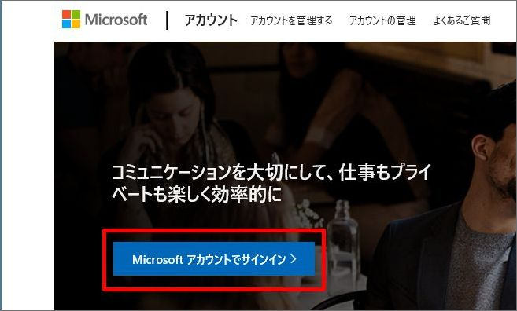
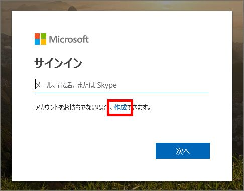
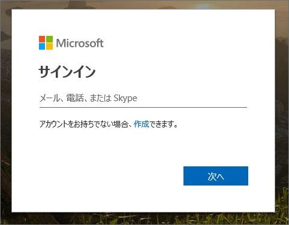
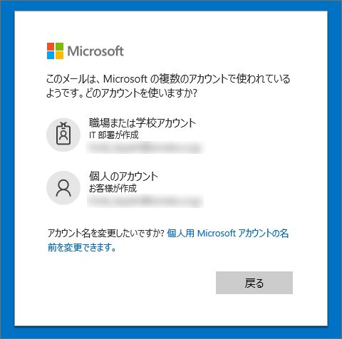

いつも大変お世話になります。Microsoft Azure サポート チームです。

Microsoft アカウントと組織アカウントについて以下をご案内させていただきます。

ご参考になりましたら幸いです。

-   本記事の目的
-   Microsoft アカウントとは
-   組織アカウントとは
-   両アカウントの注意事項
-   自分が使っているアカウントはどっち ?
-   問題がある時に試すこと
-   関連する弊社公開情報

### 本記事の目的

___

本記事では、Microsoft アカウントと組織アカウントについてご案内いたします。

お客様から「Azure ポータル上でリソースが見えない」「Azure ポータルでサブスクリプションが出てこなくなった」といったお問い合わせをいただくことがあります。

時に、これらがサインインの際にご利用をいただいているアカウント (Microsoft アカウント・組織アカウント) の違いによって発生していることがあります。

本記事では、そのような事象に合った時にお客様にお試しいただきたい点、また、Microsoft アカウント・組織アカウントについてご参考になる情報のご提供を目的としています。

**!! 注意事項 !!**

Microsoft アカウント・組織アカウントについて全てをご案内するものではありません。

是非、「関連する弊社公開情報」も併せてご参照いただけたら幸いです。

### Microsoft アカウントとは

___

Microsoft アカウントについてご案内します。

Microsoft アカウントとは、コンシューマー向けのサービス (Outlook.com、OneDrive、Xbox LIVE など) をご利用いただく際のアカウントです。

個人が作成することができます。

「outlook.jp」や Yahoo!、Gmail のアドレスなどで作成することができます。

Microsoft アカウントは「個人アカウント」とも呼ばれます。

Microsoft アカウントで Azure のサブスクリプションを作成することが可能です。

Microsoft アカウントは以下の手順で作成することができます。

1.  [https://account.microsoft.com/](https://account.microsoft.com/) にアクセスする
2.  \[Microsoft アカウントでサインイン\] をクリックする
    
    
    
3.  \[作成\] をクリックする
    
    
    
4.  手順に沿って作成を終える

### 組織アカウントとは

___

組織アカウントについてご案内します。

組織アカウントとは、Microsoft のクラウド サービス (Azure、Office 365、Intune など) をご利用いただく際のアカウントです。

組織の管理者が、Azure AD 内に作成することができます。

会社でご利用のドメイン「contoso.com」などで作成することができます。

組織アカウントは「職場または学校アカウント」とも呼ばれます。

組織アカウントで Azure のサブスクリプションを作成することが可能です。

組織アカウントは以下のような手順で作成することができます。

方法: Azure Active Directory を使用してユーザーを追加または削除する

[https://docs.microsoft.com/ja-jp/azure/active-directory/fundamentals/add-users-azure-active-directory](https://docs.microsoft.com/ja-jp/azure/active-directory/fundamentals/add-users-azure-active-directory)

Office 365 にユーザーを個別に、またはまとめて追加する - 管理者向けヘルプ

[https://docs.microsoft.com/ja-jp/office365/admin/add-users/add-users](https://docs.microsoft.com/ja-jp/office365/admin/add-users/add-users)

### 両アカウントの注意事項

___

Microsoft アカウントと組織アカウントの注意事項についてご案内します。

ある 1 つのメールアドレスが、Microsoft アカウントであり、かつ組織アカウントであるという状況が起こり得ます。

つまり、お客様が user@contoso.com というメールアドレスを持っている場合、そのメールアドレスが Microsoft アカウントとして登録されていて、かつ、同メールアドレスが UPN (User Principal Name) になっているユーザーが Azure AD 内に組織アカウントとして存在しているという状況です。

この場合、お客様は Microsoft アカウントとしての user@contoso.com と、組織アカウントとしての user@contoso.com を適宜使い分けていただく必要がありますので、ご注意ください。

### 自分が使っているアカウントはどっち ?

___

では、自分が使っているアカウントが Microsoft アカウントと組織アカウントのどちらであるか、またはその両方であるかをどのように確認するかについてご案内します。

#### Microsoft アカウントであるかを確認する方法

以下の手順で自分のアカウントが Microsoft アカウントであるかを確認します。

1.  すべてのブラウザーを閉じる
    
    セッションが残っていることで、意図しないアカウントでサインインをしてしまうことを避けるために、必ずすべてのブラウザーを閉じてください。
    
2.  InPrivate ブラウザーを起動する
    
    同様に、意図しないアカウントでサインインをしてしまうことを避けるために、必ず InPrivate ブラウザーでお試しください。
    
3.  [https://account.microsoft.com/](https://account.microsoft.com/) にアクセスする
4.  \[Microsoft アカウントでサインイン\] をクリックする
    
    
    
5.  サインイン画面が表示されるので、自分のアカウントとパスワードでサインインを試みる
    
    
    

上記でサインインが行える場合、お試しいただいたアカウントは Microsoft アカウントとして存在しています。

#### 組織アカウントであるかを確認する方法

以下の手順で自分のアカウントが組織アカウントであるかを確認します。

1.  すべてのブラウザーを閉じる
    
    セッションが残っていることで、意図しないアカウントでサインインをしてしまうことを避けるために、必ずすべてのブラウザーを閉じてください。
    
2.  InPrivate ブラウザーを起動する
    
    同様に、意図しないアカウントでサインインをしてしまうことを避けるために、必ず InPrivate ブラウザーでお試しください。
    
3.  [https://portal.azure.com/](https://portal.azure.com/) にアクセスする
4.  サインイン画面が表示されるので、自分のアカウントとパスワードでサインインを試みる
    
    
    
5.  もし、以下の画面が表示される場合、\[職場または学校アカウント\] を選択してサインインを試みる
    
    
    
    この画面は、以下の状況の時に表示されます。
    
    ・該当アカウントが Microsoft アカウントとして存在している
    
    ・かつ、該当アカウントのドメインが、Azure AD に登録されている
    
    そのため、この画面が出た時点で、該当アカウントが Microsoft アカウントとして存在していることは確定しますが、組織アカウントとして存在していることが確定するわけではありません。
    
    また逆に、この画面が出ないから Microsoft アカウントとして存在していない、というわけでもありません。
    
    Microsoft アカウントとして存在しているものの、そのドメインが Azure AD に登録されていない場合は、この画面が表示されないためです。
    
    Microsoft アカウントとして存在しているかの確認は、必ず上記「Microsoft アカウントであるかを確認する方法」の手順でご確認ください。
    
    なお、Microsoft アカウントとしても組織アカウントとしても存在しているアカウントの場合は、必ずこの画面が表示されます。
    

上記でサインインが行える場合、お試しいただいたアカウントは組織アカウントとして存在しています。

### 問題がある時に試すこと

___

Azure ポータル上で、「今まで見えていたリソースやサブスクリプションが見えなくなった」などの事象が発生した場合、まずは以下をお試しいただけますと幸いです。

1.  上記「自分が使っているアカウントはどっち ?」で、ご利用のアカウントが Microsoft アカウント、組織アカウントの両方として存在しているかを確認する
2.  もし両方として存在している場合、上記「自分が使っているアカウントはどっち ? 」 - 「組織アカウントであるかを確認する方法」の手順で「5.」まで進める
    
    Microsoft アカウント、組織アカウントの両方として存在している場合、必ずこの画面が表示されます。
    
3.  その画面で \[職場または学校アカウント\] を選択してサインインをして、事象の改善に繋がるか確認する
4.  事象の改善に繋がらない場合、同画面で今度は \[個人のアカウント\] を選択してサインインをして、事象の改善に繋がるか確認する

この手順で事象の改善に至らない場合、または、そもそもご利用のアカウントが Microsoft アカウント、組織アカウントの両方として存在していない場合は、別の要因による事象である可能性があります。

その際は是非私たちサポート サービスのご利用をご検討いただけましたら幸いです。

お客様のお力になれるようがんばらせていただきます。

### 関連する弊社公開情報

___

Microsoft アカウント、組織アカウントについて、弊社の様々な公開情報を以下にご案内します。

併せてご利用ください。

Microsoft アカウント

[https://account.microsoft.com/account?lang=ja-JP](https://account.microsoft.com/account?lang=ja-JP)

Microsoft アカウントにサインインする方法

[https://support.microsoft.com/ja-jp/help/4028195/microsoft-account-how-to-sign-in](https://support.microsoft.com/ja-jp/help/4028195/microsoft-account-how-to-sign-in)

Microsoft アカウントに関するヘルプ

[https://support.microsoft.com/ja-jp/hub/4294457/microsoft-account-help](https://support.microsoft.com/ja-jp/hub/4294457/microsoft-account-help)

Microsoft FAQ

[https://account.microsoft.com/account/faq](https://account.microsoft.com/account/faq)

指定した Microsoft アカウントは登録されていません

[https://support.microsoft.com/ja-jp/help/13811/microsoft-account-doesnt-exist](https://support.microsoft.com/ja-jp/help/13811/microsoft-account-doesnt-exist)

方法: Azure Active Directory を使用してユーザーを追加または削除する

[https://docs.microsoft.com/ja-jp/azure/active-directory/fundamentals/add-users-azure-active-directory](https://docs.microsoft.com/ja-jp/azure/active-directory/fundamentals/add-users-azure-active-directory)

Office 365 にユーザーを個別に、またはまとめて追加する - 管理者向けヘルプ

[https://docs.microsoft.com/ja-jp/office365/admin/add-users/add-users](https://docs.microsoft.com/ja-jp/office365/admin/add-users/add-users)

以上の通りご案内いたします。

引き続き弊社製品・サービスについてお客様のお役に立てる情報のご案内に努めさせていただきます。

よろしくお願いします。