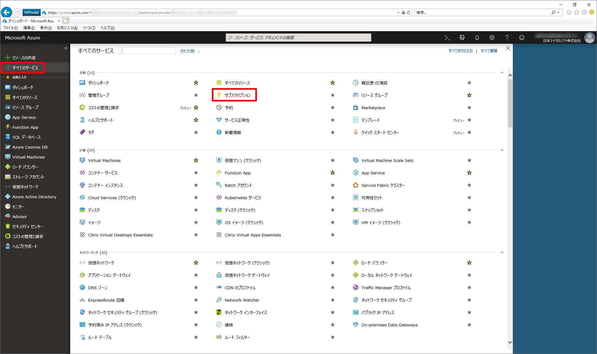
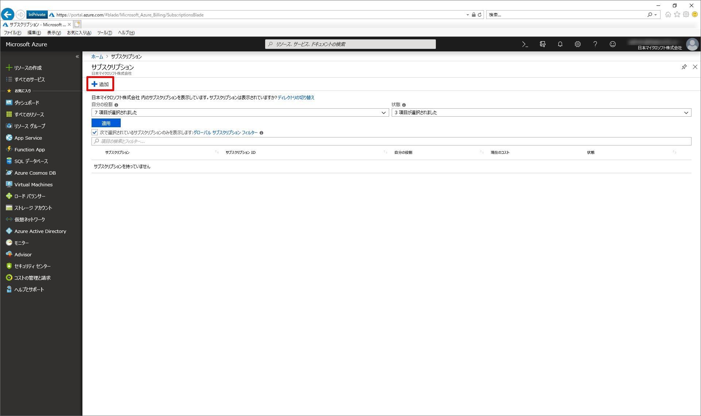
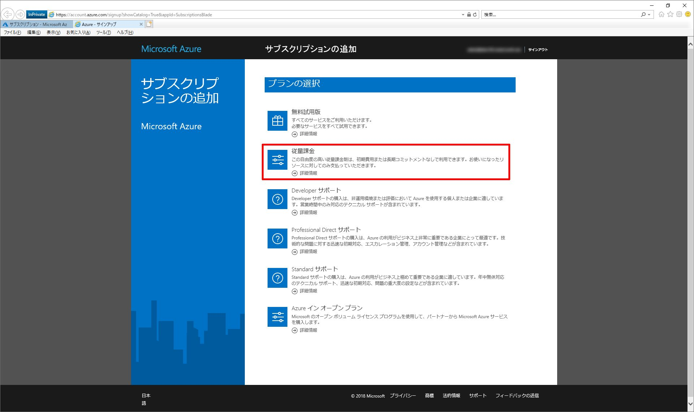
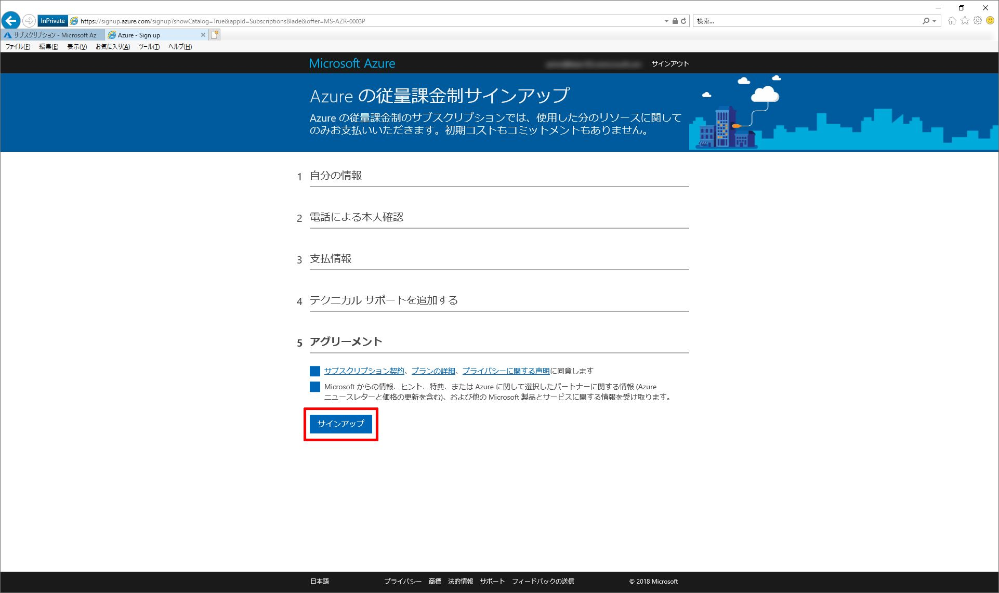
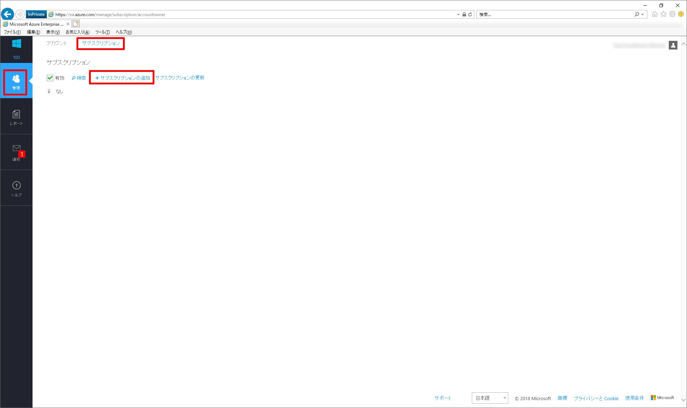
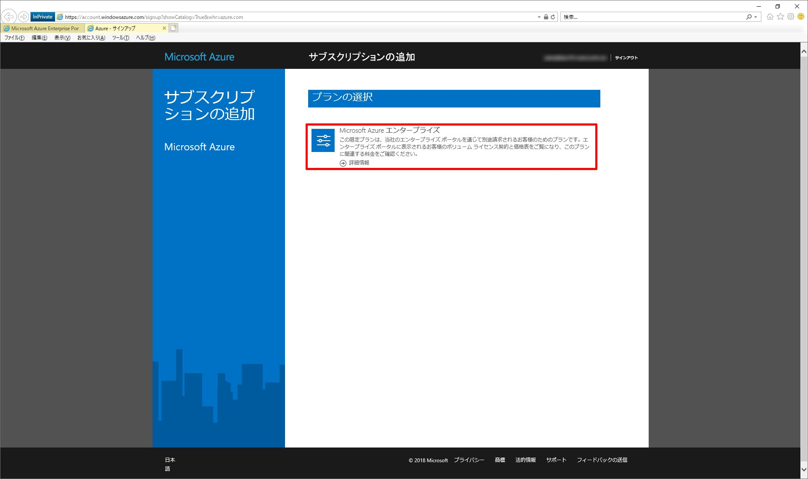
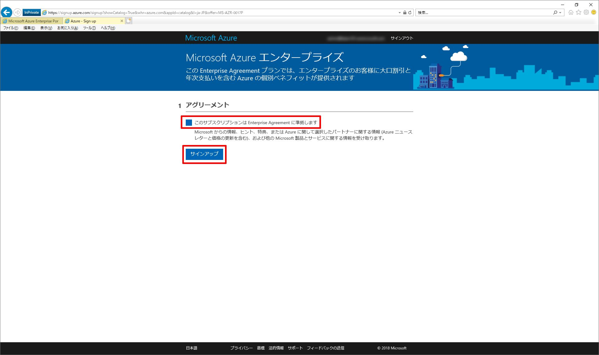
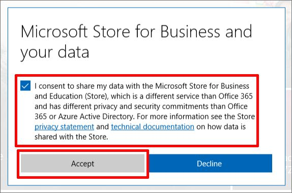
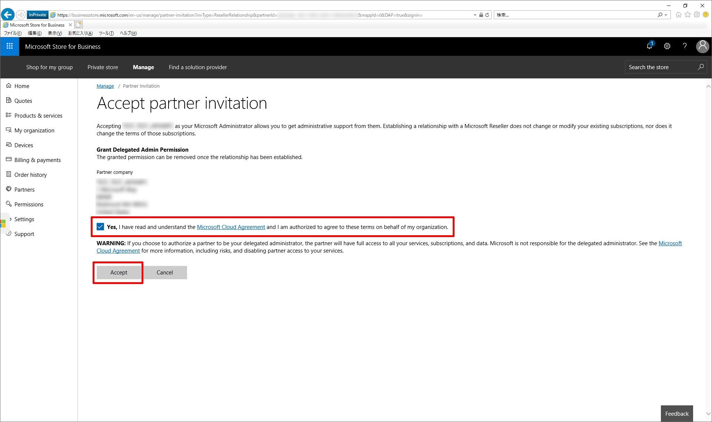

いつも大変お世話になります。Microsoft Azure サポート チームです。

既存の Azure AD に紐づけて Azure サブスクリプションを取得する方法をご案内させていただきます。

ご参考になりましたら幸いです。

-   本記事の目的
-   従量課金の場合
-   EA の場合
-   CSP の場合
-   お困りの時は・・・

### 本記事の目的

___

お客様からよく「既に Office 365 は持っているけど、その Azure AD に紐づけた形で新規に Azure サブスクリプションを取得したい」というお問い合わせをいただきます。

本記事ではこの方法についてご案内いたします。

Azure のサブスクリプションには様々な種類が存在しています。

本記事では、特にご要望の多い以下 3 つの Azure サブスクリプションについてそれぞれ以降にご案内します。

-   従量課金の場合
-   EA の場合
-   CSP の場合

### 従量課金の場合

___

「既に Office 365 は持っているけど、その Azure AD に紐づけた形で新規に "**従量課金**" の Azure サブスクリプションを取得したい」というご要望について、その対応手順をご案内します。

この場合、以下の手順を実施すると、既存の Azure AD (Office 365) に紐づけた形で、**従量課金**の Azure サブスクリプションを取得できます。

1.  以下の弊社公開情報の手順で、これから取得する Azure サブスクリプションのアカウント管理者・サービス管理者にする予定の組織アカウントを、対象の Azure AD (Office 365) 内に 1 つ作成する

    [https://docs.microsoft.com/ja-jp/microsoft-365/admin/add-users/add-users?view=o365-worldwide](https://docs.microsoft.com/ja-jp/microsoft-365/admin/add-users/add-users?view=o365-worldwide)
    ※ Office 365 の管理者様の作業です。
    
    ※ Azure サブスクリプションのアカウント管理者・サービス管理者には、Azure についての各種お知らせのメールが配信されることがあります。そのため、ここでご用意をいただく組織アカウントには Exchange Online のライセンスを付与するなどして、メールの送受信が可能なアカウントにしておくことをお勧めします。
    
2.  以下の URL から上記 1. で作成をした組織アカウントで Azure ポータルにサインインをする
    
    ※ 上記 1. で作成をした組織アカウントの持ち主様の作業です。
    
    ※ 意図しないアカウントでのサインインを避けるため、必ず InPrivate ブラウザーでご実施ください。
    
3.  Azure ポータルへのサインイン後、\[すべてのサービス\] - \[サブスクリプション\] をクリックする
    
     
    
    ※ 上記 1. で作成をした組織アカウントの持ち主様の作業です。
    
4.  \[+ 追加\] をクリックする
    
    
    
    ※ 上記 1. で作成をした組織アカウントの持ち主様の作業です。
    
5.  \[従量課金\] をクリックする
    
    
    
    ※ 上記 1. で作成をした組織アカウントの持ち主様の作業です。
    
6.  本人確認、支払情報の入力、アグリーメントのチェックなどを済ませ、\[サインアップ\] をクリックする
    
    
    
    ※ 上記 1. で作成をした組織アカウントの持ち主様の作業です。
    

以上で、既存の Azure AD (Office 365) に紐づけた形で、**従量課金**の Azure サブスクリプションを取得できます。

### EA の場合

___

「既に Office 365 は持っているけど、その Azure AD に紐づけた形で新規に "**EA**" の Azure サブスクリプションを取得したい」というご要望について、その対応手順をご案内します。

この場合、以下の手順を実施すると、既存の Azure AD (Office 365) に紐づけた形で、**EA** の Azure サブスクリプションを取得できます。

※ EA のご契約を既にお持ちであることが前提です。

1.  以下の弊社公開情報の手順で、これから取得する Azure サブスクリプションのアカウント管理者・サービス管理者にする予定の組織アカウントを、対象の Azure AD (Office 365) 内に 1 つ作成する
    
    [https://docs.microsoft.com/ja-jp/microsoft-365/admin/add-users/add-users?view=o365-worldwide](https://docs.microsoft.com/ja-jp/microsoft-365/admin/add-users/add-users?view=o365-worldwide)
    ※ Office 365 の管理者様の作業です。
    ※ Azure サブスクリプションのアカウント管理者・サービス管理者には、Azure についての各種お知らせのメールが配信されることがあります。そのため、ここでご用意をいただく組織アカウントには Exchange Online のライセンスを付与するなどして、メールの送受信が可能なアカウントにしておくことをお勧めします。
    
2.  以下の EA ヘルプの手順で、上記 1. で作成をした組織アカウントを、ご利用の EA ポータルにアカウント所有者として追加する
    
    [https://ea.azure.com/helpdocs/addNewAccount](https://ea.azure.com/helpdocs/addNewAccount)
    ※ EA の管理者様の作業です。
    ※ 上記ページは EA ポータル内のヘルプのため、EA ポータルへのアクセス権が必要です。
    
3.  以下の URL から上記 1. で作成をした組織アカウントで EA ポータルにサインインをする
    
    [https://ea.azure.com/](https://ea.azure.com/)
    ※ 上記 1. で作成をした組織アカウントの持ち主様の作業です。
    ※ 一度 EA ポータルにサインインをすることで、上記 2. のアカウント所有者として追加する処理が完了します。そのため、上記 2. の後、必ず該当アカウントで EA ポータルにサインインをしてください。
    
    ※ 意図しないアカウントでのサインインを避けるため、必ず InPrivate ブラウザーでご実施ください。
    
4.  EA ポータルへのサインイン後、\[管理\] - \[サブスクリプション\] - \[+ サブスクリプションの追加\] をクリックする
    
    
    
    ※ 上記 1. で作成をした組織アカウントの持ち主様の作業です。
    
5.  \[Microsoft Azure エンタープライズ\] をクリックする
    
    
    
    ※ 上記 1. で作成をした組織アカウントの持ち主様の作業です。
    
6.  \[このサブスクリプションは Enterprise Agreement に準拠します\] にチェックを入れて、\[サインアップ\] をクリックする
    
    
    
    ※ 上記 1. で作成をした組織アカウントの持ち主様の作業です。
    

以上で、既存の Azure AD (Office 365) に紐づけた形で、**EA** の Azure サブスクリプションを取得できます。

### CSP の場合

___

「既に Office 365 は持っているけど、その Azure AD に紐づけた形で新規に "**CSP**" の Azure サブスクリプションを取得したい」というご要望について、その対応手順をご案内します。

この場合、以下の手順を実施すると、既存の Azure AD (Office 365) に紐づけた形で、**CSP** の Azure サブスクリプションを取得できます。

※ CSP のご契約を既にお持ちであることが前提です。

1.  以下の弊社公開情報の手順で、組織アカウントを対象の Azure AD (Office 365) 内に 1 つ作成する
    
    [https://docs.microsoft.com/ja-jp/microsoft-365/admin/add-users/add-users?view=o365-worldwide](https://docs.microsoft.com/ja-jp/microsoft-365/admin/add-users/add-users?view=o365-worldwide)
    ※ Office 365 の管理者様の作業です。
    ※ 以降の CSP パートナー様の作業に伴い、このアカウントにメールが配信されます。そのため、ここでご用意をいただく組織アカウントには Exchange Online のライセンスを付与するなどして、メールの送受信が可能なアカウントにしておくことをお勧めします。
    
2.  以下の弊社公開情報の手順で、上記 1. で作成された組織アカウント宛に「relationship request」を送信する
    
    [https://docs.microsoft.com/en-us/partner-center/request-a-relationship-with-a-customer](https://docs.microsoft.com/en-us/partner-center/request-a-relationship-with-a-customer)
    ※ CSP パートナー様の作業です。
    ※ URL 内の en-us を ja-jp に変更していただくことで、機械翻訳ですが日本語ページもご参照いただけます。
    
3.  上記 2. で送信された「relationship request」のメール内の URL にアクセスをして、上記 1. で作成した組織アカウントでサインインする
    
    ※ 上記 1. で作成をした組織アカウントの持ち主様の作業です。
    ※ 意図しないアカウントでのサインインを避けるため、必ず InPrivate ブラウザーでご実施ください。
    
4.  サインイン後、以下の画面が表示されるので、「I consent to share my data ・・・」にチェックを入れて、\[Accept\] をクリックする
    
    
    
    ※ 上記 1. で作成をした組織アカウントの持ち主様の作業です。
    
5.  その後、以下の画面が表示されるので、「Yes, I have read and understand　・・・」にチェックを入れて、\[Accept\] をクリックする
    
    
    
    ※ 上記 1. で作成をした組織アカウントの持ち主様の作業です。
    
6.  以下の弊社公開情報の手順で、上記 3. - 5. で「relationship request」を承諾した該当顧客に対して Azure サブスクリプションを追加する
    
    [https://docs.microsoft.com/ja-jp/azure/cloud-solution-provider/integration/manage-customers/add-subscriptions](https://docs.microsoft.com/ja-jp/azure/cloud-solution-provider/integration/manage-customers/add-subscriptions)
    ※ CSP パートナー様の作業です。
    

以上で、既存の Azure AD (Office 365) に紐づけた形で、**CSP** の Azure サブスクリプションを取得できます。

### お困りの時は・・・

___

上記内容についてお困りのことがございましたら、是非私たちサポート サービスがご支援をさせていただければと思います。

上記ご説明の通り、そのシナリオによって、Office 365 ポータル、EA ポータル、CSP ポータル、Azure ポータルなど様々な操作が含まれています。

それぞれの専門チームがお客様のお手伝いをさせていただきますので、その内容に応じて各担当窓口にご相談ください。

窓口が複数ありお客様にはご不便をおかけしますが、どうぞよろしくお願いします。

#### Office 365 ポータル上の操作でお困りの時

以下の手順で私たちサポート サービスにお問い合わせください。

ビジネス製品についてサポートに問い合わせる - 管理者ヘルプ

[https://docs.microsoft.com/ja-jp/office365/admin/contact-support-for-business-products](https://docs.microsoft.com/ja-jp/office365/admin/contact-support-for-business-products)

#### EA ポータル上の操作でお困りの時

以下の URL から私たちサポート サービスにお問い合わせください。

[http://aka.ms/AzureEntSupport](http://aka.ms/AzureEntSupport)

#### CSP ポータル上の操作でお困りの時

以下の手順で私たちサポート サービスにお問い合わせください。

パートナー センターに関する問題の報告

[https://docs.microsoft.com/ja-jp/partner-center/report-problems-with-partner-center](https://docs.microsoft.com/ja-jp/partner-center/report-problems-with-partner-center)

#### Azure ポータル上の操作でお困りの時

以下の手順で私たちサポート サービスにお問い合わせください。

Azure サポート要求を作成する方法

[https://docs.microsoft.com/ja-jp/azure/azure-supportability/how-to-create-azure-support-request](https://docs.microsoft.com/ja-jp/azure/azure-supportability/how-to-create-azure-support-request)

以上の通りご案内いたします。

引き続き弊社製品・サービスについてお客様のお役に立てる情報のご案内に努めさせていただきます。

よろしくお願いします。