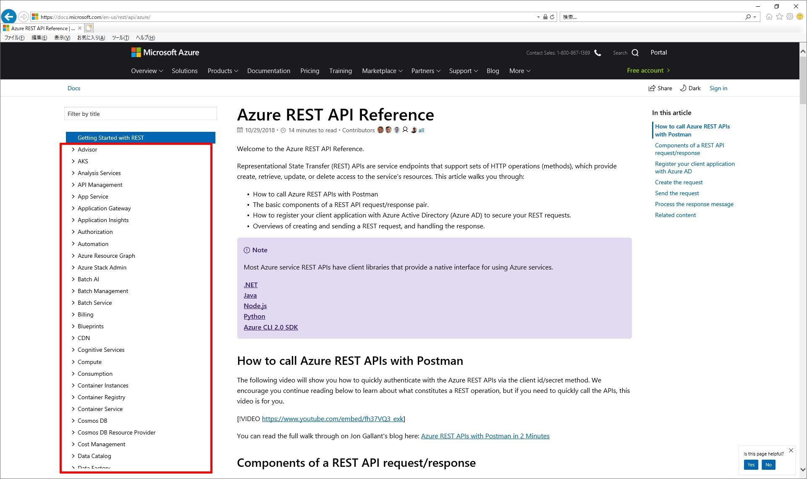
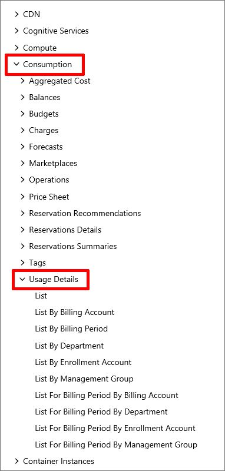
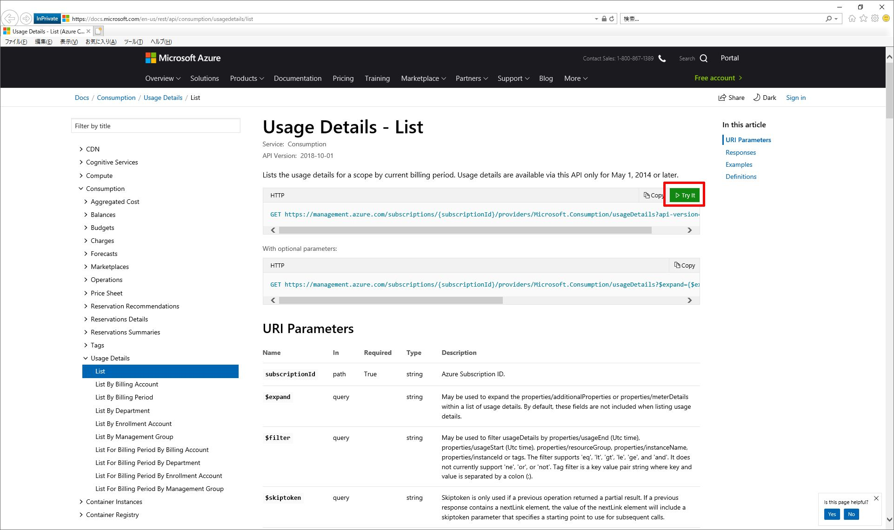
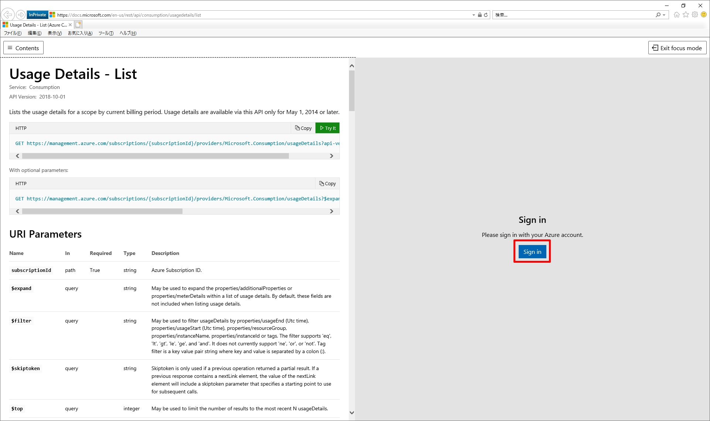
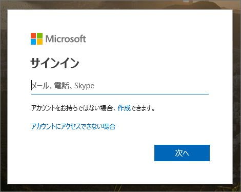
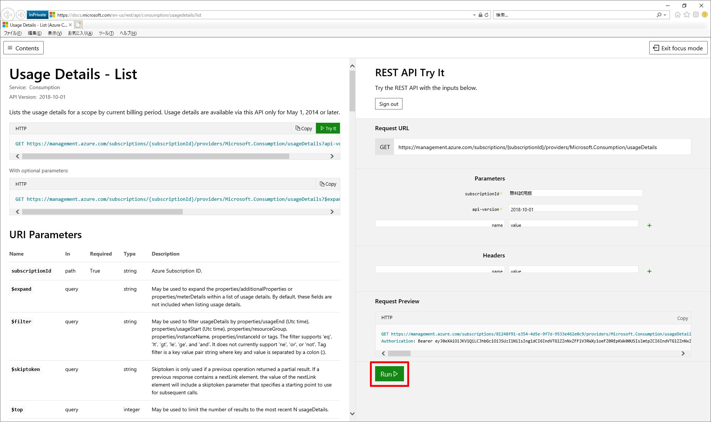
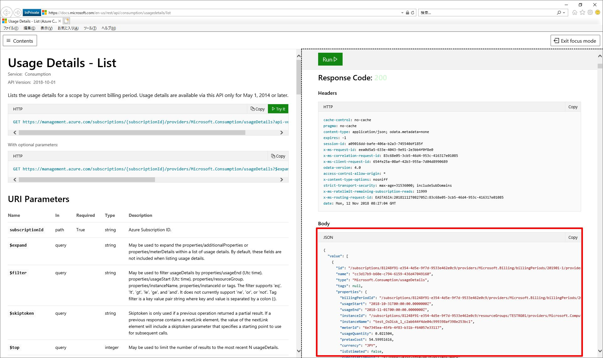
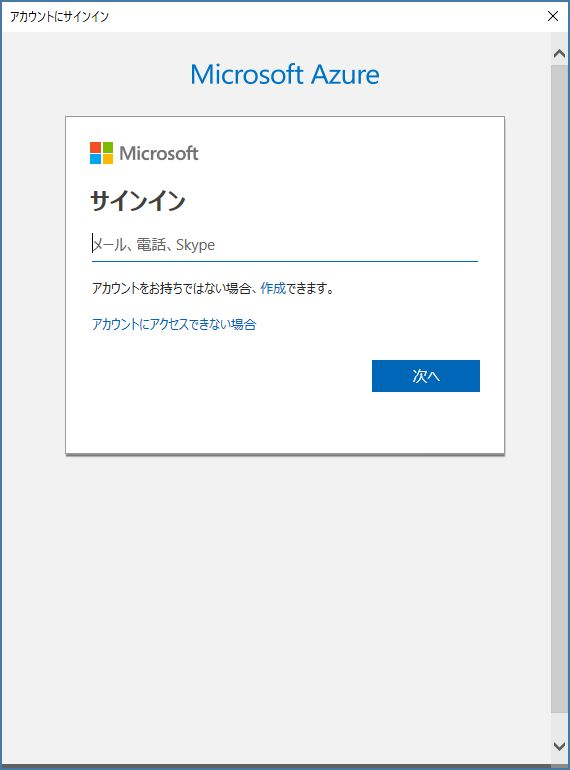

いつも大変お世話になります。Microsoft Azure サポート チームです。

Azure REST API について以下をご案内させていただきます。

ご参考になりましたら幸いです。

-   本記事の目的
-   Azure REST API とは
-   事前の準備
-   「Try It」を使用する方法
-   「PowerShell」を使用する方法
-   関連する弊社公開情報

### 本記事の目的

___

本記事では、簡単に Azure REST API を使用する方法をご案内いたします。

Azure REST API を使用することで、Azure の様々な情報を参照・更新することができます。

本来、何かしらのプログラムから Azure REST API を呼び出し、お客様独自のシステムを構築するために用意されているものとなります。

例えば・・・

-   Azure VM の操作に特化した社内用 Web サイトを作りたい
-   自社ビジネスに合った使用状況・課金管理のツールを作りたい

このような時に、.NET や Java、その他様々なフレームワークを使用して Azure REST API の呼び出し、その結果の加工などを同フレームワークを使用して行っていただき、上記のような仕組みを独自に実装してもらうものとなります。

開発環境の用意や要件定義を伴うこと、また、呼び出し方法やデータの加工などはご利用いただくフレームワークにより様々なため、なかなか Azure REST API 自体の使用方法やどのような結果が得られるものかなどについてイメージをしにくい側面があります。

本記事では、まずは簡単に Azure REST API をご利用いただきそのイメージを掴んでいただくための簡易な方法をご案内することを目的としています。

上記のようなお客様独自のシステムを構築する際に採用をしていただける現実的な方法ではないものとなりますが、「ちょっと Azure REST API の動作を試したい」「Azure REST API の呼び出し方を事前に勉強しておきたい」などの時にお役に立てば幸いです。

**!! 注意事項 !!**

Azure REST API について全てをご案内するものではありません。

是非、関連する弊社公開情報も併せてご参照いただけたら幸いです。

### Azure REST API とは

___

Azure REST API とは、Azure の各サービスごとに用意されている REST API です。

その総称を Azure REST API と呼んでいます。

例えば、お客様社内で以下のようなアプリケーションの構築をご検討いただいているとします。

-   自社ビジネスに合った Azure の使用状況・課金管理のツール

一例ではありますが、このアプリケーションを構成するものには以下のようなものが考えられます。

(あくまで一例です)

-   画面
-   データベース
-   このアプリケーション自体の権限管理ロジック
-   各業務ロジック
-   Azure データの制御ロジック
-   その他

一般的にこの中の「Azure データの制御ロジック」内で、適切な Azure REST API の呼び出しを行っていただくものとなります。

つまり、Azure REST API のみで何かを実現できるものではなく、お客様にご検討をいただいている独自の仕組みの中の一部としてご利用をご検討いただくものが Azure REST API になります。

全 Azure REST API は以下の弊社公開情報からご確認をいただけます。

Azure REST API Reference

[https://docs.microsoft.com/en-us/rest/api/azure/](https://docs.microsoft.com/en-us/rest/api/azure/)

このページの画面左に、全ての Azure REST API がツリー形式で表示されます。

 

例えば、Azure の課金に関する API である、「Consumption」を見てみましょう。

画面左から「Consumption」を展開します。

すると、更にその配下に様々な API (Aggregated Cost、Balances、Budgets など) が存在していることが確認できます。

その中の「Usage Details」を展開すると、更に細かいオペレーション (List、List By Billing Account など) が確認できます。

Azure REST API はこのように体系的に管理されています。

この中からお客様が検討されている独自のシステムを実現するための Azure REST API を見つけていただきます。

それぞれの API やオペレーションについて、各ページに詳細をご案内していますので併せてご参照いただければと思います。

### 事前の準備

___

Azure REST API を簡単にご利用いただくための事前準備についてご案内します。

この後に「Try It」「PowerShell」を使用した 2 つの方法をご案内しますが、その前の事前準備になります。

どちらの方法を使用するにしても、事前にこの準備をしておいてください。

以下の手順で、Azure REST API を実行するアカウントを作っておきましょう。

1.  以下の弊社公開情報に沿って、組織アカウントを 1 つ作成する
    
    ※ 「新しいユーザーを追加するには」の手順に沿って作成してください。
    
    ※ 作成するアカウントは初期ドメインの「xxx@xxx.onmicrosoft.com」で結構です。
    
2.  以下の弊社公開情報に沿って、上記 1. で作成したアカウントを所有者に設定する
    
    ※ 「Azure portal でサブスクリプションの RBAC 所有者を追加する」の手順に沿って設定をしてください。
    

以上で事前準備は終了です。

このアカウントを使用して、Azure REST API を試すことになります。

### 「Try It」を使用する方法

___

「Try It」を使用して、Azure REST API を簡単に試す方法をご案内します。

ここでは、\[Consumption\] - \[Usage Details\] API の \[List\] オペレーションで手順をご案内します。

上記「事前の準備」を済ませてから、以下の手順を実施してください。

1.  ブラウザーをすべて閉じる
    
    意図しないアカウントでサインインしてしまうことを避けるために、必ずすべてのブラウザーを閉じて下さい。
    
2.  InPrivate ブラウザーを起動する
    
    同様に、意図しないアカウントでサインインしてしまうことを避けるために、必ず InPrivate ブラウザーで実施してください。
    
3.  以下の URL にアクセスをする

    Usage Details - List
    [https://docs.microsoft.com/en-us/rest/api/consumption/usagedetails/list](https://docs.microsoft.com/en-us/rest/api/consumption/usagedetails/list)

4.  「Tri It」をクリックする
    
    
    
5.  「Sign in」をクリックする
    
     
    
6.  「事前の準備」で作成をしたアカウントでサインインをする
    
     
    
7.  「Run」をクリックする
    
    
    
8.  この API が実行されて、結果が表示されることを確認する
    
    
    

以上で「Try It」を使用した Azure REST API の呼び出しは終了です。

上記 7. の画面からも分かる通り、「Try It」でも様々なパラメーターを設定して Azure REST API を呼び出せます。

是非、色々お試しいただければと思います。

### 「PowerShell」を使用する方法

___

次に「PowerShell」を使用して、Azure REST API を簡単に試す方法をご案内します。

上記「Try It」でも様々お試しいただけますが、よりプログラミングからの使用をイメージしやすい方法となります。

同様に、\[Consumption\] - \[Usage Details\] API の \[List\] オペレーションで手順をご案内します。

上記「事前の準備」を済ませてから、以下の手順を実施してください。

1.  以下の弊社公開情報に沿って、PowerShell のモジュールをインストールする
    
    Azure PowerShell インストール手順
    [https://blogs.technet.microsoft.com/jpaztech/2017/05/02/azure-powershell-3-8-0-install/](https://blogs.technet.microsoft.com/jpaztech/2017/05/02/azure-powershell-3-8-0-install/)
    
    ※ 「リソース マネージャー デプロイ モデルの Azure PowerShell」をインストールします。
    
2.  PowerShell を管理者として起動する
3.  以下のコマンドを実行する
    
    Login-AzureRmAccount -Subscription "＜サブスクリプション ID ＞"
    
    サブスクリプション ID は、以下の弊社公開情報の手順でご確認いただけます。
    
    ※ 「■ サブスクリプション ID の確認方法」の項目をご参照ください。
    
    例)
    
    Login-AzureRmAccount -Subscription "8124xxxx-e3xx-4dxx-9fxx-9533e462xxxx"
    
4.  認証画面が表示されるので、「事前の準備」で作成をしたアカウントでサインインをする
    
    
    
5.  以下のコマンドを実行して、SubscriptionID、TenantID、AccountID を取得する
    
    $subscriptionid = (Get-AzureRmContext).Subscription.Id
    
    $tenantid = (Get-AzureRmContext).Tenant.Id
    
    $accountid = (Get-AzureRmContext).Account.Id
    
    ※ ここで取得した各値は後で使用します。
    
6.  以下のコマンドを実行して Token を取得する
    
    $token = (Get-AzureRmContext).TokenCache.ReadItems() | where {($\_.TenantId -eq $tenantid) -and ($\_.DisplayableId -eq $accountid)}
    
    ※ ここで取得した Token を使用して、Azure REST API を呼びます。
    
    ※ つまり、上記 3. - 4. の PowerShell からのサインインの際に発行された Token を流用して Azure REST API を使用します。
    
7.  以下のコマンドを実行して、Azure REST API を呼び出すための URL を作成する
    
    $url = "https://management.azure.com/subscriptions/" + $subscriptionId + "/providers/Microsoft.Consumption/usageDetails?api-version=2018-10-01"
    
    ※ この URL の詳細は、以下弊社公開情報をご参照ください。
    Usage Details - List
    https://docs.microsoft.com/en-us/rest/api/consumption/usagedetails/list
    
8.  以下のコマンドを実行して、Azure REST API を呼び出すためのその他の情報を作成する
    
    $method = "GET"
    
    $headers = @{"Authorization" = "Bearer " + $token\[0\].AccessToken}
    
    $contenttype = "application/json"
    
9.  以下のコマンドを実行して、Azure REST API を呼び出し、その結果を取得する
    
    $responce = Invoke-WebRequest -Uri $url -Method $method -Headers $headers -ContentType $contenttype
    
10.  以下のコマンドを実行して、Azure REST API の結果を表示する
    
    ConvertFrom-Json $responce | ConvertTo-Json
    

以上で「PowerShell」を使用した Azure REST API の呼び出しは終了です。

上記 7. で作成している URL に様々なパラメーターを設定して Azure REST API を呼び出せます。

是非、色々お試しいただければと思います。

### 関連する弊社公開情報

___

Azure REST API について、弊社の様々な公開情報を以下にご案内します。

併せてご利用ください。

Azure REST API Reference

[https://docs.microsoft.com/en-us/rest/api/azure/](https://docs.microsoft.com/en-us/rest/api/azure/)

REST API ブラウザー

[https://docs.microsoft.com/ja-jp/rest/api/](https://docs.microsoft.com/ja-jp/rest/api/)

REST API を使用して Azure リソースの使用状況を確認する

[https://docs.microsoft.com/ja-jp/azure/billing/billing-review-service-usage-api](https://docs.microsoft.com/ja-jp/azure/billing/billing-review-service-usage-api)

Azure 監視 REST API のチュートリアル

[https://docs.microsoft.com/ja-jp/azure/monitoring-and-diagnostics/monitoring-rest-api-walkthrough](https://docs.microsoft.com/ja-jp/azure/monitoring-and-diagnostics/monitoring-rest-api-walkthrough)

SSH 認証を使用する Linux 仮想マシンを REST API で作成する

[https://docs.microsoft.com/ja-jp/azure/virtual-machines/linux/create-vm-rest-api](https://docs.microsoft.com/ja-jp/azure/virtual-machines/linux/create-vm-rest-api)

REST API を使用して仮想マシンの使用状況のメトリックを取得する

[https://docs.microsoft.com/ja-jp/azure/virtual-machines/linux/metrics-vm-usage-rest](https://docs.microsoft.com/ja-jp/azure/virtual-machines/linux/metrics-vm-usage-rest)

RBAC と REST API を使用してアクセスを管理する

[https://docs.microsoft.com/ja-jp/azure/role-based-access-control/role-assignments-rest](https://docs.microsoft.com/ja-jp/azure/role-based-access-control/role-assignments-rest)

Azure REST API を使用して Security Center のコンプライアンス結果を確認する

[https://docs.microsoft.com/ja-jp/azure/security-center/security-center-compliance-rest-api](https://docs.microsoft.com/ja-jp/azure/security-center/security-center-compliance-rest-api)

Azure REST API を使用して Hadoop クラスターを作成する

[https://docs.microsoft.com/ja-jp/azure/hdinsight/hdinsight-hadoop-create-linux-clusters-curl-rest](https://docs.microsoft.com/ja-jp/azure/hdinsight/hdinsight-hadoop-create-linux-clusters-curl-rest)

REST API で Azure Blueprint を定義して割り当てる

[https://docs.microsoft.com/ja-jp/azure/governance/blueprints/create-blueprint-rest-api](https://docs.microsoft.com/ja-jp/azure/governance/blueprints/create-blueprint-rest-api)

以上の通りご案内いたします。

引き続き弊社製品・サービスについてお客様のお役に立てる情報のご案内に努めさせていただきます。

よろしくお願いします。