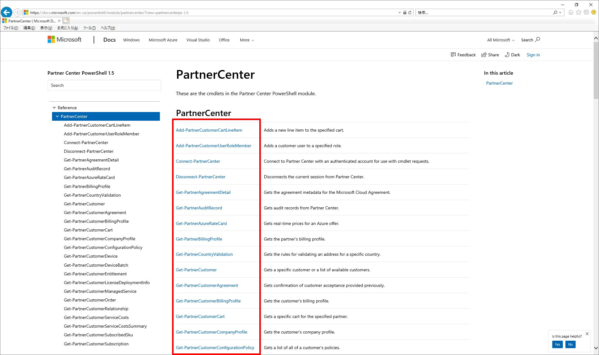
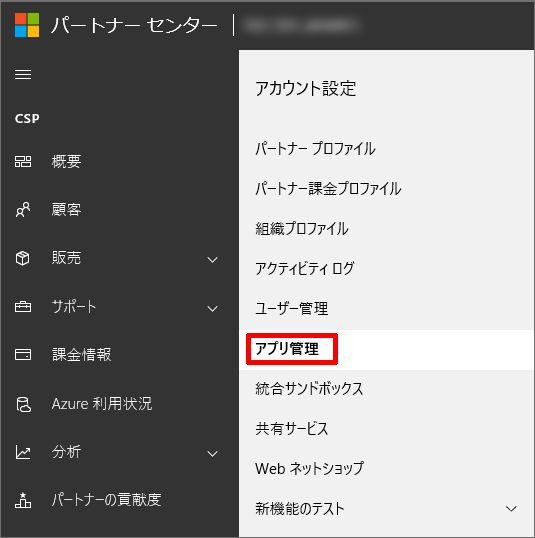
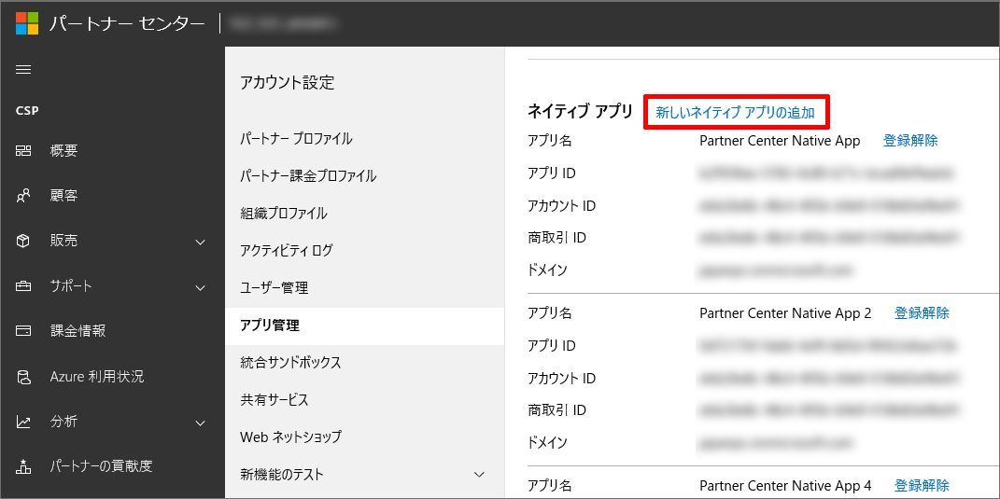
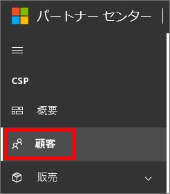
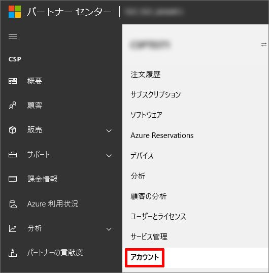
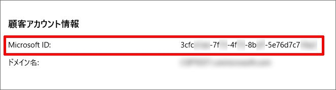
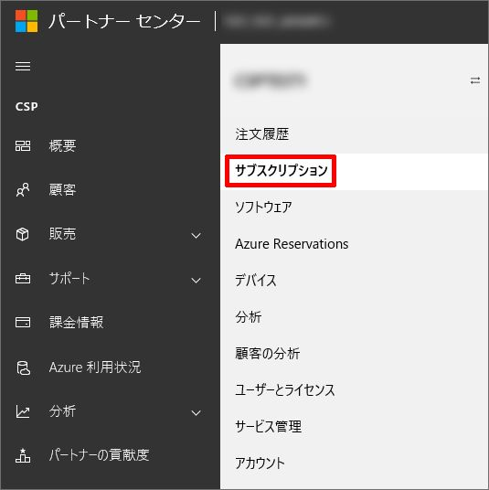
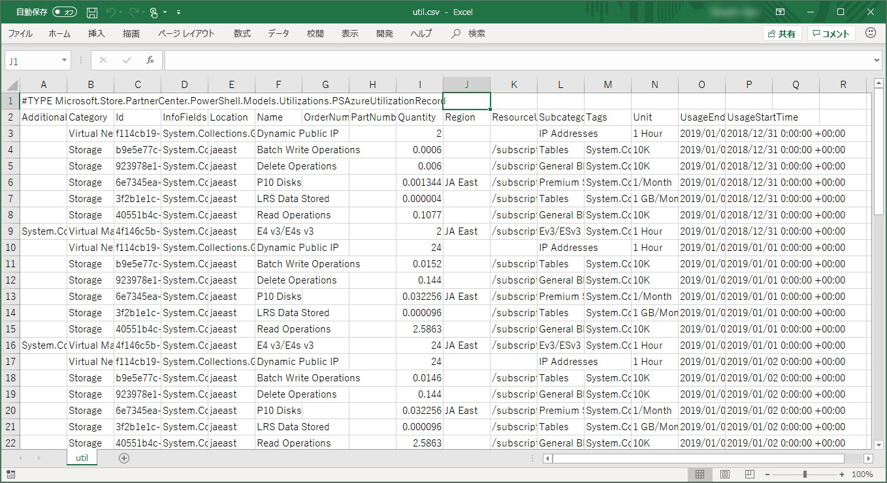

いつも大変お世話になります。Microsoft Azure サポート チームです。

CSP のパートナー センター PowerShell について以下をご案内させていただきます。

ご参考になりましたら幸いです。

   ・本記事の目的
   ・パートナー センター PowerShell とは
   ・注意事項
   ・事前の準備
   ・パートナー センター PowerShell で使用状況を取得
   ・関連する公開情報

### 本記事の目的

___

本記事は、CSP パートナー様向けにパートナー センター PowerShell の使用例やその他情報をご案内することを目的にしております。

CSP パートナー様の管理業務は主に以下のような方法で行っていただきます。

-   CSP パートナー センターの Web UI を使用する
-   PowerShell を使用する

後者の PowerShell をご利用いただくことで、一部管理業務の自動化などをご検討いただけることがございます。

この際にご利用をいただくのが CSP のパートナー センター PowerShell です。

本記事では、このパートナー センター PowerShell の使用例や注意事項について CSP パートナー様にご案内を致します。

**!! 注意事項 !!**

本記事で CSP のパートナー センター PowerShell の全てをご案内するものではありません。

是非、関連する公開情報も併せてご参照いただけたら幸いです。

### パートナー センター PowerShell とは

___

パートナー センター PowerShell とは、CSP パートナー様がその管理業務の効率化・自動化などを図っていただくために用意されている PowerShell のモジュールです。

このモジュール内には多数のコマンドが用意されています。

これらを総称してパートナー センター PowerShell と呼んでいます。

パートナー センター PowerShell の全コマンドは以下の弊社公開情報からご確認をいただけます。

PartnerCenter

[https://docs.microsoft.com/en-us/powershell/module/partnercenter/](https://docs.microsoft.com/en-us/powershell/module/partnercenter/)

このページに全コマンドがリストされています。

各コマンドをクリックしていただくと、そのコマンドの詳細ページに遷移いたします。

このページから

-   「現在、パートナー センター PowerShell にはどのような処理を行うコマンドが存在しているか」
-   「自分が実現をしたい処理を行えるコマンドがあるか」

などを CSP パートナー様に探していただいてご利用をいただくものとなります。

### 注意事項

___

CSP のパートナー センター PowerShell をご利用いただくにあたり、1 点注意事項をご案内します。

CSP のパートナー センター PowerShell はオープン ソース プロジェクトによりリリースされているモジュールです。

そのため、 Microsoft で正式なサポートをしておりません。

この記事でご紹介をしておきながら、上記となりますこと何卒ご了承ください。

そのため、CSP のパートナー センター PowerShell をご利用の際は「関連する公開情報」にご案内をしております各種情報や、その他インターネット上の各種フォーラムの場などを CSP パートナー様でご活用いただくことをご検討いただけましたら幸いです。

以下にこれを示す弊社公開情報も併せてご案内いたします。

Azure CSP 管理オプション

[https://docs.microsoft.com/ja-jp/azure/cloud-solution-provider/overview/azure-csp-management-options](https://docs.microsoft.com/ja-jp/azure/cloud-solution-provider/overview/azure-csp-management-options)

> **重要**
> 
> パートナー センターの PowerShell モジュールは、Microsoft で正式にはサポートされていないオープン ソース プロジェクトです。

### 事前の準備

___

CSP のパートナー センター PowerShell をご利用いただくにあたり、事前の準備をご案内します。

パートナー センター PowerShell をご利用いただく前に以下をご実施ください。

1.  パートナー センター PowerShell のインストール
2.  Application Id を取得
3.  Customer Id を取得
4.  Subscription Id を取得

それぞれ詳細をご案内します。

#### 1\. パートナー センター PowerShell のインストール

以下の手順で、クライアント PC にパートナー センター PowerShell のモジュールをインストールします。

1.  PowerShell を管理者として実行する
2.  以下のコマンドを実行してパートナー センター PowerShell モジュールをインストールする
    
    Install-Module -Name PartnerCenter
    
3.  すでにインストールされている場合は、以下のコマンドを実行して最新版にアップデートする
    
    Update-Module -Name PartnerCenter
    

以上でパートナー センター PowerShell のインストールは終了です。

#### 2\. Application Id を取得

以下の手順で Application Id を取得します。

ここで取得した Application Id は、パートナー センター PowerShell のコマンドを実行する際に使用します。

1.  CSP パートナー アカウントで CSP パートナー センターにサインインする
2.  画面右上の歯車のアイコンから \[パートナーの設定\] をクリックする
    
    
    
3.  \[アプリ管理\] をクリックする
    
    
    
4.  画面を下にスクロールして、\[新しいネイティブ アプリの追加\] をクリックする
    
    
    
5.  新しく追加されたネイティブ アプリの \[アプリ ID\] を確認する
    
    
    

以上で Application Id の取得は終了です。

#### 3\. Customer Id を取得

以下の手順で対象顧客の Customer Id を取得します。

ここで取得した Customer Id は、パートナー センター PowerShell のコマンドを実行する際に使用します。

1.  CSP パートナー アカウントで CSP パートナー センターにサインインする
2.  画面左から \[顧客\] をクリックする
    
    
    
3.  顧客の一覧から対象の顧客をクリックする
4.  \[アカウント\] をクリックする
    
    
    
5.  \[顧客アカウント情報\] の \[Microsoft ID\] を確認する
    
    
    
    ※ \[Microsoft ID\] が \[Customer Id\] になります。
    

以上で Customer Id の取得は終了です。

#### 4\. Subscription Id を取得

以下の手順で対象顧客の対象サブスクリプションの Subscription Id を取得します。

ここで取得した Subscription Id は、パートナー センター PowerShell のコマンドを実行する際に使用します。

1.  CSP パートナー アカウントで CSP パートナー センターにサインインする
2.  画面左から \[顧客\] をクリックする
    
    
    
3.  顧客の一覧から対象の顧客をクリックする
4.  \[サブスクリプション\] をクリックする
    
    
    
5.  画面を下にスクロールして、対象の Azure サブスクリプションを展開して \[サブスクリプション ID\] を確認する
    
    
    

以上で Subscription Id の取得は終了です。

### パートナー センター PowerShell で使用状況を取得

___

例として、CSP のパートナー センター PowerShell をご利用いただき、対象顧客・対象サブスクリプションの使用状況詳細データを取得する手順をご案内します。

この例では、パートナー センター PowerShell の Get-PartnerCustomerSubscriptionUtilization コマンドを使用します。

上記「事前の準備」をご実施いただいてから、以下の手順をご実施ください。

1.  PowerShell を管理者として実行する
2.  以下のコマンドを実行して、CSP パートナー アカウントの資格情報を入力する
　
　　 Connect-PartnerCenter
　
　　　※ApplicationId の入力を求められるので、「事前の準備」で確認した Application Id を入力して Enter を押下します。
　　　　その後、認証が発生するので、CSP パートナー アカウントの資格情報で認証を行います。
　
3.  以下のコマンドを実行して、CSP パートナー センターにサインインする
    
    Connect-PartnerCenter -ApplicationId "＜事前の準備で確認した Application Id ＞" -Credential $cred
    
    例)
    
    Connect-PartnerCenter -ApplicationId "3e25xxxx-35xx-4fxx-87xx-d4e8a19cxxxx" -Credential $cred
    
4.  以下のコマンドを実行して、対象顧客・対象サブスクリプションの使用状況詳細データを出力する
    
    Get-PartnerCustomerSubscriptionUtilization -CustomerId "＜事前の準備で確認した Customer Id ＞" -SubscriptionId "＜事前の準備で確認した Subscription Id ＞" -StartDate "＜開始日時 ( UTC ) ＞" -EndDate "＜終了日時 ( UTC ) ＞" -ShowDetails | Export-Csv -Path "＜出力パス＞"
    
    例)
    
    Get-PartnerCustomerSubscriptionUtilization -CustomerId "3cfcxxxx-7fxx-4fxx-8bxx-5e76d7c7xxxx" -SubscriptionId "AA21xxxx-EBxx-48xx-ADxx-B00A08D0xxxx" -StartDate "2019/01/01 00:00:00" -EndDate "2019/01/10 00:00:00" -ShowDetails | Export-Csv -Path "c:\\temp\\util.csv"
    
5.  上記 4. で以下のような CSV ファイルが出力されていることを確認する
    
    
    

以上で CSP のパートナー センター PowerShell をご利用いただき、対象顧客・対象サブスクリプションの使用状況詳細データを取得する手順は終了です。

他のコマンドについても、同じ要領でご利用いただけますので色々お試しいただけましたら幸いです。

### 関連する公開情報

___

CSP のパートナー センター PowerShell について、様々な公開情報を以下にご案内します。

併せてご利用ください。

Microsoft Partner Center PowerShell

[https://github.com/Microsoft/Partner-Center-PowerShell](https://github.com/Microsoft/Partner-Center-PowerShell)

Microsoft Partner Center PowerShell - ReadMe

[https://github.com/Microsoft/Partner-Center-PowerShell/blob/master/README.md](https://github.com/Microsoft/Partner-Center-PowerShell/blob/master/README.md)

PartnerCenter

[https://docs.microsoft.com/en-us/powershell/module/partnercenter/](https://docs.microsoft.com/en-us/powershell/module/partnercenter/)

Azure CSP 管理オプション

[https://docs.microsoft.com/ja-jp/azure/cloud-solution-provider/overview/azure-csp-management-options](https://docs.microsoft.com/ja-jp/azure/cloud-solution-provider/overview/azure-csp-management-options)

Azure CSP API 統合オプション

[https://docs.microsoft.com/ja-jp/azure/cloud-solution-provider/integration/available-apis-overview](https://docs.microsoft.com/ja-jp/azure/cloud-solution-provider/integration/available-apis-overview)

以上の通りご案内いたします。

引き続き弊社製品・サービスについてお客様のお役に立てる情報のご案内に努めさせていただきます。

よろしくお願いします。