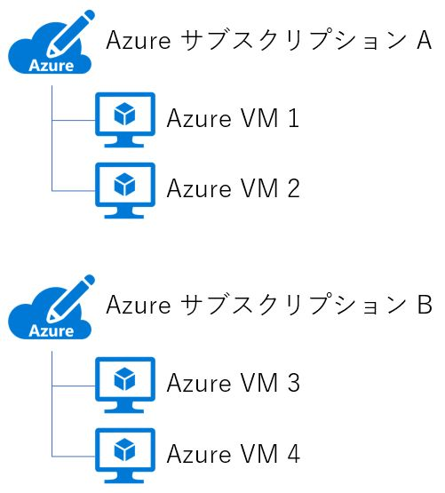
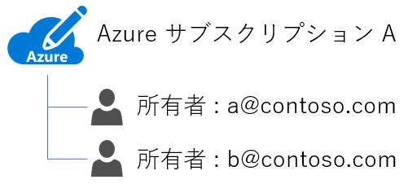
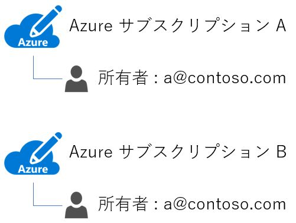
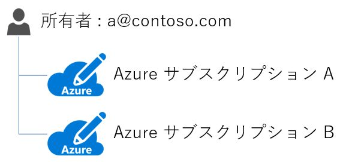
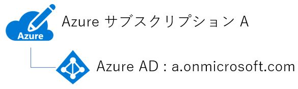
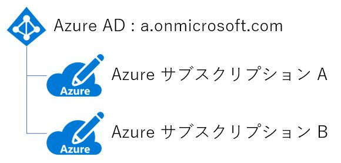
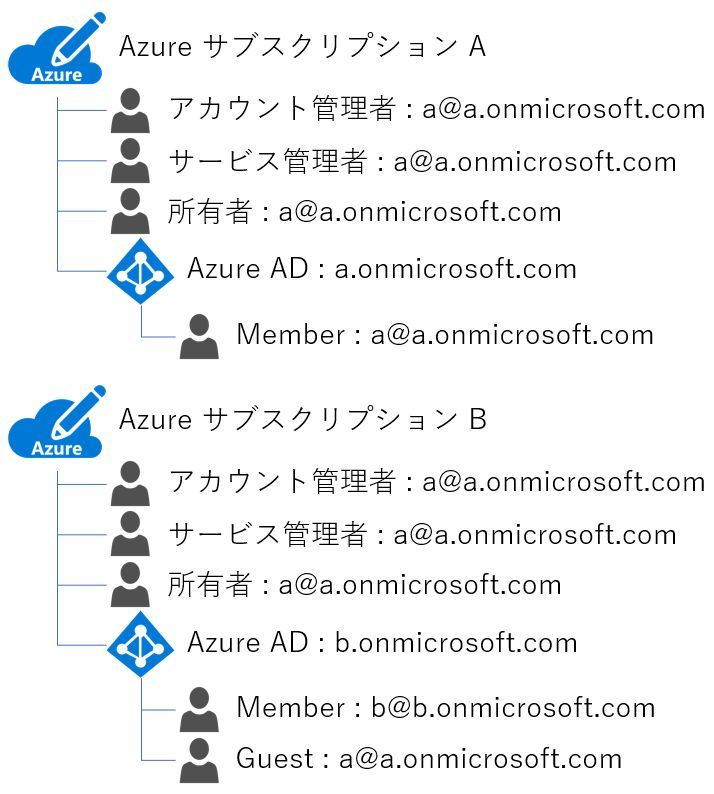
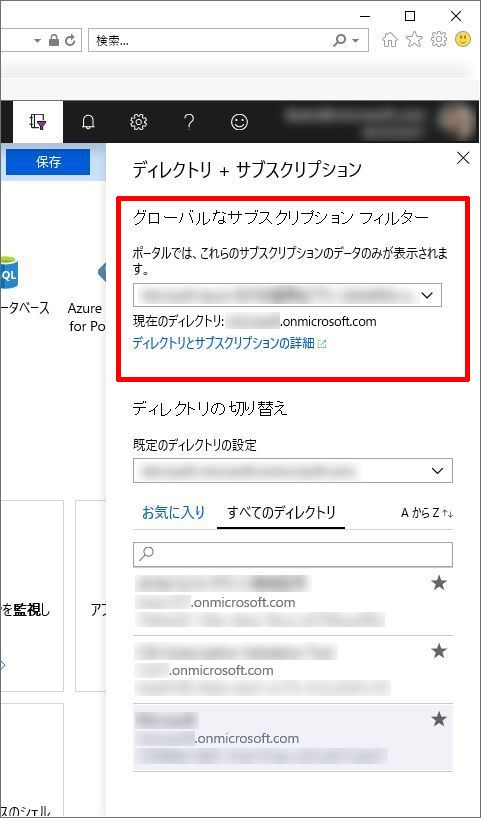

いつも大変お世話になります。Microsoft Azure サポート チームです。

Azure サブスクリプションと Azure AD の関連性についてご案内させていただきます。

ご参考になりましたら幸いです。

   [本記事の目的]
   [Azure サブスクリプションとは]
   [Azure AD とは]
   [Azure サブスクリプションの管理者について]
   [Azure AD の管理者について]
   [Azure サブスクリプションと Azure AD の関係について]
   [Azure サブスクリプションの管理者と Azure AD の関係について]
   [Azure ポータルについて]
   [Azure サブスクリプション作成時の動作について]
   [関連する弊社公開情報など]

### 本記事の目的

___

本記事では、Azure サブスクリプションと Azure AD の関係についてご案内いたします。

Azure サブスクリプションと Azure AD には密接な関係があります。

適切に Azure の各サービスをご利用いただくために、まずはこの関係性をしっかりと理解する必要があります。

これから Azure をご利用いただく方、既にご利用をいただいている方、多くの皆様に Azure を正しくご利用いただけますよう、Azure サブスクリプションと Azure AD の関係性についてご理解いただくことを本記事の目的としています。

**!! 注意事項 !!**

Azure サブスクリプションと Azure AD について全てをご案内するものではありません。

是非、関連する弊社公開情報なども併せてご参照いただけたら幸いです。

### Azure サブスクリプションとは

___

Azure サブスクリプションについてご説明いたします。

Azure サブスクリプションとは、お支払いをいただく単位です。

その Azure サブスクリプションの中のリソースで課金が発生した場合、その Azure サブスクリプションに計上され、その Azure サブスクリプションに設定されているお支払い方法でお支払いいただきます。

例えば、以下のような状況があったとします。

Azure VM 1 と Azure VM 2 で課金が発生したとします。

これは、Azure サブスクリプション A に計上されます。

そのため、Azure サブスクリプション A に設定されているお支払い方法でお支払いいただきます。

Azure VM 3 と Azure VM 4 で課金が発生したとします。

これは、Azure サブスクリプション B に計上されます。

そのため、Azure サブスクリプション B に設定されているお支払い方法でお支払いいただきます。

Azure の有償のサービスは、必ず作成の際に Azure サブスクリプションを選択するインターフェースがあります。

ここでお選びいただく Azure サブスクリプション配下のリソースになり、そこで発生した課金がその Azure サブスクリプションに計上されることを決定するためのものとなります。

### Azure AD とは

___

Azure AD (Azure Active Directory) についてご説明いたします。

Azure AD とは、ユーザー管理、認証の基盤です。

Azure 内のサービスの 1 つです。

ユーザーを追加したり、認証の各種設定をしたりすることができます。

Azure を管理するためには Azure ポータルにサインインをする必要がありますが、その際の認証も Azure AD で行われています。

Azure サブスクリプションをご購入いただくと、既定の Azure AD が 1 つ作成され紐づきます。

また、弊社 Office 365 のユーザー管理、認証の基盤も Azure AD が使用されています。

つまり、Office 365 をご購入いただいた場合も、既定の Azure AD が 1 つ作成され紐づきます。

弊社クラウド製品のユーザー管理、認証の基盤となっているサービスが Azure AD と言えます。

### Azure サブスクリプションの管理者について

___

Azure サブスクリプションの管理者についてご説明します。

Azure サブスクリプションの管理者には、代表的なものとして以下がございます。

(すべてをご案内するものではございません)

-   アカウント管理者
-   サービス管理者
-   所有者 (RBAC のロール)

それぞれについてご説明いたします。

#### アカウント管理者

アカウント管理者は、Azure サブスクリプション管理のための従来のロールの 1 つです。

該当 Azure サブスクリプションの課金などの管理を行うための権限です。

アカウント管理者が付与されているアカウントは、Azure アカウント センターからその Azure サブスクリプションを参照し各種課金の管理を行えます。

アカウント管理者のみが付与されているアカウント (後述のサービス管理者、所有者が付与されていないアカウント) は、Azure ポータル上からはその Azure サブスクリプションを参照することができません。

アカウント管理者は、あくまで Azure アカウント センターからのみその Azure サブスクリプションを参照できます。

Azure サブスクリプションを作成すると、既定でその作成時のアカウントがアカウント管理者・サービス管理者・所有者に設定されます。

Azure サブスクリプションにはアカウント管理者が必ず 1 つのみ紐づきます。

これは以下のような関係になります。

Azure サブスクリプションにアカウント管理者が複数紐づくことはありません。

そのため以下のような関係は起こりえません。

一方で、1 つのアカウントが、複数の Azure サブスクリプションのアカウント管理者になることがあります。

これは以下のような関係になります。

今回は Azure サブスクリプションを基点にご説明をしておりますが、もしアカウント管理者を基点に考えるのであれば、この関係は以下のように考えることもできます。

#### サービス管理者

サービス管理者も、Azure サブスクリプション管理のための従来のロールの 1 つです。

該当 Azure サブスクリプション内のリソースなどの管理を行うための権限です。

サービス管理者が付与されているアカウントは、Azure ポータルからその Azure サブスクリプションを参照し各種リソースの管理を行えます。

サービス管理者のみが付与されているアカウント (前述のアカウント管理者が付与されていないアカウント) は、Azure アカウント センター上からはその Azure サブスクリプションを参照することができません。

サービス管理者は、あくまで Azure ポータルからのみその Azure サブスクリプションを参照できます。

Azure サブスクリプションを作成すると、既定でその作成時のアカウントがアカウント管理者・サービス管理者・所有者に設定されます。

Azure サブスクリプションにはサービス管理者が必ず 1 つのみ紐づきます。

これは以下のような関係になります。

Azure サブスクリプションにサービス管理者が複数紐づくことはありません。

そのため以下のような関係は起こりえません。

もし Azure サブスクリプションに対して、サービス管理者と同等の権限を持つアカウントを複数設定したい場合は、後述の所有者 (RBAC) を使用します。

一方で、1 つのアカウントが、複数の Azure サブスクリプションのサービス管理者になることがあります。

これは以下のような関係になります。

今回は Azure サブスクリプションを基点にご説明をしておりますが、もしサービス管理者を基点に考えるのであれば、この関係は以下のように考えることもできます。

#### 所有者 (RBAC のロール)

所有者は従来のロールとは異なる RBAC によるロールの 1 つです。

RBAC 自体は、Azure サブスクリプションのみならず、様々なリソースに対して設定が可能なものとなります。

Azure サブスクリプションに対して所有者が付与されているアカウントは、Azure ポータルからその Azure サブスクリプションを参照し各種リソースの管理を行えます。

所有者のみが付与されているアカウント (前述のアカウント管理者が付与されていないアカウント) は、Azure アカウント センター上からはその Azure サブスクリプションを参照することができません。

所有者は、あくまで Azure ポータルからのみその Azure サブスクリプションを参照できます。

該当 Azure サブスクリプション内のリソースに対して、サービス管理者と同等の権限を持ちます。

Azure サブスクリプションを作成すると、既定でその作成時のアカウントがアカウント管理者・サービス管理者・所有者に設定されます。

Azure サブスクリプションには所有者を複数紐づけられます。

これは以下のような関係になります。

また、1 つのアカウントが、複数の Azure サブスクリプションの所有者になることもあります。

これは以下のような関係になります。

今回は Azure サブスクリプションを基点にご説明をしておりますが、もし所有者を基点に考えるのであれば、この関係は以下のように考えることもできます。

### Azure AD の管理者について

___

本記事に Azure AD の管理者は関係してきませんが、Azure サブスクリプションの管理者と混同することが多いようですので、少しご紹介をしておきます。

Azure AD の管理者には、代表的なものとして以下がございます。

(すべてをご案内するものではございません)

-   全体管理者

この全体管理者は、Azure AD 上で一番強い権限を持つ管理者です。

一般的に Azure AD 上で様々な管理業務を行うアカウントに設定をします。

全体管理者自体は、Azure サブスクリプションに対して何かしらの権限を持つものではないのでご注意ください。

あくまで、Azure AD 上での管理者になります。

### Azure サブスクリプションと Azure AD の関係について

___

Azure サブスクリプションと Azure AD の関係についてご説明します。

Azure サブスクリプションには既定の Azure AD が必ず 1 つのみ紐づきます。

これは以下のような関係になります。

Azure サブスクリプションに既定の Azure AD が複数紐づくことはありません。

そのため以下のような関係は起こりえません。

一方で、Azure AD は、複数の Azure サブスクリプションから紐づけされることがあります。

これは以下のような関係になります。

今回は Azure サブスクリプションを基点にご説明をしておりますが、もし Azure AD を基点に考えるのであれば、この関係は以下のように考えることもできます。

### Azure サブスクリプションの管理者と Azure AD の関係について

___

Azure サブスクリプションの管理者と Azure AD の関係についてご説明いたします。

上記「Azure サブスクリプションの管理者について」でご説明をした Azure サブスクリプションの各管理者は、その Azure サブスクリプションに紐づく既定の Azure AD 内に Member もしくは Guest として存在しているアカウントである必要があります。

この条件を満たしていれば、組織アカウントでも Microsoft アカウントでもその Azure サブスクリプションの各管理者になれます。

逆に言いますと、Microsoft アカウントや他の Azure AD 内の組織アカウントをある Azure サブスクリプションの各管理者に設定をしたい場合、その Azure サブスクリプションに紐づいている Azure AD に Guest として招待する必要があります。

以下のような関係が起こりえます。

いくつかの例を記載します。

### Azure ポータルについて

___

Azure ポータルについてご説明いたします。

Azure ポータルでは、サインインをしたアカウントに基づき、常に 1 つの Azure AD に紐づく情報 (Azure サブスクリプション、各リソースなど) のみが参照可能です。

これを制御するのが、Azure ポータル上の以下の機能です。

-   ディレクトリの切り替え
-   グローバルなサブスクリプション フィルター
-   使用例

それぞれについてご説明いたします。

#### ディレクトリの切り替え

ディレクトリの切り替えでは、現在サインインをしている Azure ポータル上でどの Azure AD に紐づく情報 (Azure サブスクリプション、各リソースなど) を参照するかを選択することができます。

\[ディレクトリの切り替え\] 画面は、以下の手順で確認することができます。

1.  Azure ポータルにサインインする
2.  画面上部の \[ディレクトリ + サブスクリプション\] のアイコンをクリックする
    
    
    
3.  \[ディレクトリの切り替え\] 画面が表示されることを確認する
    
    

この \[ディレクトリの切り替え\] 画面で、現在サインインをしている Azure ポータル上でどの Azure AD に紐づく情報 (Azure サブスクリプション、各リソースなど) を参照するか選択します。

#### グローバルなサブスクリプション フィルター

グローバルなサブスクリプション フィルターでは、ディレクトリの切り替えで選択した Azure AD に紐づく Azure サブスクリプションを更にフィルターすることができます。

\[グローバルなサブスクリプション フィルター\] 画面は、\[ディレクトリの切り替え\] 画面と同じ手順で確認することができます。

以下が \[グローバルなサブスクリプション フィルター\] 画面になります。

この \[グローバルなサブスクリプション フィルター\] 画面で、ディレクトリの切り替えで選択した Azure AD に紐づく Azure サブスクリプションを更にフィルターします。

#### 使用例

例えば、以下のような状況が存在したとします。

この状況で、a@a.onmicrosoft.com で Azure ポータルにサインインをしたとします。

この場合、\[ディレクトリの切り替え\] 画面には以下の Azure AD が表示されることになります。

-   a.onmicrosoft.com
-   b.onmicrosoft.com

これは、サインインに使用したアカウント (a@a.onmicrosoft.com) が所属している Azure AD がこの 2 つだからです。

この \[ディレクトリの切り替え\] 画面で a.onmicrosoft.com を選択した場合、その Azure ポータル上では以下の Azure サブスクリプションとその中のリソースを参照できます。

※ \[グローバルなサブスクリプション フィルター\] 画面で \[すべて選択\] が選ばれていることを前提に致します。

-   Azure サブスクリプション A
-   Azure サブスクリプション C

これは、選択をした Azure AD (a.onmicrosoft.com) を既定の Azure AD とする Azure サブスクリプションがこの 2 つで、かつサインインに使用したアカウント (a@a.onmicrosoft.com) がこれらのサブスクリプションに対して Azure ポータル上で参照が可能な権限を持っているからです。

同様に \[ディレクトリの切り替え\] 画面で b.onmicrosoft.com を選択した場合、その Azure ポータル上では以下の Azure サブスクリプションとその中のリソースを参照できます。

-   Azure サブスクリプション B

これは、選択をした Azure AD (b.onmicrosoft.com) を既定の Azure AD とする Azure サブスクリプションがこの 1 つのみで、かつサインインに使用したアカウント (a@a.onmicrosoft.com) がこのサブスクリプションに対して Azure ポータル上で参照が可能な権限を持っているからです。

### Azure サブスクリプション作成時の動作について

___

Azure サブスクリプション作成時の動作についてご説明いたします。

Azure サブスクリプションはその作成に使用したアカウントに基づき、既定の Azure AD が決まります。

例えば、どの Azure AD にも所属していない以下の Microsoft アカウントが存在したとします。

-   a@contoso.com

このアカウントで Azure サブスクリプションを作成したとします。

すると、以下のように Azure サブスクリプションと Azure AD が作成されます。

この Azure サブスクリプションの作成に使用した Microsoft アカウント (a@contoso.com) は、まだどの Azure AD にも所属していないため、そのアカウントのメールアドレスを基に acontoso.onmicrosoft.com という Azure AD が作成され、それを既定の Azure AD とする Azure サブスクリプションが作成されます。

同アカウントで 2 つ目の Azure サブスクリプションを作成したとします。

すると、次に以下のように Azure サブスクリプションが作成されます。

この Azure サブスクリプションの作成に使用した Microsoft アカウント (a@contoso.com) は、既に Azure AD (acontoso.onmicrosoft.com) に Member として所属しているため、その Azure AD を既定の Azure AD とする Azure サブスクリプションが作成されます。

以降、同様の動作となります。

例えば、以下の組織アカウントが存在したとします。

このアカウントで Azure サブスクリプションを作成したとします。

すると、以下のように Azure サブスクリプションが作成されます。

この Azure サブスクリプションの作成に使用した組織アカウント (a@a.onmicrosoft.com) は、既に Azure AD (a.onmicrosoft.com) に Member として所属しているため、その Azure AD を既定の Azure AD とする Azure サブスクリプションが作成されます。

### 関連する弊社公開情報など

___

Azure サブスクリプションと Azure AD について、様々な弊社公開情報などを以下にご案内します。

併せてご利用ください。

Azure ポータル

[https://portal.azure.com/](https://portal.azure.com/)

Azure アカウント センター

[https://account.azure.com/Subscriptions](https://account.azure.com/Subscriptions)

従来のサブスクリプション管理者ロール、Azure RBAC ロール、および Azure AD 管理者ロール

[https://docs.microsoft.com/ja-jp/azure/role-based-access-control/rbac-and-directory-admin-roles](https://docs.microsoft.com/ja-jp/azure/role-based-access-control/rbac-and-directory-admin-roles)

Azure サブスクリプション管理者を追加または変更する

[https://docs.microsoft.com/ja-jp/azure/billing/billing-add-change-azure-subscription-administrator](https://docs.microsoft.com/ja-jp/azure/billing/billing-add-change-azure-subscription-administrator)

Azure サブスクリプションを Azure Active Directory テナントに関連付けるまたは追加する

[https://docs.microsoft.com/ja-jp/azure/active-directory/fundamentals/active-directory-how-subscriptions-associated-directory](https://docs.microsoft.com/ja-jp/azure/active-directory/fundamentals/active-directory-how-subscriptions-associated-directory)

Azure サブスクリプションを Azure Active Directory テナントに関連付けるまたは追加する

[https://docs.microsoft.com/ja-jp/azure/active-directory/fundamentals/active-directory-how-subscriptions-associated-directory](https://docs.microsoft.com/ja-jp/azure/active-directory/fundamentals/active-directory-how-subscriptions-associated-directory)

Azure サブスクリプションの所有権を別のアカウントに譲渡する

[https://docs.microsoft.com/ja-jp/azure/billing/billing-subscription-transfer](https://docs.microsoft.com/ja-jp/azure/billing/billing-subscription-transfer)

クイック スタート: Azure Active Directory で新しいテナントを作成する

[https://docs.microsoft.com/ja-jp/azure/active-directory/fundamentals/active-directory-access-create-new-tenant](https://docs.microsoft.com/ja-jp/azure/active-directory/fundamentals/active-directory-access-create-new-tenant)

以上の通りご案内いたします。

引き続き弊社製品・サービスについてお客様のお役に立てる情報のご案内に努めさせていただきます。

よろしくお願いします。