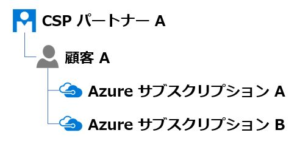
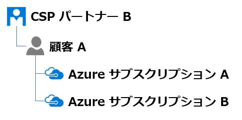

いつも大変お世話になります。Microsoft Azure サポート チームです。

Azure サブスクリプションの CSP パートナー切り替えについてご案内させていただきます。

ご参考になりましたら幸いです。

   本記事の目的
   CSP パートナーの切り替えとは
   全体の流れ
   弊社サポート サービス利用時のお願い
   関連する弊社公開情報

### 本記事の目的

___

弊社サポート サービスに、Azure サブスクリプションの CSP パートナーを切り替える際のお問い合わせをいただくことがあります。

後述しますが、この作業は弊社サポート サービスを含め、切り替え元 CSP パートナー、切り替え先 CSP パートナー、顧客など様々な関係者様が連携して作業を行うことになります。

この Azure サブスクリプションの CSP パートナーを切り替える際の以下について CSP をご利用の様々なお客様にご理解をいただくこと、お知らせすることを本記事の目的にしています。

-   全体の流れ
-   弊社サポート サービス利用時のお願い

**!! 注意事項 !!**

本記事のみで CSP パートナーの切り替えについて全てをご案内するものではありません。

是非、関連する弊社公開情報も併せてご参照いただけたら幸いです。

### CSP パートナーの切り替えとは

___

本題に入る前に、「Azure サブスクリプションの CSP パートナーを切り替える」というものがどのようなものであるかについてご説明します。

-   CSP の Azure サブスクリプションについて
-   Azure サブスクリプションの CSP パートナーを切り替えるとは

それぞれについてご説明いたします。

#### CSP の Azure サブスクリプションについて

CSP は「クラウド ソリューション プロバイダー」の略です。

CSP パートナーは顧客と直接の関係を構築し、弊社 Microsoft の各種クラウド サービス (Azure、Office 365 など) を提供します。

CSP パートナーは固有のサービス・価格設定や付加価値を基に、顧客に様々なサービスを提供します。

顧客は、Microsoft から直接 Azure を購入して使用することもできますし、CSP パートナーから Azure を購入して使用することもできます。

Microsoft から直接 Azure を購入する場合、関係は以下になります。

一方で、CSP パートナーから Azure を購入する場合、関係は以下になります。

このように CSP パートナーから購入する Azure サブスクリプションを、CSP の Azure サブスクリプションと言います。

#### Azure サブスクリプションの CSP パートナーを切り替えるとは

顧客 A が CSP パートナー A から、Azure サブスクリプション A と B を購入したとします。

この場合、その関係は以下になります。

この顧客 A が、Azure サブスクリプション A と B を保持したまま、CSP パートナー A から CSP パートナー B に切り替えたいとします。

この場合、切り替え後の関係は以下になります。

Azure サブスクリプション A と B はそのままで、CSP パートナー A が CSP パートナー B に切り替わるだけです。

これが、Azure サブスクリプションの CSP パートナーを切り替えるということです。

### 全体の流れ

___

Azure サブスクリプションの CSP パートナーを切り替える手順について全体の流れをご説明します。

この流れには以下が関与します。

-   顧客
-   切り替え元 CSP パートナー
-   切り替え先 CSP パートナー
-   Microsoft の Azure サポート

これは以下の流れで行われます。

なお、切り替え先 CSP パートナーが顧客とリセラー関係を確立していることが前提になります。

1.  譲渡フォームを完成する
2.  譲渡フォームを提出する
3.  切り替えを実施する
4.  旧情報を削除する

それぞれについてご説明いたします。

1.  譲渡フォームを完成する

顧客、切り替え元 CSP パートナー、切り替え先 CSP パートナーの作業です。

切り替え元 CSP パートナーが以下から譲渡フォームを入手します。
この譲渡フォーム内には以下の入力欄があります。

・顧客情報
・切り替え対象の Azure サブスクリプション情報
・切り替え元 CSP パートナー情報
・切り替え先 CSP パートナー情報

切り替え元 CSP パートナーが「切り替え対象の Azure サブスクリプション情報」「切り替え元 CSP パートナー情報」を入力します。
その後、切り替え元 CSP パートナーは顧客にその譲渡フォームを送信します。

顧客は切り替え先 CSP パートナーと協力し、「顧客情報」「切り替え先 CSP パートナー情報」を入力します。
その後、顧客は切り替え元 CSP パートナーにその譲渡フォームを返信します。

切り替え元 CSP パートナーは、譲渡フォームの必要項目が全て入力されていることを確認します。

2.  譲渡フォームを提出する
    
    切り替え元 CSP パートナーの作業です。
    
    切り替え元 CSP パートナーは、完成した譲渡フォームを Microsoft の Azure サポートに提出します。
    
    この際に、切り替え元 CSP パートナーは、CSP パートナーセンターから対象顧客の Azure ポータルに遷移し、そこから Azure サポートへお問い合わせを作成してください。
    
    そのお問い合わせ内容として、CSP パートナーの切り替え依頼であることを明記していただき、完成した譲渡フォームを添付してください。
    
    このような形で完成した譲渡フォームを Microsoft の Azure サポートに提出します。
    
3.  切り替えを実施する
    
    Microsoft の Azure サポートの作業です。
    
    Microsoft の Azure サポートは、切り替え元 CSP パートナーが作成したお問い合わせを通して、譲渡フォームの内容に基づいて対象サブスクリプションを切り替え元 CSP パートナーから切り替え先 CSP パートナーに切り替えます。
    
    作業が完了をしましたら、Microsoft の Azure サポートから同お問い合わせを通して切り替え元 CSP パートナーに結果をお知らせします。
    
4.  旧情報を削除する
    
    切り替え先 CSP パートナーの作業です。
    
    切り替えが行われた Azure サブスクリプションに設定されている、切り替え元 CSP パートナーの各種ロールを削除します。
    

以上で、Azure サブスクリプションの CSP パートナーを切り替える作業を終了です。

### 弊社サポート サービス利用時のお願い

___

Azure サブスクリプションの CSP パートナー切り替えについて、弊社サポート サービスご利用時のお願い事を書かせてください。

上記「全体の流れ」に記載をしました通り、この手順を完了するために、手順「譲渡フォームを提出する」で Azure サポートに 1 つお問い合わせを作成することになります。

ここで作成されるお問い合わせは、Azure サポートが譲渡フォームの内容に基づいて CSP パートナー切り替え作業を行うためのお問い合わせになります。

その前の手順「譲渡フォームを完成する」でそこに入力する切り替え元・先 CSP パートナーの情報の収集の際にお困りのことがあったり、それ以前の「切り替え先 CSP パートナーが顧客とリセラー関係を確立」で不明な点などがありましたら、弊社の以下窓口に別途ご相談をいただけますと幸いです。

これは、切り替え元・先 CSP パートナー様の情報についてのご対応、CSP 契約固有のご対応となるためです。

パートナー コールセンター

[https://partner.microsoft.com/ja-jp/support/call-center](https://partner.microsoft.com/ja-jp/support/call-center)

また最後の手順「旧情報を削除する」で、その手法などでお困りのことがありましたら、切り替え先 CSP パートナーから Azure サポートへ別途ご相談をいただけますと幸いです。

これは、Azure サブスクリプション上の操作についてのご対応となるためです。

お客様からの個々のご依頼・ご要望に対してより専門性を持った対応を行わせていただくこと、お客様情報保護の観点からその内容に応じた適切なチームで適切な情報をお取り扱いすること、これらを目的に専門チームをそれぞれ用意しそれぞれに窓口が用意されています。

本記事でご紹介をしているような様々な立ち位置の方々が関連するご案件の場合、どうしても関係者皆様には弊社様々な窓口やサポート サービスを併用していただくことになってしまいます。

弊社サポート窓口が複数あることでお客様にはご不便とご面倒をおかけする側面が決して少なくない事、しっかりと理解しそれを踏まえまして各窓口で誠意ご支援にあたらせていただきます。

何とぞこの点についてお客様皆様のご理解を賜れましたら幸いです。

### 関連する弊社公開情報

___

Azure サブスクリプションの CSP パートナー切り替えについて、様々な弊社公開情報を以下にご案内します。

併せてご利用ください。

Azure CSP サブスクリプションを別の CSP パートナーに切り替える

[https://docs.microsoft.com/ja-jp/azure/cloud-solution-provider/customer-management/switch-subscription-to-different-csp-partner](https://docs.microsoft.com/ja-jp/azure/cloud-solution-provider/customer-management/switch-subscription-to-different-csp-partner)

Azure サブスクリプションの譲渡

[https://docs.microsoft.com/ja-jp/partner-center/switch-azure-subscriptions-to-a-different-partner](https://docs.microsoft.com/ja-jp/partner-center/switch-azure-subscriptions-to-a-different-partner)

Azure in CSP

[https://azure.microsoft.com/ja-jp/offers/ms-azr-0145p/](https://azure.microsoft.com/ja-jp/offers/ms-azr-0145p/)

Microsoft ソリューション プロバイダーの検索

[https://www.microsoft.com/ja-jp/solution-providers/home](https://www.microsoft.com/ja-jp/solution-providers/home)

パートナー コールセンター

[https://partner.microsoft.com/ja-jp/support/call-center](https://partner.microsoft.com/ja-jp/support/call-center)

以上の通りご案内いたします。

引き続き弊社製品・サービスについてお客様のお役に立てる情報のご案内に努めさせていただきます。

よろしくお願いします。