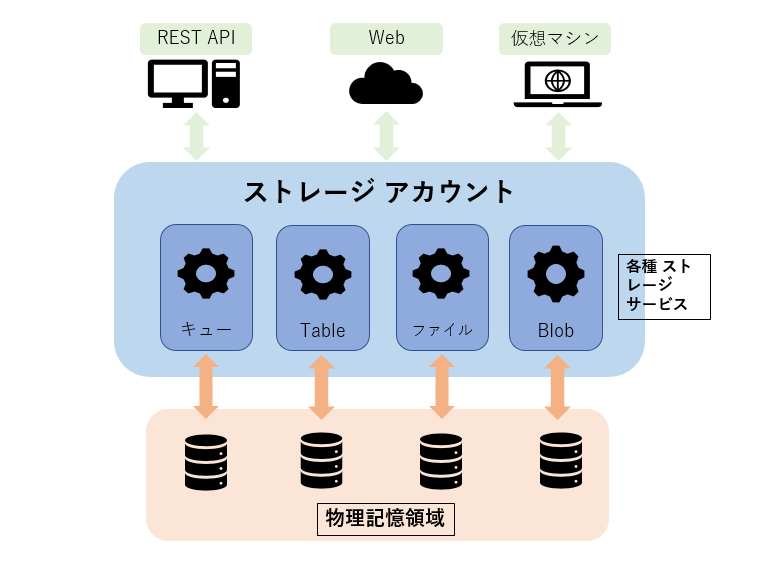

皆さん こんにちは。Microsoft Azure サポート チームです。

本記事ではストレージ アカウントについて、その概要と課金に関する点をご案内します。特に課金については複雑であり、本件でも全てを網羅できているわけではありませんが、少しでも参考になれば幸いです。

-   ストレージ アカウントの概要
    1.  ストレージ アカウントの種類
    2.  ストレージ アカウントで利用できるストレージ サービス

-   ストレージ アカウントの料金の考え方
    1.  基本的な課金要素について
    2.  各種課金対象の使用量の算出の考え方について

-   参考情報

### ストレージ アカウントの概要

___

ストレージ アカウントとは Azure 上で利用するデータを取り扱うにあたって、冗長性やデータの利用頻度、パフォーマンスなどを設定し、それに基づいた複数の種類のストレージ サービスを用いてデータの保持や課金を取りまとめて扱うサービスの一種です。

新たにファイルや Blob などデータを保存するストレージを作成したい場合は、管理ディスクを利用する場合を除き、新規もしくは既存のストレージ アカウントと紐づけて各種ストレージ サービスを作成する必要があります。

考え方としては Web Apps 等が属する App Service プランのイメージに近いかと思います。

 

#### **1\. ストレージ アカウントの種類**

ストレージ アカウントは、その汎用性により３つの種類が用意されています。

汎用 (General Purpose) v2 アカウント
　・・・　基本的なストレージ アカウントの種類です。Azure Resource Manager （ 以下 ARM ）モデルにおいて ストレージを使用するほとんどのシナリオにお勧めします。

汎用 v1 アカウント
　・・・　ARM モデル以前の従来のアカウントの種類です。 ARM モデルの場合は、ご利用可能であれば汎用 v2 アカウントを代わりに使用してください。クラシックモデルをご利用の場合はこちらのストレージアカウントのみ利用可能です。

BLOB ストレージ アカウント
　・・・　データをブロック BLOB として格納するために特化したストレージ アカウントです。
　
　
各種類によって利用できるストレージや、選択できるパフォーマンスレベル / 冗長性（レプリケーション）/ アクセス層が異なります。　アカウントの種類やそれぞれ選択できる項目の詳細については以下のサイトをご覧ください。

\- Azure ストレージ アカウントの概要

[https://docs.microsoft.com/ja-jp/azure/storage/common/storage-account-overview#types-of-storage-accounts](https://docs.microsoft.com/ja-jp/azure/storage/common/storage-account-overview#types-of-storage-accounts)
　
　
#### **2\. ストレージ アカウントで利用できるストレージ サービス**

前述のストレージ アカウントの種類によって異なりますが、実際のデータの格納には以下のストレージ サービスを利用することができます。

-   ブロック BLOB / ファイル / ディスク（ページ BLOB) / キュー / テーブル

1 つのストレージ アカウントから利用できるストレージの種類や格納するデータの数には制限はありません。ただし、ストレージ アカウント全体での 500 TB までのサイズの制限や、アカウントごとの最大要求レートや最大送受信速度の制限があります。また、それぞれのストレージ サービスに対しても制限があります。

詳細につきましては以下のサイトをご覧ください。

\- Azure Storage のスケーラビリティおよびパフォーマンスのターゲット - ストレージ アカウントのスケーラビリティ ターゲット

[https://docs.microsoft.com/ja-jp/azure/storage/common/storage-scalability-targets#scalability-targets-for-a-storage-account](https://docs.microsoft.com/ja-jp/azure/storage/common/storage-scalability-targets#scalability-targets-for-a-storage-account)
　
　
　
### ストレージ アカウントの料金の考え方

___

ストレージ アカウントを利用する際の料金についてはいろいろな要素があります。

#### **1.基本的な課金要素について**

まず各種ストレージに対して、以下の使用量に対して課金が発生します。

1.  データ保存量
2.  トランザクション量
3.  データ転送量

さらにストレージ アカウントを作成した際に選択した項目（ストレージ アカウントの種類、リージョン、アクセス層、冗長性）によって、データ保存量や転送量に対する基本料金が変わったり、追加の料金が発生することがあります（ 例 ： XX リージョンでのクール アクセス層は 10 円/GB だが OO リージョンでのホット アクセス層は 20 円 /GB など）。

冗長性も GRS や RA-GRS などのリージョン間のレプリケーションが必須となるものを選択すると、その分の追加のデータ転送料金が発生します。

#### **2.各種課金対象の使用量の算出の考え方について**

##### a) データ保存量

Standard ストレージアカウントの場合は、実際に保存されているデータの利用状況を日割り（どの月であっても 1 か月 = 31 日）で算出します。またデータ保存量に増減があった場合、その日の内の最大保存量が対象となります。

例えば、あるストレージに 10 日間 100 GB のデータを置いておいた場合は、1 か月で考えると 10 日間 100 GB を保存し、21 日間 0 GB を保存していたことになります。そのため一日あたりの平均利用量は ( 100 GB \* 10 日 / 31 日\+ 0GB \* 21 日 / 31 日) = 32.25806GB になります。それにより実際の料金は (32.25806 \* 1 か月分の料金 ) となります。

ただし、Premium ストレージアカウントに保存されたディスクの使用料金は、実際の利用料ではなくディスクのサイズにより決定されます。（ 例 ： 128 GB のディスクの 10 GB のデータが保存されている場合、Premium ストレージアカウントでは 128 GB 分の課金が発生します。Standard ストレージアカウントでは 10 GB 分の課金となります。）

※Premium ストレージアカウントの使用料金については、管理ディスクの記事を参考にしてください。

なお、課金対象となるディスクの利用状況のサイズと、仮想マシンの Explorer から確認できるサイズに違いが出る場合があります。これは最適化処理時の一時ディスクの利用によるものであったり、ディスクのデータ保存時の割り当てのサイズによる影響が考えられます。

##### b)トランザクション量

トランザクションは主にストレージに対する書き込み操作および読み込み操作 (I/O) が該当します。

具体的なトランザクション量ですが、こちらは対象となるデータをいくつのブロックサイズで処理するかによって変わってきます。

例えば 4KB 単位で I/O を行うアプリケーションがあったとしますと、1 GB （ = 1,048,576 KB) を書き込む場合のトランザクションは以下のようになります。

・ 1,048,576 KiB / 4KiB = 262,144 トランザクション

512KB 単位で I/O が行われた場合、1GB 書き込み時のトランザクションは以下のようになります。

・ 1,048,576 KiB / 512KiB = 2,048 トランザクション

上記トランザクション数に、例えば「トランザクション 10,000 回あたり \\0.01 」を乗算すると、トランザクション料金となります。

実際のブロックサイズは、ディスク I/O を要求するアプリケーションの実装に依存します。また同一の 仮想マシンによるディスク I/O であっても様々なサイズでのトランザクションが行われますので、具体的なサイズのご案内は困難であることをご了承ください。

また I/O 以外にもいくつかトランザクションに該当するものがあります。詳細につきましては以下のサイトをご覧ください。

\- Understanding Windows Azure Storage Billing – Bandwidth, Transactions, and Capacity

[https://blogs.msdn.microsoft.com/windowsazurestorage/2010/07/08/understanding-windows-azure-storage-billing-bandwidth-transactions-and-capacity/](https://blogs.msdn.microsoft.com/windowsazurestorage/2010/07/08/understanding-windows-azure-storage-billing-bandwidth-transactions-and-capacity/)

##### c) データ転送量

該当のストレージ アカウントを経由して異なるリージョンや Azure の外へ送信されたデータ量が課金対象となります。受信データや、同一リージョン内への送信データについては課金対象となりません。

例えば該当のストレージに Web 情報が格納されていて、そのサイトの１か月のページビューが 60,000 PV であり、ページ当たりの平均バイト数が 500 K バイトの場合には、60,000 PV x 500 KB = 30.0 GB/月 かかることになります。

### 

参考情報

___

ストレージ アカウントと各ストレージの詳細や課金情報については以下の情報を参考にしてください。

〇 Azure ストレージ アカウントの概要

[https://docs.microsoft.com/ja-jp/azure/storage/common/storage-account-overview](https://docs.microsoft.com/ja-jp/azure/storage/common/storage-account-overview)

〇 ブロック BLOB の料金

[https://azure.microsoft.com/ja-jp/pricing/details/storage/blobs/](https://azure.microsoft.com/ja-jp/pricing/details/storage/blobs/)

〇 Azure ページ BLOB の価格

[https://azure.microsoft.com/ja-jp/pricing/details/storage/page-blobs/](https://azure.microsoft.com/ja-jp/pricing/details/storage/page-blobs/)

〇 Azure Files の料金

[https://azure.microsoft.com/ja-jp/pricing/details/storage/files/](https://azure.microsoft.com/ja-jp/pricing/details/storage/files/)

〇 Azure Table Storage の料金

[https://azure.microsoft.com/ja-jp/pricing/details/storage/tables/](https://azure.microsoft.com/ja-jp/pricing/details/storage/tables/)

〇 Azure Queue Storage の価格

[https://azure.microsoft.com/ja-jp/pricing/details/storage/queues/](https://azure.microsoft.com/ja-jp/pricing/details/storage/queues/)

〇 Windows Azure 計算ツールの使い方

[https://blogs.msdn.microsoft.com/dsazurejp/2014/03/26/windows-azure/](https://blogs.msdn.microsoft.com/dsazurejp/2014/03/26/windows-azure/)

ご案内内容は以上となります。

併せて「管理ディスクの課金について」もご覧いただければ幸いです。